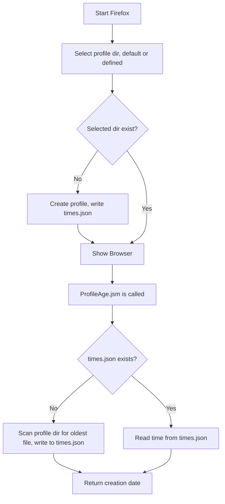
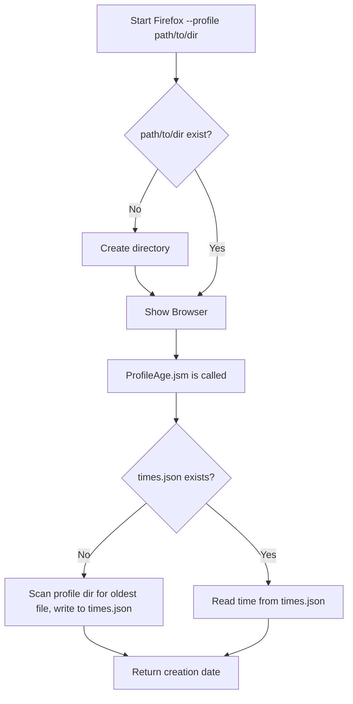

# Profile Creation

<!-- toc -->

## What is a profile?

All of the changes a user makes in Firefox, like the home page, what toolbars you use, installed addons, saved passwords and your bookmarks, are all stored in a special folder, called a profile.
Telemetry stores archived and pending pings in the profile directory as well as metadata like the client ID.

Every run of Firefox needs a profile. However a single installation can use multiple profiles for different runs.
The profile folder is stored in a separate place from the Firefox program so that, if something ever goes wrong with Firefox, the profil information will still be there.

Firefox also comes with a profile manager, a different run mode to create, migrate and delete the profiles.

## Profile Behaviors

In order to understand the behaviour of users and base analysis on things like the profile creation date,
it is essential to understand how a profile is created and identified by the browser.

### Profile Creation

#### First use

When Firefox is opened for the first time after a fresh install, without any prior installation of Firefox, it will create new profile.
A random name will be picked, the profile directory will be created and the profile be marked as default for subsequent starts of Firefox.
If a initial profile is created, Firefox will write the current timestamp to a file called `times.json` inside the profile directory.
This timestamp is used as the profile creation date and reported by Telemetry.

#### Default or Profile Manager creation

On subsequent starts, Firefox tries to find the profile directory and load the profile data (bookmarks, addons, etc.).
If not otherwise specified it uses the default (or last used) profile, finds the profile directory and starts loading files from there.

If a new profile is created through the profile manager it picks a new directory.
If that directory does not exist, it will be created and the timestamp will be written to `times.json`[^1].
If it exists, it tries to load data from files. Missing files are created when needed.

Once the profile creation date is needed, `ProfileAge.jsm` will encounter that the `times.json` is missing.
It will then go through all files inside the current profile directory, reading the creation date or last modification date of each file.
The oldest of these dates will be used as the profile creation date and a timestamp will be written to `times.json`

[^1]: Relevant parts in the code: [`nsAppRunner::SelectProfile`](https://searchfox.org/mozilla-central/rev/292d295d6b084b43b70de26a42e68513bb7b36a3/toolkit/xre/nsAppRunner.cpp#2394-2395,2397-2398,2527-2533) calling [`nsToolkitProfileService::CreateProfile`](https://searchfox.org/mozilla-central/rev/196560b95f191b48ff7cba7c2ba9237bba6b5b6a/toolkit/profile/nsToolkitProfileService.cpp#789-793).

---

#### Command-line start

Firefox can be started on the command line with a path to a profile directory: `firefox --profile path/to/directory`.
In that case the passed profile directory is, if not already existing, created. No files inside that directory are written at launch, therefore no `times.json` is written[^2].

Once the profile creation date is needed, `ProfileAge.jsm` will encounter that the `times.json` is missing.
It will then go through all files inside the current profile directory, reading the creation date or last modification date of each file.
The oldest of these dates will be used as the profile creation date and a timestamp will be written to `times.json`

[^2]: Relevant part in the code: [`nsAppRunner::SelectProfile`](https://searchfox.org/mozilla-central/rev/292d295d6b084b43b70de26a42e68513bb7b36a3/toolkit/xre/nsAppRunner.cpp#2357-2363) creating the directory.

### Profile Reset

TODO

### Profile Deletion

TODO

### Telemetry opt-out

TODO

## Profile Creation Date

TODO
