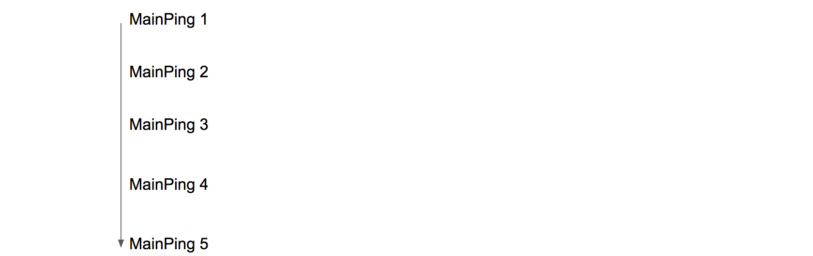
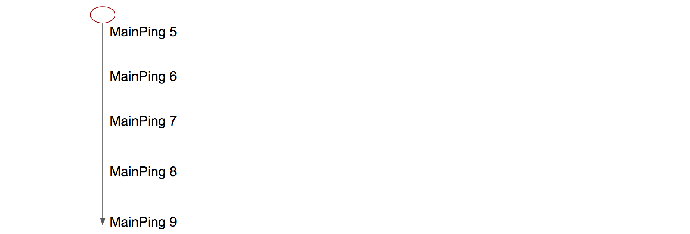
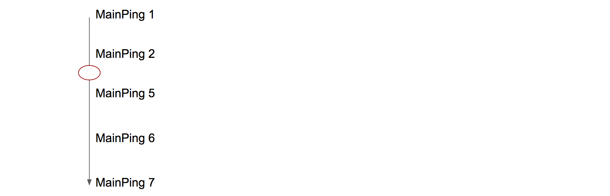
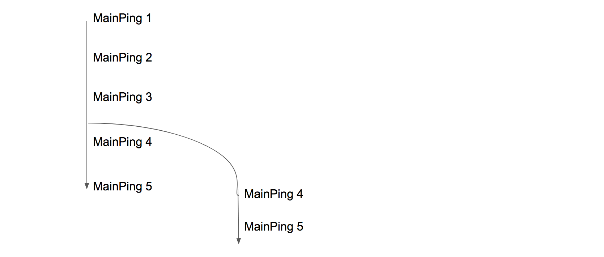
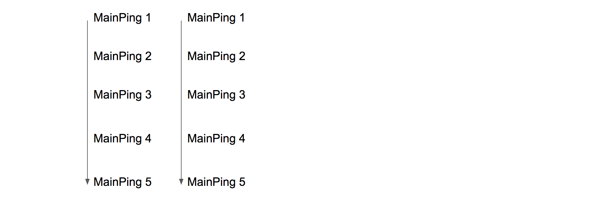

# Profile History

A profile's history is simply the progression of that profile's subsessions over it's lifetime. We can see this in our main pings by checking: 

* `profile_subsession_counter`
	- A counter which starts at 1 on the very first run and increments for each subsession. This counter can be reset to 1 if a client restart / refreshes their profile. 
* `subsession_start_date`
	- The date the subsession occurs in. This field is not always reliable, either due to local clock skew or other less understood reasons. 
* `previous_subsession_id`
	- The ID of the previous subsession. Will be `null` for the very first subsession. 
* `subsession_id`
	- The ID of the current subsession. 
* `submission_date_s3`
	- The date we recieved the ping. 

This is a nice clean example of profile history. It has a clear **starting ping** and it progresses linearly, with each subsession connecting to the next via `subsession_id`. However, due to the fact that profiles can be shared across machines, and restored manually, etc. [see here](section1-realworldusage.md) strange behaviors can arise. 

Furthermore, due to the ways that profiles can be created [see here](link to janerik's documentation), a profile history can also start out of nowhere. 

## Profile History Start Conditions

Under normal assumptions, we expect to see the **starting ping** in a profile's history in our telemetry data. The starting ping in the profile's history is the ping from their very first subsession. We expect this ping to have `profile_subsession_counter = 1` and `previous_subsession_id is none` and `profile_reset_date is null`. 

#### History Has Beginning

For example.

Diagram: 

Example: 

As you can see, this profile starts with a ping where `profile_subsession_counter = 1` and `previous_subsession_id is none`.

#### History Has No Beginning

However, not all profiles appear in our data with a starting ping and instead appear to us mid-history. 

Diagram: 

Example: 

As you can see, in this example, the profile simply appears in our data mid-history, with presumably the 25th subsession in it's history. It's previous history is a mystery. 

## Profile History Progression Events

After a profile appears, in 'normal' conditions, there should be a linear, straightforward progression with each subsession linking to the next. However, abnormal events can occur. 

#### History Gap

There is a gap in the profile history. 

Diagram: 

It's possible this behavior is due to dropped pings or pings that never reached us due ping sending logic. 

Example: 

Here, we see a gap between the 30th ping and the 41st ping and the 44th ping. 

#### History Splits

The history of a profile splits, and after a single subsession, there are two (or more) subsessions that link back to it. 

Diagram: 

This is probably due to cloned machines or disk image restores. Note, after the profile splits, the two branches might continue concurrently or one branch might die while the other continues. It is very hard to distinugish between them. 

Example: 

Profile begins

Profile splits: branch 1

 

Profile splits: branch 2

In this example, the profile history starts normally, but on the 5th ping, the history splits into two branches that seem to progress concurrently. 

#### History Restarts Fresh

The history of a profile suddenly starts over, with a brand new starting ping. 

Diagram: 

Profile begins

Profile restarts  

 

Here, we see the profile start their history normally, but then they begin a new, totally unconnected branch with a starting ping that is **not** the same as the original starting ping (different `subsession_id`s). 

#### History Resets to Previous

(Work in Progress)

## How to Order History

(Work in Progress)
