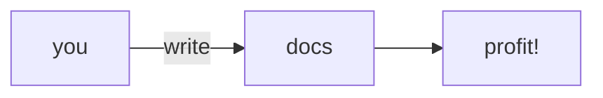

# Contributing

Documentation is critical to making a usable data platform.
When surveying our users,
their most common complaint has been our lack of documentation.
It's important that we improve our documentation as often as possible.

## Getting the Raw Documentation

The documentation is intended to be read as HTML at
[`docs.telemetry.mozilla.org`][dtmo].
However, we store the documentation in raw text files in the
[`firefox-data-docs` repo](https://github.com/mozilla/firefox-data-docs).
To begin contributing to the docs, fork the `firefox-data-docs` repo.

## Building the Documentation

The documentation is rendered with [GitBook](https://www.gitbook.com/)
To build the documentation locally,
you'll need to install the `gitbook-cli` app with
[npm](https://www.npmjs.com/get-npm):

```bash
npm install gitbook-cli -g
```

and install the GitBook plugins with:

```bash
gitbook install
```

You can then serve the documentation locally with:

```
gitbook serve
```

The complete documentation for the GitBook toolchain is at: https://toolchain.gitbook.com/.
If you run into any technical limitations, let me (`@harterrt`) know.
I'm happy to change the tooling to make it as much fun as possible to write.

## Adding a new article

Be sure to link to your new article from `SUMMARY.md`, or GitBook will not render the file.

The structure of the repository is outlined in [this article](./structure.md).

This documentation is under active development,
so we may already be working on the documentation you need.
Take a look at
[this bug component](https://bugzilla.mozilla.org/buglist.cgi?product=Data%20Platform%20and%20Tools&component=Documentation%20and%20Knowledge%20Repo%20%28RTMO%29&resolution=---)
to check.

## Style Guide

Articles should be written in
[Markdown](https://daringfireball.net/projects/markdown/syntax)
(not [AsciiDoc](http://asciidoctor.org/docs/asciidoc-syntax-quick-reference/)).
Markdown is usually powerful enough and is a more common technology than AsciiDoc.

Limit lines to **100 characters** where possible.
Try to split lines at the end of sentences.
This makes it easier to reorganize your thoughts later.

This documentation is meant to be read digitally.
Keep in mind that people read digital content much differently than other media.
Specifically, readers are going to skim your writing,
so make it easy to identify important information.

Use **visual markup** like **bold text**, `code blocks`, and section headers.
Avoid long paragraphs.
Short paragraphs that describe one concept each makes finding important information easier.

## Spell checking

Articles should use proper spelling, and pull requests will be automatically checked for spelling
errors.

Technical articles often contain words that are not recognized by common dictionaries, if this
happens you may either put specialized terms in `code blocks`, or you may add an exception to
the `.spelling` file in the code repository.

For things like dataset names or field names, `code blocks` should be preferred. Things like
project names or common technical terms should be added to the `.spelling` file.

To run the spell checker locally,
[install the `markdown-spellcheck` library](https://www.npmjs.com/package/markdown-spellcheck),
then run the `scripts/spell_check.sh` script from the root of the repository.

You may also remove the `--report` parameter to begin an interactive fixing session. In this
case, it is highly recommended to also add the `--no-suggestions` parameter, which greatly
speeds things up.

## Link checking

Any web links should be valid. A dead link might not be your fault, but you will earn a lot
of good karma by fixing a dead link!

To run the link checker locally, [install the `markdown-link-check` library](https://github.com/tcort/markdown-link-check#installation), then run the `scripts/link_check.sh` script from the root of the repository.

## Supported Plugins

### Mermaid

You may use [`mermaid.js`](https://mermaidjs.github.io/) diagrams in code blocks:
```
graph LR
  you -->|write|docs
  docs --> profit!
```

Which will be rendered as:




## Review

Once you're happy with your contribution, please open a PR and flag `@harterrt` for review.
Please squash your changes  into meaningful commits  and follow these
[commit message guidelines](https://chris.beams.io/posts/git-commit/).

## Publishing

The documentation is hosted on [Github Pages](https://pages.github.com/).

Updates to the documentation are automatically published to
[`docs.telemetry.mozilla.org`][dtmo] when changes are merged.

To publish to your own fork of this repo, changes need to be pushed manually.
Use the [deploy script](https://github.com/mozilla/firefox-data-docs/blob/master/scripts/deploy.sh)
to publish new changes.

This script depends on
[`ghp-import`](https://github.com/davisp/ghp-import).

Keep in mind that this will deploy the docs to your `origin` repo.
If you're working from a fork (which you should be),
`deploy.sh` will update the docs hosted from your fork - not the production docs.

# Colophon

This document's structure is heavily influenced by
[Django's Documentation Style Guide](https://docs.djangoproject.com/en/1.11/internals/contributing/writing-documentation/).

You can find more context for this document in
[this blog post](http://blog.harterrt.com/lit-review.html).

[dtmo]: https://docs.telemetry.mozilla.org
