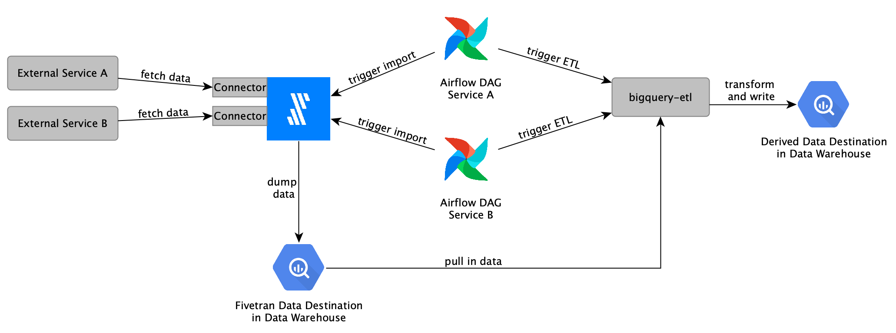

# External data integration using Fivetran

[Fivetran](https://www.fivetran.com/) is used for importing data from external services into our data warehouse. A [range of prebuilt connectors](https://www.fivetran.com/connectors) are available that can be configured in the Fivetran web interface. Custom connectors can be implemented as [Google Cloud Functions](https://fivetran.com/docs/functions/google-cloud-functions).

## Getting access

Access to Fivetran is limited to Mozilla employees. By default, users do not have permissions to create or access connectors. To gain access, create a task in [Jira under the DENG project](https://mozilla-hub.atlassian.net/jira/software/c/projects/DENG/issues/).

Fivetran can be accessed using your Mozilla LDAP credentials through [`sso.mozilla.com`](https://sso.mozilla.com/).

## Architecture

Fivetran is used to extract data from external services and load it into our data warehouse. For transforming data or writing data to a different destination [bigquery-etl](https://github.com/mozilla/bigquery-etl) is used.

The integration of Fivetran and external data import into our data platform is illustrated in the following:



A separate connector is set up in Fivetran for each external service data should be imported from. The imports get triggered via Airflow which will have different DAGs with a specific schedule. Fivetran will dump the data into our data warehouse. Once the first Airflow-triggered import is done, Airflow can trigger the ETL process which will write the extracted data to a different location in our data warehouse.

### Environments

We have production and development environments in Fivetran.

| Environment | Description                                                                                                                               | Fivetran Warehouse | GCP Destination Project   | Access                                                                                             |
| ----------- | ----------------------------------------------------------------------------------------------------------------------------------------- | ------------------ | ------------------------- | -------------------------------------------------------------------------------------------------- |
| Development | This environment allows developers to test their connectors during development, quickly deploy changes and make changes to imported data. | **Fivetran_Dev**   | `dev-fivetran`            | Anyone in data engineering                                                                         |
| Production  | This environment has connectors deployed that are used in production. Access to connectors and imported data is restricted.               | **Fivetran_Prod**  | `moz-fx-data-bq-fivetran` | Only automation has access. If access to the data is required a ticket needs to be filed with SRE. |

To prevent Fivetran from having access to our data warehouse, separate GCP projects have been provisioned for Fivetran to dump imported data into. The data can be transformed and moved to different projects and datasets using bigquery-etl.

When working in the **Fivetran_Dev** environment, data is written to the `dev-fivetran` GCP project in BigQuery. All datasets are by default accessible to data engineers. So when working with sensitive data, it might be necessary to manually update the access permissions to the dataset. Ensure that the Fivetran service account has the necessary permissions to write data to the dataset when making updates.

Once the development has finished, either manually delete previously created datasets or set an expiration date so that the datasets will be removed automatically after some time.

There are also some additional Fivetran environments that are not managed through Data Engineering and are not integrated into our data platform.

## Setting up connectors

This is a step-by-step guide for setting up a new connector in Fivetran, scheduling it via Airflow and transforming imported data via bigquery-etl:

1. Log in to [Fivetran](https://fivetran.com) and select the environment the new connector should be created in.
1. Click on the "Add Connector" button and search for the service data that should be imported from. If no connector is available for the service please check out ["Developing custom connectors"](#developing-custom-connectors) for writing custom connectors.
1. Specify the name of the `destination schema` (BigQuery dataset name where data will be loaded into)
1. Configure the connector by providing API credentials and other required settings.
1. Finish the setup and wait for the connection tests to pass.
1. Once the connector has been created a historical data import will be automatically triggered. This import can take a few minutes up to several days depending on how much historical data is available.
   - By default, Fivetran schedules imports to run every 6 hours. This schedule will be ignored when scheduling the import through Airflow as explained in the following steps.
1. Specify the data transformation in [bigquery-etl](https://github.com/mozilla/bigquery-etl) or [private-bigquery-etl](https://github.com/mozilla/private-bigquery-etl) when working with sensitive data. Please follow the [general guide of creating a derived dataset](https://mozilla.github.io/bigquery-etl/cookbooks/creating_a_derived_dataset/). When writing the query, data will be queried from the dataset that was specified when the connector was set up. The connector documentation specifies what tables will be available and what the schemas will look like.
   - Make sure to query from the correct GCP project depending on the environment for which the connector was set up for.
1. [Scheduling](https://github.com/mozilla/bigquery-etl/blob/main/docs/reference/scheduling.md) the ETL and the Fivetran import is also done in bigquery-etl. In the `metadata.yaml` file of the transformation queries, in addition to specifying the DAG which will be generated automatically, also specify the Fivetran tasks that the ETL depends on, for example:

   ```yaml
   scheduling:
     dag_name: bqetl_external_service
     depends_on_fivetran:
       - task_id: fivetran_import_1
       - task_id: another_fivetran_import
   ```

1. Once the changes have been merged into bigquery-etl and the Airflow DAGs have been updated and are available in Airflow the connector ID needs to be configured in the Airflow Admin interface. The connector ID is used for identifying the specific Fivetran connector that should be triggered. Looking at the Airflow DAGs each Fivetran import task will reference an Airflow variable. To configure these variables in the [Airflow Admin - Variables settings](https://workflow.telemetry.mozilla.org/variable/list/) add a new entry. The **Key** needs to be set to the variable name as shown in the DAG source, the **Value** is the Fivetran connector ID which can be copied from the Connection Details of the Fivetran connector in the "Setup" tab.
1. Enable the DAG in Airflow and trigger an import.
   - By default the Airflow DAG is turned off and needs to be activated manually through the Airflow web UI. Once the first run has started, the Fivetran connector will be updated to only run when triggered manually. If a schedule has been configured through the Fivetran web UI then it will be overwritten.

## Developing custom connectors

Fivetran might not provide a prebuilt connector for a specific service. It is possible to implement custom connectors that will be deployed as [Google Cloud Functions](https://fivetran.com/docs/functions/google-cloud-functions). The code bases of these connectors are part of one of the following repositories:

- [Fivetran Connectors](https://github.com/mozilla/fivetran-connectors) - This repository contains custom connectors that can be shared publicly.
- [Private Fivetran Connectors](https://github.com/mozilla/private-fivetran-connectors) - This repository contains custom connectors that should not be shared publicly since the code bases might contain sensitive information.

When developing connectors use the **Fivetran_Dev** environment. This environment allows for faster changes, data is directly accessible and can be deleted by developers.
Deploy connectors to the **Fivetran_Prod** environment only after the connector has been thoroughly tested and the data schema is unlikely to change.
A detailed guide of how to create a new custom connector step by step, best practices and tips around debugging are available [here](https://github.com/mozilla/fivetran-connectors#development).

## Getting help

- [**#data-help**](https://mozilla.slack.com/archives/C4D5ZA91B) - for questions about the data imported from external services and derived datasets
- [**#fivetran-discussion**](https://mozilla.slack.com/archives/C02GZTFM08M) - for questions regarding the development of custom connectors or setting up connectors
