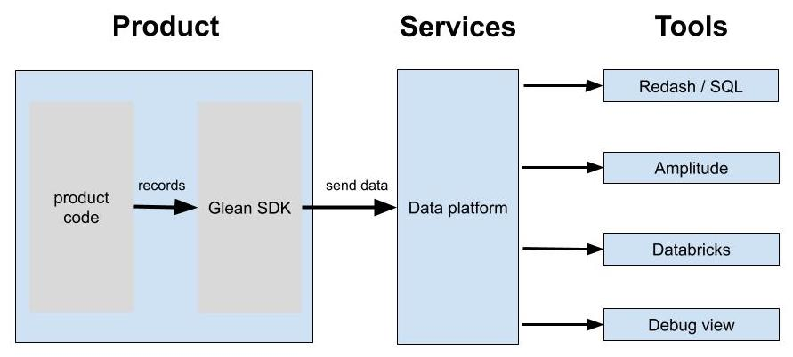

# Glean - product analytics & telemetry

For Mozilla, getting reliable data from our products is critical to inform our decision making. Glean is our new product analytics & telemetry solution that provides that data for our mobile products.
It aims to be easy to integrate, reliable and transparent by providing an SDK and integrated tools.

It currently supports Android products, while iOS support is planned.
Note that this is different from Telemetry for Firefox Desktop ([library](https://firefox-source-docs.mozilla.org/toolkit/components/telemetry/telemetry/index.html), [datasets](choosing_a_dataset.html)), although it provides similar capabilities.

Contents:

<!-- toc -->

# Overview

Glean consists of different pieces:

*   Product-side tools - [the Glean SDK](https://github.com/mozilla-mobile/android-components/blob/master/components/service/glean/README.md) is what products integrate and record data into.
*   Services - this is where the data is stored and made available for analysis in our data platform.
*   Data Tools - these are used to look at the data, performing analysis and setting up dashboards.

# What does it offer

Glean is designed to support typical product analytics use-cases and encourage best practices by requiring clearly defined metrics through the following:

**Basic product analytics are collected out-of-the-box in a standardized way.**
A baseline of analysis is important for all our mobile application, from counting active users to retention and session times. This is supported out-of-the-box by the library and work consistently across our mobile products.

**No custom code is required for adding new metrics to a product.**
To make engineers more productive, the SDK keeps the amount of instrumentation code required for metrics as small as possible. Engineers only need to specify what they want to instrument, with which semantics and then record the data using the Glean SDK. The SDK takes care of storing & sending that data reliably.

**Following [lean data practices](https://leandatapractices.com/) through SDK design choices.**
It's easy to limit data collection to what's necessary and documentation can be generated easily, aiding both transparency & understanding for analysis.

**Better data tooling integration due to standardized data types & registering them in machine-readable files.**
By having collected data described in machine-readable files, our various data tools can read them and support metrics automatically, without manual work.

**Due to common high-level concepts for metrics, APIs & data tools can better match the use-cases.**
To make the choice easier for which metric type to use, we are introducing higher-level data types that offer clear and understandable semantics - for example, when you want to count something, you use the _"count"_ type. This also gives us opportunities to offer better tooling for the data, both on the client and for data tooling.

**Basic semantics on how the data is collected are clearly defined by the library.**
To make it easier to understand the general semantics of our data, the Glean SDK will define and document when which kind of data will get sent. This gives data analysis common basic semantics.

# How to use Glean

*   [Integrate the Glean SDK / library](https://github.com/mozilla-mobile/android-components/blob/master/components/service/glean/README.md) into your product.
*   [File a data engineering bug](https://bugzilla.mozilla.org/enter_bug.cgi?product=Data%20Platform%20and%20Tools&component=General&short_desc=Glean:%20Enable%20application%20id%20org.mozilla.myProduct) to enable your products application id.
*   [Use Redash](https://sql.telemetry.mozilla.org/) to write SQL queries & build dashboards using your products datasets, e.g.:
    *   `_org_mozilla_fenix_baseline_parquet`
    *   `_org_mozilla_fenix_events_parquet`
    *   `_org_mozilla_fenix_metrics_parquet`
*   _(Work in progress)_ Use events and [Amplitude](https://sso.mozilla.com/amplitude) for product analytics.
*   [Use Databricks](https://sso.mozilla.com/databricks) for deep-dive analysis.
*   [Use the Glean debug ping viewer](https://docs.google.com/document/d/1LdXgXxOTDQQqD7_yGYj9TE80JQ3Wq2nx5vrgn7oDqt8/) for QA & development.
*   _(Work in progress)_ For experimentation, you will be able to use our [Android experiments library](https://github.com/mozilla-mobile/android-components/blob/master/components/service/experiments/README.md), which integrates with Glean.

# Contact

*   `#glean` & `#fx-metrics` on slack
*   [`glean-team@mozilla.com`](mailto:glean-team@mozilla.com) to reach out
*   [`fx-data-dev@mozilla.com`](mailto:fx-data-dev@mozilla.com) for announcements etc.

# References

*   [Glean SDK](https://github.com/mozilla-mobile/android-components/blob/master/components/service/glean/) - the SDK/library that products integrate.
*   [Reporting issues & bugs for the Glean SDK](https://bugzilla.mozilla.org/enter_bug.cgi?product=Data%20Platform%20and%20Tools&component=Glean%3A%20SDK).
*   Datasets documentation (TBD)
