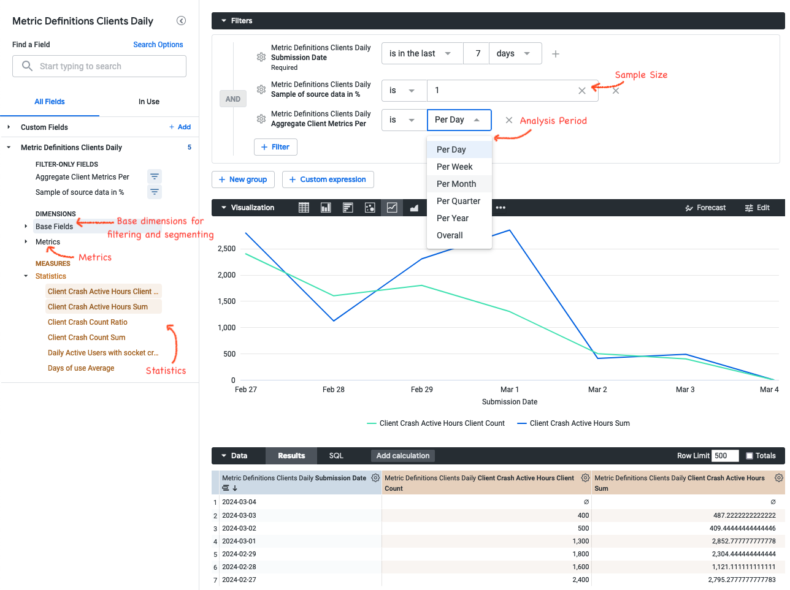

# Metric Hub

Metric Hub is a [repository](https://github.com/mozilla/metric-hub) that contains metric, data source and segment definitions that have been
reviewed and can be seen as the source of truth.
Definitions that are part of Metric Hub can be referenced in configurations of other tooling as well, such as [Jetstream](https://experimenter.info/deep-dives/jetstream/overview) and [OpMon](https://docs.telemetry.mozilla.org/cookbooks/operational_monitoring.html?highlight=opmon#operational-monitoring-opmon).

Metric Hub is a "thin" metric layer that lies between the Data Warehouse and consumers, such as analysis tools.
The Data Warehouse contains the datasets and tables referenced in the metric definitions. Analysis tools can reference metrics that are defined in metric-hub.


Available metrics can be found in the [DataHub metrics glossary](https://mozilla.acryl.io/glossaryNode/urn:li:glossaryNode:Metric%20Hub/Contents?is_lineage_mode=false)

## Metrics and Statistics

_Metric_ is a very overloaded term and has different meanings in different parts of our data platform.
In the context of metric-hub there are two key concepts:

- _metric_: A metric describes an aggregation of activities or measurements for a specific entity (e.g. clients, users, ...).
  - Example 1: A metric "Ad Clicks" is defined as `SUM('ad_click')`, counts clicks on ads for individual clients
  - Example 2: A metric "Income" can be calculated as `SUM('money_made')` for individual people
- _statistic_: Statistics summarize the distribution of metrics within a specific time frame and population segment. Statistics are used to derive insights and patterns from the raw metric data
  - Example 1: To get the average number of daily "Ad Clicks" for all Windows clients over the last month, the statistic "Mean" can be applied. To see the distribution of ad clicks across clients in the US, "Frequency Binning" can be applied to the "Ad Clicks" metric data.
  - Example 2: To see the median monthly "Income" for people in the US, the "Percentile" statistic can be applied on the calculated "Income" metric aggregated over a month, with the 50th percentile representing the median
  - Different statistics are available for different tools that use metrics.

## Adding definitions

To add or update a project configuration, open a pull request against [metric-hub](https://github.com/mozilla/metric-hub).
CI checks will validate that the structure of the definitions as well as the SQL syntax is correct. A review by data science is required before changes can get merged.

Definitions are part of config files that are written in [TOML](https://toml.io/en/).
These definitions files are platform-specific and located in the [`definitions/` directory of the metric-hub repository](https://github.com/mozilla/metric-hub/tree/main/definitions). Definitions files are named after the platform they target, for example definitions related to Firefox Desktop are in the `firefox_desktop.toml` file.

Generally, configuration files have four main sections: `[data_sources]`, `[metrics]`, `[segments]`, and `[dimensions]`. All of these sections are optional.

Lines starting with a `#` are comments and have no effect.

### `[data_sources]` Section

Data sources specify the tables data should be queried from.

```toml
[data_sources]

[data_sources.main_v1]
# FROM expression - often just a fully-qualified table name. Sometimes a subquery.
from_expression = "mozdata.telemetry.main"

# SQL snippet specifying the submission_date column
submission_date_column = "submission_date"

[data_sources.events_memory_v1]
# FROM expression - subquery
from_expression = """
    (
        SELECT
            *
        FROM `moz-fx-data-shared-prod.telemetry.events`
        WHERE
            event_category = 'memory_watcher'
    )
"""
submission_date_column = "submission_date"
```

Data sources can be joined with other data sources:

```toml
# Join the `baseline` data source with the `metrics` data source.
# Definitions for both data sources must exist.
[data_sources.baseline.joins.metrics]
relationship = "many_to_many"  # this determines the type of JOIN used; options: many_to_many, one_to_one, one_to_many, many_to_one; default: many_to_many
on_expression = """  # SQL expression specifying the JOIN condition; default join is on client_id_column and submission_date_columns
  baseline.client_id = metrics.client_id AND
  baseline.submission_date = metrics.submission_date
"""
```

Wildcard character can be used to apply joins to multiple data sources:

```toml
# Apply join to all data sources prefixed with user_
[data_sources.user_'*'.joins.metrics]
# [default] relationship = many_to_many
# [default] on_expression = """  # SQL expression specifying the JOIN condition; default join is on client_id_column and submission_date_columns
#  baseline.{client_id_column} = metrics.{client_id_column} AND
#  baseline.{submission_date_column} = metrics.{submission_date_column}
# """
```

> If there are multiple wildcard expression targeting a data source, the definition that is provided
> last in the config file has precedence. This means `joins` expressions can be overwritten by
> re-defining a data source definition later on in the config file.

### `[metrics]` Section

The metrics sections allows to specify metrics. A metric aggregates data and is associated with some data source.

Each metric is identified by a unique slug and a version (versions are optional but strongly encouraged), and can be defined by adding a new section with a name like:

`[metrics.<new_metric_slug>_v<version>]`

```toml
[metrics]

[metrics.memory_pressure_count_v1]

# The data source to use. Use the slug of a data source defined in a platform-specific config,
# or else define a new data source (see above).
data_source = "events_memory"

# A clause of a SELECT expression with an aggregation
select_expression = "SUM(SAFE_CAST(SPLIT(event_string_value, ',')[OFFSET(1)] AS NUMERIC))"

# Type of the metric to be evaluated.
# This is used to determine the method of aggregation to be applied.
# Either "scalar" or "histogram".
# scalar = a single value is returned
# histogram = an array of scalars is returned
type = "scalar"

# A friendly metric name displayed in dashboards.
friendly_name = "Memory Pressure Count"

# A description that will be displayed by dashboards.
description = "Number of memory pressure events"

# An optional category that can be any string value. It's currently not being used but in the future, this could be used to visually group different metrics by category.
category = "performance"

# An optional owner or team owning this metric. Can be a string or list of strings.
owner = "example@mozilla.org"

# Whether the metric is deprecated and should no longer be used (optional).
deprecated = false

# An optionl string ('gold', 'silver', or 'bronze') that is the metric's current level according to the Metric Levels Taxonomy (https://mozilla-hub.atlassian.net/wiki/spaces/DATA/pages/610894135/Metrics#Metric-Levels-Taxonomy).
level = "gold"
```

Since metrics aggregate data, the metric SQL definition must contain some aggregation method (like `SUM`, `COUNT`, ...) to be valid.

Existing metrics cannot be removed after they have been added to Metric Hub. Other tools or configurations might still reference the
deleted metric resulting in their computations to break. Instead, to indicate that a metric should no longer be used `deprecated` should
be set to `true`.

#### Statistics

Statistics reduce a set of metric values to a summary describing the population.
Any summarization of the client-level data can be implemented as a statistic.

Different statistics are available for different tools. To specify which statistic should be applied to a specific metric, use the config files that live in the folders specific to each tool that integrates metric-hub. For example, to specify that certain statistics should be applied to the `memory_pressure_count` metric in Looker, go to the `looker/definitions/firefox_desktop.toml` file and specify the statistics:

```toml
# Specify which statistic to use for a metric
[metrics.memory_pressure_count.statistics]
client_count = {}
mean = {}
```

Wildcard expressions can be used to express that a specific statistic should be available for multiple metrics:

```toml
# All metrics with the bookmark_ prefix should have the mean computed
[metrics.bookmark_'*'.statistics.mean]

# All metrics should have client counts computed (not recommended to apply statistic to every metric)
[metrics.'*'.statistics.client_count]
```

New statistics need to be implemented inside the tooling that uses metric definitions.

### `[dimensions]` Section

Dimensions define a field or dimension on which the client population should be segmented. Dimensions are used in OpMon. For segmenting client populations clients see the `[segments]` section.

For example:

```toml
[dimensions]

[dimensions.os_v1]
# The data source to use. Use the slug of a data source defined in a platform-specific config,
# or else define a new data source (see above).
data_source = "main"

# SQL snippet referencing a field whose values should be used to segment the client population.
select_expression = "normalized_os"
```

### `[segments]` Section

Segments specify a boolean condition that determines whether a client is part of the segment. Segment are used in Jetstream, for segmenting client populations in OpMon please see the `[dimensions]` section.

```toml
[segments.my_segment_v1]
# Note the aggregation function; these expressions are grouped over client_id
select_expression = '{{agg_any("is_default_browser")}}'data_source = "my_data_source"

# segments require their own data source to be defined
# the standard `data_source`s cannot be used for segments
[segments.data_sources.my_data_source_v1]
from_expression = '(SELECT submission_date, client_id, is_default_browser FROM my_cool_table)'
```

Segment SQL snippets need to be boolean expressions to be valid.

## Accessing and Using Metric Definitions

All the definitions are automatically available in some of our tooling:

- [Jetstream](https://experimenter.info/deep-dives/jetstream/overview) - used for analyzing experiments
- [mozanalysis](https://github.com/mozilla/mozanalysis) - a Python library which standardizes how experiment data is analyzed at Mozilla
- [OpMon](https://docs.telemetry.mozilla.org/cookbooks/operational_monitoring.html) - a tool for monitoring operational metrics
- [bigquery-etl](https://github.com/mozilla/bigquery-etl) - used for writing ETL queries
- [Looker](https://mozilla.cloud.looker.com) - used for creating dashboards and ad-hoc analyses

### Using Metrics in ETL queries

Metrics and data sources can be referenced in query and view definitions in [bigquery-etl](https://github.com/mozilla/bigquery-etl).
Query and view definitions are [Jinja templates](https://jinja.palletsprojects.com/en/3.1.x/) which have access to the `metrics.calculate()` and `metrics.data_source()` functions.

Metrics can be referenced as follows:

```sql
 SELECT
      *
FROM
    {{ metrics.calculate(
    metrics=['days_of_use', 'active_hours'],
    platform='firefox_desktop',
    group_by={'sample_id': 'sample_id', 'channel': 'application.channel'},
    where='submission_date = "2023-01-01"'
    ) }}
```

This query will get translated to:

```sql
SELECT
    *
FROM
    (
    WITH clients_daily AS (
        SELECT
        client_id AS client_id,
        submission_date AS submission_date,
        COALESCE(SUM(active_hours_sum), 0) AS active_hours,
        COUNT(submission_date) AS days_of_use,
        FROM
        mozdata.telemetry.clients_daily
        GROUP BY
        client_id,
        submission_date
    )
    SELECT
        clients_daily.client_id,
        clients_daily.submission_date,
        active_hours,
        days_of_use,
    FROM
        clients_daily
    )
```

The following parameters are available for `metrics.calculate()` to customize the query:

- `metrics`: unique reference(s) to metric definition, all [metric definitions](https://mozilla.github.io/metric-hub/metrics/firefox_desktop/) are aggregations (e.g. SUM, AVG, ...)
- `platform`: platform to compute metrics for (e.g. `firefox_desktop`, `firefox_ios`, `fenix`, ...)
- `group_by`: fields used in the GROUP BY statement; this is a dictionary where the key represents the alias, the value is the field path; `GROUP BY` always includes the configured `client_id` and `submission_date` fields
- `where`: SQL filter clause
- `group_by_client_id`: Whether the field configured as `client_id` (defined as part of the data source specification in metric-hub) should be part of the `GROUP BY`. `True` by default
- `group_by_submission_date`: Whether the field configured as `submission_date` (defined as part of the data source specification in metric-hub) should be part of the `GROUP BY`. `True` by default

Data sources can be referenced as follows:

```sql
SELECT
    *
FROM {{ metrics.data_source(
        data_source="main",
        platform="firefox_desktop",
        where='submission_date = "2023-01-01"'
    )
}}
```

To render queries into raw SQL queries use the `./bqetl query render path/to/query.sql` command. Rendered views and queries are also available on the [`generated-sql` branch in bigquery-etl](https://github.com/mozilla/bigquery-etl/tree/generated-sql). The `bqetl` tooling does support running and publishing artifacts that use Jinja (translating Jinja templates into raw SQL isn't strictly necessary to perform these actions).

### Using Metrics in Python Scripts

Metric definitions can also be imported into Python scripts by using the [`mozilla-metric-config-parser`](https://github.com/mozilla/metric-config-parser). This library automatically parses the definitions in Metric Hub and returns their Python type representations.

```python
from metric_config_parser.config import ConfigCollection

config_collection = ConfigCollection.from_github_repo("https://github.com/mozilla/metric-hub")
metric = config_collection.get_metric_definition(slug="active_hours", app_name="firefox_desktop")
print(metric.select_expression)
```

To use the metrics with Mozanalysis, you'll need `Metric`s not `MetricDefinition`s. For example:

```python
from mozanalysis.config import ConfigLoader
metric = ConfigLoader.get_metric(metric_slug="active_hours", app_name="firefox_desktop")
```

### Using Metrics in Looker

Metric definitions are available in Looker. For each data source a corresponding explore exists in Looker. These explores are prefixed with "Metric Definitions" followed by the data source name. For example, for the Firefox Desktop `clients_daily` data source an explore "Metric Definitions Clients Daily" is available under the Firefox Desktop section.

These explores look like the following:



The side pane is split into different sections:

- **Base Fields**: This section contains dimensions that are useful for filtering or segmenting the population, like channel or operating system. These base fields can be configured in metric-hub (see below).
- **Metrics**: This section contains all metrics that are based on the data source represented by the explore. These metrics describe an aggregation of activities or measurements on a per-client basis.
- **Statistics**: This sections contains the [statistics that have been defined in metric-hub on top of the metric definitions](https://github.com/mozilla/metric-hub/tree/main/looker) as measures. These statistics summarize the distribution of metrics within a specific time frame, population and/or segment and are used to derive insights and patterns from the raw metric data. Statistics have to be defined manually under the [`looker/` directory in metric-hub](https://github.com/mozilla/metric-hub/tree/main/looker).
- **Sample of source data**: Defines the sample size that should be selected from the data source. Decreasing the sample size will speed up getting results in Looker, however it might decrease the accuracy. The results are being adjusted based on the sample size. For example, if a 1% sample is being used, then certain statistic results (like sum, count) will be multiplied by 100.
- **Aggregate Client Metrics Per ...**: This parameter controls the time window over which metrics are aggregated per client. For example, this allows to get a weekly average of a metric, a maximum of a metric over the entire time period. By default, aggregations are on a daily basis.

#### Getting Metrics into Looker

Metric definitions will be available in the "Metric Definition" explores for metrics that have been added to the [`definitions/` folder in metric-hub](https://github.com/mozilla/metric-hub/tree/main/definitions).

Statistics on top of these metrics need to be defined in the [`looker/` folder in metric-hub](https://github.com/mozilla/metric-hub/tree/main/looker). Statistics currently supported by Looker are:

- `sum`
- `count`
- `average`
- `min`
- `max`
- `client_count`: distinct count of clients where the metric value is >0
- `ratio`: ratio between two metrics. When configuring the statistic metric slugs need to be provided for the `numerator` and `denominator` parameters
- `dau_proportion`: Ratio between the metric and active user counts

To get more statistics added, please reach out on the [#data-help](https://mozilla.slack.com/archives/C4D5ZA91B) Slack channel.

To filter and segment metrics in Looker, data sources that expose fields as dimensions can be configured in metric-hub. These base field data sources need to be joined with the metric data sources. Wildcard characters can be used to apply these joins to multiple data sources:

```toml
[data_sources.looker_base_fields]
select_expression = """
    SELECT
        submission_date,
        client_id,
        os,
        country,
        channel
    FROM
        mozdata.telemetry.clients_daily
"""
columns_as_dimensions = true  # expose the selected fields as dimensions in Looker

# Join `looker_base_fields` on to all the data sources that are in scope for the current file (i.e., data sources for the current application)
# The selected fields in `looker_base_fields` will show up as dimensions for all the metrics
[data_sources.'*'.joins.looker_base_fields]

# Overwrite the join, to allow for a different data source to be used as base field data source
[data_sources.baseline.joins.some_other_datasource]
relationship = "many_to_many"
on_expression = "baseline.client_id = some_other_datasource.client_id"
```

#### Example Use Cases

Some stakeholders would like to analyze crash metrics for Firefox Desktop in Looker. First, relevant metrics, such as number of socket crashes, need to be [added to `definitions/firefox_desktop.toml`](https://github.com/mozilla/metric-hub/blob/4ef7e2ef8a53c90f77a692af4c82ef31be8bf369/definitions/firefox_desktop.toml#L1577C10-L1593C11):

```toml
[metrics.socket_crash_count_v1]
select_expression = "SUM(socket_crash_count)"
data_source = "clients_daily"
friendly_name = "Client Crash Count"
description = "Number of Socket crashes by a single client. Filter on this field to remove clients with large numbers of crashes."

[metrics.socket_crash_active_hours_v1]
select_expression = "SUM(IF(socket_crash_count > 0, active_hours_sum, 0))"
data_source = "clients_daily"
friendly_name = "Client Crash Active Hours"
description = "Total active hours of a client with socket crashes"
```

To summarize these metrics for specific channels, operating systems, etc, statistics need to be defined in [`looker/definitions/firefox_desktop.toml` in metric-hub](https://github.com/mozilla/metric-hub/blob/4ef7e2ef8a53c90f77a692af4c82ef31be8bf369/looker/definitions/firefox_desktop.toml#L3C10-L9):

```toml
[metrics.socket_crash_count_v1.statistics.sum]

[metrics.socket_crash_active_hours_v1.statistics.sum]

[metrics.socket_crash_active_hours_v1.statistics.client_count]

[metrics.socket_crash_count_v1.statistics.ratio]
numerator = "socket_crash_count_v1.sum"
denominator = "socket_crash_active_hours_v1.sum"
```

These statistics allow to determine the total number of crashes, total number of hours with crashes, how many clients were affected and so on.

The [Metric Definitions Clients Daily explore in Looker](https://mozilla.cloud.looker.com/explore/firefox_desktop/metric_definitions_clients_daily?qid=KxzAcgpqBQEzaCcVxrUA3w&toggle=fil,vis) now exposes the defined metrics in statistics which are ready to be used in dashboards or ad-hoc analyses.

## FAQ

### Should metrics be defined in the metric definition, data source definition or source table?

Definitions for metrics can be encoded at different levels. It is preferable to specify the SQL that defines how a metric should be computed as much upstream as possible. This allows the most flexible usage of metric definitions.

Ideally, metrics should be defined in the `[metrics]` section. However in some cases metrics might rely on more complex logic. For example, if some more complicated unnesting of fields or `JOIN`s across multiple tables are required it might make sense to move the metric computation into the `[data_sources]` definition and then simply reference the field in the `[metrics]` section. The main drawback of this is that if users want to find the definition they will have to go one layer deeper and check how the data source is defined versus just having to look at the metric definition itself.

For computationally expensive metrics it can make sense to set up an ETL job that computes the metrics on a daily basis and writes results to a separate table. This table can serve as basis of a data source which can then be used to define a metric.
