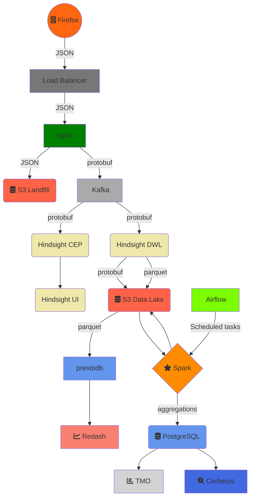
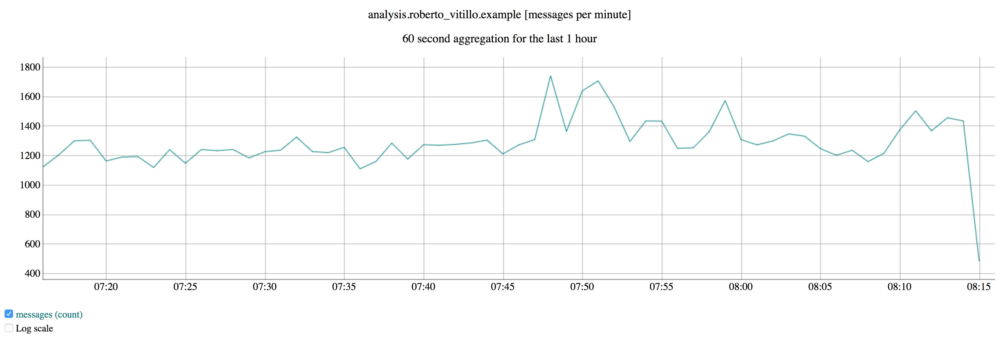
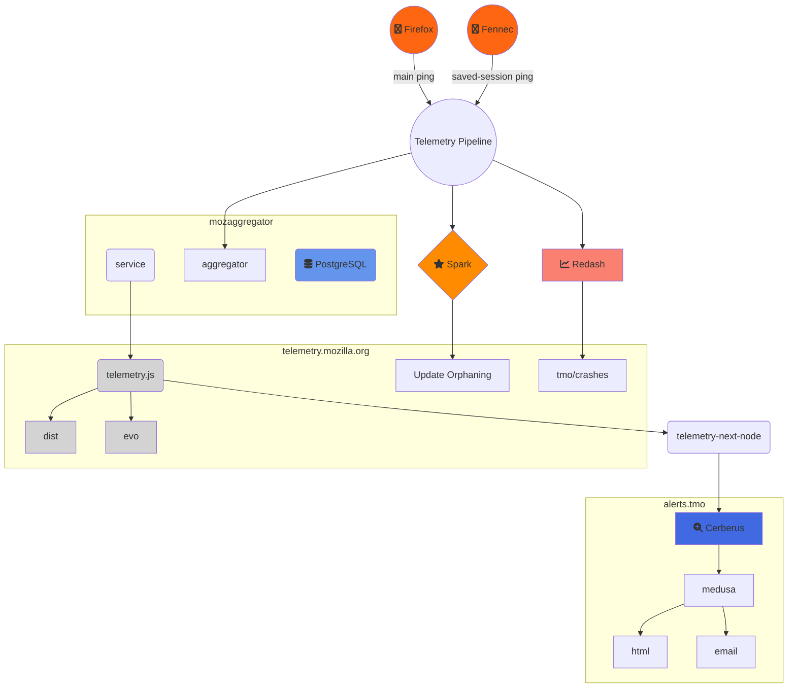
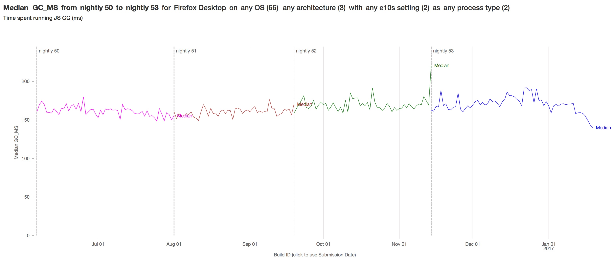
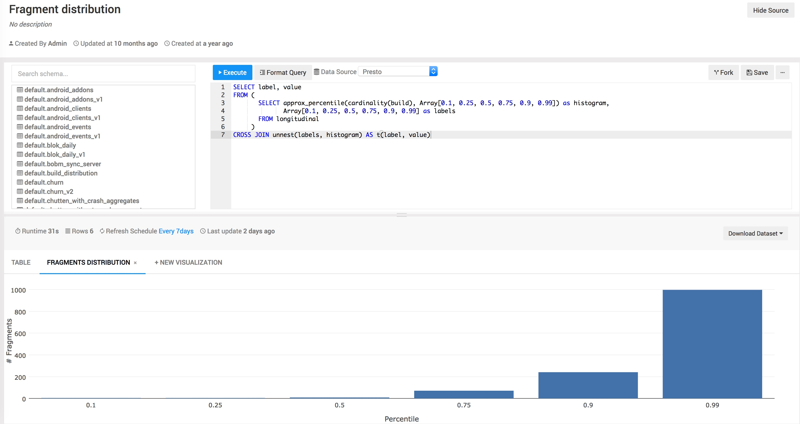

# An overview of Mozilla’s Data Pipeline

> Note: This article describes the AWS-based pipeline which
> [has been retired](https://bugzilla.mozilla.org/show_bug.cgi?id=1598815);
> the client-side concepts here still apply, but this article has been updated
> to reflect the [new GCP pipeline](gcp_data_pipeline.md).

This post describes the architecture of Mozilla’s data pipeline, which is used to collect Telemetry data from our users and logs from various services. One of the cool perks of working at Mozilla is that most of what we do is out in the open and because of that I can do more than just show you some diagram with arrows of our architecture; I can point you to the code, script & configuration that underlies it!

To make the examples concrete, the following description is centered around the collection of Firefox Telemetry data. The same tool-chain is used to collect, store and analyze data coming from disparate sources though, such as service logs.

# Firefox

There are different APIs and formats to [collect data] in Firefox, all suiting different use cases:

- [histograms] – for recording multiple data points;
- [scalars] – for recording single values;
- [timings] – for measuring how long operations take;
- [events] – for recording time-stamped events.

These are commonly referred to as _[probes]_. Each probe must declare the [collection policy] it conforms to: either _release_ or _prerelease_. When adding a new measurement data-reviewers carefully inspect the probe and eventually approve the requested collection policy:

- Release data is collected from all Firefox users.
- Prerelease data is collected from users on Firefox Nightly and Beta channels.

Users may choose to turn the data collection off in preferences.

A _session_ begins when Firefox starts up and ends when it shuts down. As a session could be long-running and last weeks, it gets sliced into smaller logical units called [subsessions]. Each subsession generates a batch of data containing the current state of all probes collected so far, i.e. a [main ping], which is sent to our servers. The main ping is just one of the many [ping types] we support. Developers can [create their own ping types] if needed.

_Pings_ are submitted via an [API] that performs a HTTP POST request to our edge servers. If a ping fails to successfully [submit] (e.g. because of missing internet connection), Firefox will store the ping on disk and retry to send it until the maximum ping age is exceeded.

# Kafka

HTTP submissions coming in from the wild hit a [load balancer] and then an NGINX [module]. The [module] accepts data via a [HTTP request] which it wraps in a Hindsight protobuf message and forwards to two places: a Kafka cluster and a short-lived S3 bucket (landfill) which acts as a fail-safe in case there is a processing error and/or data loss within the rest of the pipeline. The deployment scripts and configuration files of NGINX and Kafka live in a [private repository].

The data from Kafka is read from the Complex Event Processors (CEP) and the Data Warehouse Loader (DWL), both of which use Hindsight.

# Hindsight

[Hindsight], an open source stream processing software system developed by Mozilla as [Heka]’s successor, is useful for a wide variety of different tasks, such as:

- converting data from one format to another;
- shipping data from one location to another;
- performing real time analysis, graphing, and anomaly detection.

Hindsight’s core is a lightweight data processing kernel written in C that controls a set of Lua [plugins] executed inside a sandbox.

The CEP are custom plugins that are created, configured and deployed from an [UI] which produce real-time plots like the number of pings matching a certain criteria. Mozilla employees can [access the UI] and create/deploy their own custom plugin in real-time without interfering with other plugins running.

The DWL is composed of a set of plugins that transform, convert & finally shovel pings into S3 for long term storage. In the specific case of Telemetry data, an input plugin [reads pings from Kafka], [pre-processes] them and [sends batches to S3], our data lake, for long term storage. The data is compressed and partitioned by a set of dimensions, like date and application.

The data has traditionally been serialized to [Protobuf] sequence files which contain some nasty “free-form” JSON fields. Hindsight gained recently the ability to [dump data directly in Parquet form] though.

The deployment scripts and configuration files of the CEP & DWL live in a [private repository].

# Spark

Once the data reaches our data lake on S3 it can be processed with Spark on Mozilla's Databricks instance. Databricks allows Mozilla employees to write custom analyses in notebooks, and also schedule Databricks jobs to run periodically.

As mentioned earlier, most of our data lake contains data serialized to Protobuf with free-form JSON fields. Needless to say, parsing JSON is terribly slow when ingesting Terabytes of data per day. A set of [ETL jobs], written in Scala by Data Engineers and scheduled with [Airflow], create [Parquet views] of our raw data. We have a Github repository [telemetry-batch-view] that showcases this.

# Aggregates Dataset

A dedicated Spark job feeds daily aggregates to a PostgreSQL database which powers a [HTTP service] to easily retrieve faceted roll-ups. The service is mainly used by [TMO], a dashboard that visualizes distributions and time-series, and [Cerberus](https://github.com/mozilla/cerberus/), an anomaly detection tool that detects and alerts developers of changes in the distributions. Originally the sole purpose of the Telemetry pipeline was to feed data into this dashboard but in time its scope and flexibility grew to support more general use-cases.

# Presto & STMO

We maintain a couple of [Presto clusters] and a centralized Hive metastore to query Parquet data with SQL. The Hive metastore provides an universal view of our Parquet dataset to both Spark and Presto clusters.

Presto, and other databases, are behind a [Redash] service ([STMO]) which provides a convenient & powerful interface to query SQL engines and build dashboards that can be shared within the company. Mozilla maintains its own [fork of Redash] to iterate quickly on new features, but as good open source citizen we push our changes upstream.

# Is that it?

No, not really. If you want to read more, check out [this article](data_pipeline_detail.md). For example, the DWL pushes some of the Telemetry data to Redshift and other tools that satisfy more niche needs. The pipeline ingests logs from services as well and there are many specialized dashboards out there I haven’t mentioned.

There is a vast ecosystem of tools for processing data at scale, each with their pros & cons. The pipeline grew organically and we added new tools as new use-cases came up that we couldn’t solve with our existing stack. There are still scars left from that growth though which require some effort to get rid of, like ingesting data from schema-less format.

[collect data]: https://firefox-source-docs.mozilla.org/toolkit/components/telemetry/telemetry/collection/index.html
[histograms]: https://firefox-source-docs.mozilla.org/toolkit/components/telemetry/telemetry/collection/histograms.html
[scalars]: https://firefox-source-docs.mozilla.org/toolkit/components/telemetry/telemetry/collection/scalars.html
[timings]: https://firefox-source-docs.mozilla.org/toolkit/components/telemetry/telemetry/collection/measuring-time.html
[events]: https://firefox-source-docs.mozilla.org/toolkit/components/telemetry/telemetry/collection/events.html
[probes]: ../../datasets/new_data.md
[collection policy]: https://wiki.mozilla.org/Firefox/Data_Collection
[subsessions]: https://firefox-source-docs.mozilla.org/toolkit/components/telemetry/telemetry/concepts/sessions.html#subsessions
[main ping]: https://firefox-source-docs.mozilla.org/toolkit/components/telemetry/telemetry/data/main-ping.html
[ping types]: https://firefox-source-docs.mozilla.org/toolkit/components/telemetry/telemetry/concepts/pings.html#ping-types
[create their own ping types]: https://firefox-source-docs.mozilla.org/toolkit/components/telemetry/telemetry/collection/custom-pings.html
[api]: https://searchfox.org/mozilla-central/rev/501eb4718d73870892d28f31a99b46f4783efaa0/toolkit/components/telemetry/app/TelemetryController.jsm#231
[submit]: https://firefox-source-docs.mozilla.org/toolkit/components/telemetry/telemetry/concepts/submission.html#submission
[load balancer]: https://aws.amazon.com/elasticloadbalancing/
[module]: https://github.com/mozilla-services/nginx_moz_ingest
[http request]: https://wiki.mozilla.org/CloudServices/DataPipeline/HTTPEdgeServerSpecification
[hindsight]: https://github.com/mozilla-services/hindsight
[heka]: https://github.com/mozilla-services/heka
[plugins]: https://github.com/mozilla-services/hindsight/blob/9593668e84a642aff9dd95ccc648b6585948abfe/docs/index.md
[ui]: https://github.com/mozilla-services/hindsight_admin
[access the ui]: BROKEN:https://pipeline-cep.prod.mozaws.net/
[reads pings from kafka]: https://github.com/mozilla-services/lua_sandbox_extensions/blob/0895238e32d25241ef46f561e43039beb201c7cd/kafka/sandboxes/heka/input/kafka.lua
[pre-processes]: https://github.com/mozilla-services/lua_sandbox_extensions/blob/5d8907ee9f1a20e3a02bfe5b57d4312b173487a3/moz_telemetry/io_modules/decoders/moz_telemetry/ping.lua
[sends batches to s3]: https://github.com/mozilla-services/lua_sandbox_extensions/blob/5d8907ee9f1a20e3a02bfe5b57d4312b173487a3/moz_telemetry/sandboxes/heka/output/moz_telemetry_s3.lua
[protobuf]: https://hekad.readthedocs.io/en/latest/message/index.html#stream-framing
[dump data directly in parquet form]: https://github.com/mozilla-services/lua_sandbox_extensions/pull/48
[private repository]: https://github.com/mozilla-services/puppet-config/tree/02f716a3e0df1117fc2494b41e85a1416f8e2a64/pipeline
[an api]: https://mozilla.github.io/python_moztelemetry/api.html#module-moztelemetry.dataset
[emr]: https://github.com/mozilla/emr-bootstrap-spark/
[etl jobs]: https://github.com/mozilla/telemetry-batch-view
[airflow]: https://github.com/mozilla/telemetry-airflow/
[parquet views]: ../choosing_a_dataset.md
[telemetry-batch-view]: https://github.com/mozilla/telemetry-batch-view/
[http service]: https://github.com/mozilla/python_mozaggregator/#api
[tmo]: https://telemetry.mozilla.org/
[presto clusters]: https://github.com/mozilla/emr-bootstrap-presto
[redash]: https://redash.io/
[stmo]: https://sql.telemetry.mozilla.org/
[fork of redash]: https://github.com/mozilla/redash
