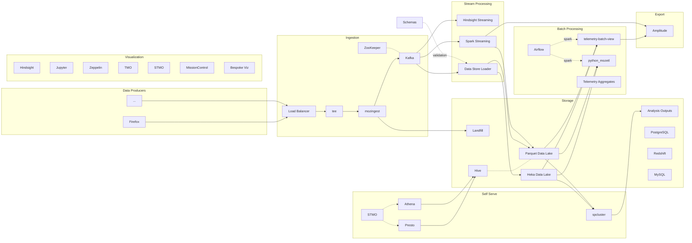

# A Detailed Look at the Data Platform

For a more gentle introduction to the data platform, please read the [Pipeline Overview](data_pipeline.md) article.

This article goes into more depth about the architecture and flow of data in the platform.

## The Entire Platform

The full detail of the platform can get quite complex, but at a high level the structure is fairly simple.


Each of these high-level parts of the platform are described in more detail below.

## Data Producers

By far most data handled by the Data Platform is [produced by Firefox][fx_telemetry_docs]. There are other producers, though, and the eventual aim is to generalize data production using a client SDK or set of standard tools.

Most data is submitted via HTTP POST, but data is also produced in the form of service logs and `statsd` messages.

If you would like to locally test a new data producer, the [`gzipServer`][gzipserver] project provides a simplified server that makes it easy to inspect submitted messages.

## Ingestion


Data arrives as an HTTP POST of an optionally gzipped payload of JSON. See the common [Edge Server] specification for details.

Submissions hit a load balancer which handles the SSL connection, then forwards to a "tee" server, which may direct some or all submissions to alternate backends. In the past, the tee was used to manage the [cutover between different versions of the backend][cutover] infrastructure. It is implemented as an [`OpenResty`][openresty] plugin.

From there, the [`mozingest`][mozingest] HTTP Server receives submissions from the tee and batches and stores data durably on Amazon S3 as a fail-safe (we call this "Landfill"). Data is then passed along via [Kafka] for validation and further processing. If there is a problem with decoding, validation, or any of the code described in the rest of this section, data can be re-processed from this fail-safe store. The `mozingest` server is implemented as an `nginx` module.

Validation, at a minimum, ensures that a payload is valid JSON (possibly compressed). Many document types also have a [JSONSchema specification][mps], and are further validated against that.

Invalid messages are redirected to a separate "errors" stream for debugging and inspection.

Valid messages proceed for further decoding and processing. This involves things like doing GeoIP lookup and discarding the IP address, and attaching some HTTP header info as annotated metadata.

Validated and annotated messages become available for stream processing.

They are also batched and stored durably for later batch processing and ad-hoc querying.

See also the "[generic ingestion]" proposal which aims to make ingestion, validation, storage, and querying available as self-serve for platform users.

##### Data flow for valid submissions


##### Other ingestion methods

Hindsight is used for [ingestion of logs][hslog] from applications and services, it supports parsing of log lines and appending similar metadata as the HTTP ingestion above (timestamp, source, and so on).

[`Statsd`][statsd] messages are ingested in the usual way.

## Storage


[Amazon S3] forms the backbone of the platform storage layer. The primary format used in the Data Lake is [parquet], which is a strongly typed columnar storage format that can easily be read and written by [Spark], as well as being compatible with SQL interfaces such as [Hive] and [Presto]. Some data is also stored in [Heka-framed protobuf][heka_protobuf] format. This custom format is usually reserved for data where we do not have a complete [JSONSchema specification][mps].

Using S3 for storage avoids the need for an always-on cluster, which means that data at rest is inexpensive. S3 also makes it very easy to automatically expire (delete) objects after a certain period of time, which is helpful for implementing data retention policies.

Once written to S3, the data is typically treated as immutable - data is not appended to existing files, nor is data normally updated in place. The exception here is when data is back-filled, in which case previous data may be overwritten.

There are a number of other types of storage used for more specialized applications, including relational databases (such as PostgreSQL for the [Telemetry Aggregates]) and NoSQL databases (DynamoDB is used for a backing store for the [TAAR project]). Reading data from a variety of RDBMS sources is also supported via STMO.

The data stored in Heka format is [readable from Spark](../../tools/spark.md) using libraries in [Scala][moztelemetry] or [Python][py_dataset].

Parquet data can be read and written natively from Spark, and many datasets are indexed in a [Hive] Metastore, making them available through a SQL interface on STMO and in notebooks via Spark SQL. Many other SQL data sources are also made available via STMO, see [this article](../../tools/stmo.md) for more information on accessing data using SQL.

There is a separate data store for self-serve **Analysis Outputs**, intended to keep ad-hoc, temporary data out of the Data Lake. This is implemented as a separate S3 location, with personal output locations prefixed with each person's user id, similar to the layout of the `/home` directory on a Unix system.

Analysis outputs can also be made public using the **Public Outputs** bucket. This is a web-accessible S3 location for powering public dashboards. This public data is available at `https://analysis-output.telemetry.mozilla.org/<job name>/data/<files>`.

## Stream Processing

Stream processing is done using [Hindsight] and [Spark Streaming].

Hindsight allows you to run [plugins written in Lua inside a sandbox][lua_sandbox]. This gives a safe, performant way to do self-serve streaming analysis. Hindsight plugins do the initial data validation and decoding, as well as writing out to long-term storage in both [Heka-framed protobuf][heka_protobuf] and [parquet][direct2parquet] forms.

Spark Streaming is used to read from Kafka and perform [low-latency ETL and aggregation tasks][telemetry-streaming]. These aggregates are currently used by [Mission Control] and are also available for querying via [STMO].

## Batch Processing

Batch processing is done using [Spark]. Production ETL code is written in both [Python][python_mozetl] and [Scala][telemetry-batch-view].

There are [Python][py_dataset] and [Scala][moztelemetry] libraries for reading data from the Data Lake in [Heka-framed protobuf][heka_protobuf] form, though it is much easier and more performant to make use of a [derived dataset](../../concepts/choosing_a_dataset.md) whenever possible.

Datasets in parquet format can be read natively by Spark, either using Spark SQL or by reading data directly from S3.

Data produced by production jobs go into the Data Lake, while output from ad-hoc jobs go into Analysis Outputs.

Job scheduling and dependency management is done using [Airflow]. Most jobs run once a day, processing data from "yesterday" on each run. A typical job launches a cluster, which fetches the specified ETL code as part of its bootstrap on startup, runs the ETL code, then shuts down upon completion. If something goes wrong, a job may time out or fail, and in this case it is retried automatically.

## Self Serve Data Analysis

```mermaid
graph TD
  subgraph Storage
    lake[Data Lake]
    s3_output_public[Public Outputs]
    s3_output_private[Analysis Outputs]
  end
  subgraph STMO
    STMO[STMO] -->|read| lake
  end
  subgraph TMO
    evo[Evolution Dashboard]
    histo[Histogram Dashboard]
    agg[Telemetry Aggregates]
    evo -.- agg
    histo -.- agg
  end
  subgraph Databricks
    db_notebook[Notebook]
    db_notebook -->|read + write| lake
  end
```

Most of the data analysis tooling has been developed with the goal of being "self-serve". This means that people should be able to access and analyze data on their own, without involving data engineers or operations. Thus can data access scale beyond a small set of people with specialized knowledge of the entire pipeline.

The use of these self-serve tools is described in the [Getting Started] article. This section focuses on how these tools integrate with the platform infrastructure.

##### STMO: SQL Analysis

[STMO] is a customized [Redash] installation that provides self-serve access to a a variety of different [datasets](../../concepts/choosing_a_dataset.md). From here, you can query data in the Parquet Data Lake as well as various RDBMS data sources.

STMO interfaces with the data lake using both [Presto] and Amazon [Athena]. Each has its own data source in STMO. Since Athena does not support user-defined functions, datasets with HyperLogLog columns, such as [`client_count_daily`](../../datasets/obsolete/client_count_daily/reference.md), are only available via Presto..

Different **Data Sources** in STMO connect to different backends, and each backend might use a slightly different flavor of SQL. You should find a link to the documentation for the expected SQL variant next to the Data Sources list.

Queries can be run just once, or scheduled to run periodically to keep data up-to-date.

There is a command-line interface to STMO called [St. Mocli], if you prefer writing SQL using your own editor and tools.

##### Databricks: Managed Spark Analysis

Our Databricks instance (see [Databricks docs]) offers another notebook interface for doing analysis in Scala, SQL, Python and R.

Databricks provides an always-on shared server which is nice for quick data investigations.

##### TMO: Aggregate Graphs

[TMO] provides easy visualizations of histogram and scalar measures over time. Time can be in terms of either builds or submission dates. This is the most convenient interface to the Telemetry data, as it does not require any custom code.

## Visualization

There are a number of visualization libraries and tools being used to display data.

##### TMO Dashboards

The landing page at [`telemetry.mozilla.org`][tmo] is a good place to look for existing graphs, notably the [measurement dashboard] which gives a lot of information about histogram and scalar measures collected on pre-release channels.

##### Notebooks

Use of interactive notebooks has become a standard in the industry, and Mozilla makes heavy use of this approach. Databricks makes it easy to run, share, and schedule notebooks.

##### Others

[STMO] lets you query the data using SQL, but it also supports a number of useful visualizations.

[Hindsight's web interface][cep] has the ability to visualize time-series data.

[Mission Control] gives a low-latency view into release health.

Many bespoke visualizations are built using the [Metrics Graphics] library as a display layer.

## Monitoring and Alerting

There are multiple layers of monitoring and alerting.

At a low level, the system is monitored to ensure that it is functioning as expected. This includes things like machine-level resources (network capacity, disk space, available RAM, CPU load) which are typically monitored using [DataDog].

Next, we monitor the "transport" functionality of the system. This includes monitoring incoming submission rates, payload sizes, traffic patterns, schema validation failure rates, and alerting if anomalies are detected. This type of anomaly detection and alerting is handled by [Hindsight].

Once data has been safely ingested and stored, we run some automatic regression detection on all Telemetry [histogram measures] using [Cerberus]. This code looks for changes in the distribution of a measure, and emails probe owners if a significant change is observed.

Production ETL jobs are run via [Airflow], which monitors batch job progress and alerts if there are failures in any job. Self-serve batch jobs running via Databricks also generate alerts upon failure.

Scheduled [STMO] queries may also be configured to generate alerts, which is used to monitor the last-mile user facing status of derived datasets. STMO may also be used to monitor and alert on high-level characteristics of the data, or really anything you can think of.

## Data Exports

Data is exported from the pipeline to a few other tools and systems. Examples include integration with [Amplitude] for mobile and product analytics and shipping data to other parts of the Mozilla organization.

There are also a few data sets which are made publicly available, such as the [Firefox Hardware Report].

## Bringing it all together

Finally, here is a more detailed view of the entire platform. Some connections are omitted for clarity.



[fx_telemetry_docs]: https://firefox-source-docs.mozilla.org/toolkit/components/telemetry/telemetry/data/main-ping.html
[gzipserver]: https://github.com/mozilla/gzipServer
[hindsight]: https://github.com/mozilla-services/hindsight
[telemetry-streaming]: https://github.com/mozilla/telemetry-streaming
[spark streaming]: https://spark.apache.org/docs/latest/structured-streaming-programming-guide.html
[edge server]: http_edge_spec.md
[generic ingestion]: https://docs.google.com/document/d/1PqiF1rF2fCk_kQuGSwGwildDf4Crg9MJTY44E6N5DSk/edit
[mps]: https://github.com/mozilla-services/mozilla-pipeline-schemas
[lua_sandbox]: http://mozilla-services.github.io/lua_sandbox/
[heka_protobuf]: https://hekad.readthedocs.io/en/dev/message/index.html#stream-framing
[direct2parquet]: https://mozilla-services.github.io/lua_sandbox_extensions/parquet/
[mozingest]: https://github.com/mozilla-services/nginx_moz_ingest
[cutover]: https://bugzilla.mozilla.org/show_bug.cgi?id=1302265
[openresty]: http://openresty.org/en/
[amplitude]: https://amplitude.com/
[firefox hardware report]: https://data.firefox.com/dashboard/hardware
[datadog]: http://datadoghq.com/
[cerberus]: https://github.com/mozilla/cerberus
[histogram measures]: https://firefox-source-docs.mozilla.org/toolkit/components/telemetry/telemetry/collection/histograms.html
[airflow]: https://github.com/mozilla/telemetry-airflow
[redash]: https://redash.io
[stmo]: ../../tools/stmo.md
[jupyter]: https://jupyter.org/
[zeppelin]: https://zeppelin.apache.org/
[databricks docs]: https://docs.databricks.com/user-guide/notebooks/index.html
[tmo]: https://telemetry.mozilla.org
[measurement dashboard]: https://telemetry.mozilla.org/new-pipeline/dist.html
[cep]: BROKEN:http://pipeline-cep.prod.mozaws.net/
[mission control]: https://data-missioncontrol.dev.mozaws.net
[metrics graphics]: http://metricsgraphicsjs.org/
[parquet]: https://parquet.apache.org/
[hive]: https://cwiki.apache.org/confluence/display/Hive/Home
[presto]: http://prestosql.io/
[telemetry aggregates]: https://github.com/mozilla/python_mozaggregator/#api
[amazon s3]: https://aws.amazon.com/s3/
[taar project]: https://github.com/mozilla/python_mozetl/blob/master/mozetl/taar/taar_dynamo.py
[py_dataset]: https://mozilla.github.io/python_moztelemetry/api.html#dataset
[moztelemetry]: https://github.com/mozilla/moztelemetry/blob/master/src/main/scala/com/mozilla/telemetry/heka/Dataset.scala
[statsd]: https://github.com/etsy/statsd
[hslog]: https://mozilla-services.github.io/lua_sandbox_extensions/moz_logging/
[python_mozetl]: https://github.com/mozilla/python_mozetl
[telemetry-batch-view]: https://github.com/mozilla/telemetry-batch-view
[getting started]: ../../concepts/analysis_intro.md
[st. mocli]: https://github.com/mozilla/stmocli
[kafka]: https://kafka.apache.org/
[spark]: https://spark.apache.org/docs/latest/index.html
[athena]: https://aws.amazon.com/athena/
