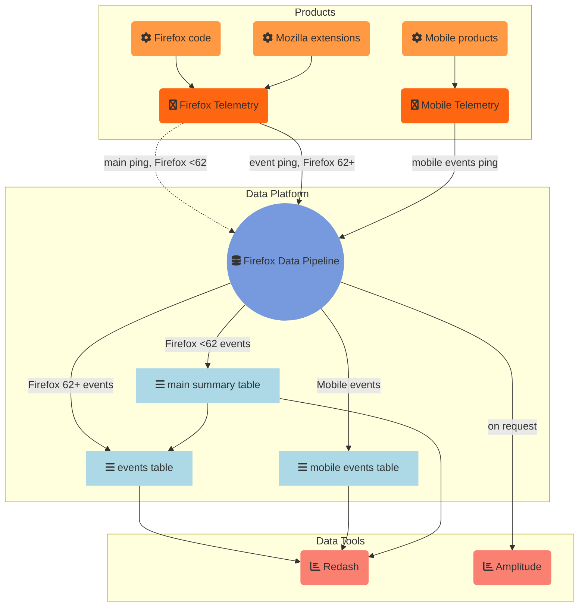

# Event Data Pipeline

We collect event-oriented data from different sources. This data is collected and processed in a
specific path through our data pipeline, which we will detail here.



# Overview

Across the different Firefox teams there is a common need for a more fine grained understanding of
product usage, like understanding the order of interactions or how they occur over time.
To address that our data pipeline needs to support working with event-oriented data.

We specify a common event data format, which allows for broader, shared usage of data processing tools.
To make working with event data feasible, we provide different mechanisms to get the event data
from products to our data pipeline and make the data available in tools for analysis.

# The event format

Events are submitted as an array, e.g.:

```javascript
[
  [2147, "ui", "click", "back_button"],
  [2213, "ui", "search", "search_bar", "google"],
  [
    2892,
    "ui",
    "completion",
    "search_bar",
    "yahoo",
    { querylen: "7", results: "23" },
  ],
  [5434, "dom", "load", "frame", null, { prot: "https", src: "script" }],
  // ...
];
```

Each event is of the form:

```javascript
[timestamp, category, method, object, value, extra];
```

Where the individual fields are:

- `timestamp`: `Number`, positive integer. This is the time in ms when the event was recorded, relative to the main process start time.
- `category`: `String`, identifier. The category is a group name for events and helps to avoid name conflicts.
- `method`: `String`, identifier. This describes the type of event that occurred, e.g. `click`, `keydown` or `focus`.
- `object`: `String`, identifier. This is the object the event occurred on, e.g. `reload_button` or `urlbar`.
- `value`: `String`, optional, may be null. This is a user defined value, providing context for the event.
- `extra`: `Object`, optional, may be null. This is an object of the form `{"key": "value", ...}`, both keys and values need to be strings. This is used for events when additional richer context is needed.

See also the [Firefox Telemetry documentation](https://firefox-source-docs.mozilla.org/toolkit/components/telemetry/telemetry/collection/events.html#serialization-format).

# Event data collection

## Firefox event collection

To collect this event data in Firefox there are different APIs in Firefox, all addressing different
use cases:

- The [_Telemetry event API_](https://firefox-source-docs.mozilla.org/toolkit/components/telemetry/telemetry/collection/events.html)
  allows easy recording of events from Firefox code.
- The [_dynamic event API_](https://firefox-source-docs.mozilla.org/toolkit/components/telemetry/telemetry/collection/events.html#registerevents)
  allows code from Mozilla addons to record new events into Telemetry without shipping Firefox
  code.
- The _[Telemetry WebExtension API](https://searchfox.org/mozilla-central/rev/55da592d85c2baf8d8818010c41d9738c97013d2/toolkit/components/extensions/schemas/telemetry.json#87)_ ([introduced here](https://bugzilla.mozilla.org/show_bug.cgi?id=1280234))
  which allows Mozilla extensions to record new events into Telemetry.

For all these APIs, events will get sent to the pipeline through the
[event ping](https://firefox-source-docs.mozilla.org/toolkit/components/telemetry/telemetry/data/event-ping.html), which gets sent hourly, if any pings were recorded, or up to every 10 minutes whenever 1000 events were recorded.
Before Firefox 62, events were sent through the [main ping](https://firefox-source-docs.mozilla.org/toolkit/components/telemetry/telemetry/data/main-ping.html) instead, with a hard limit of 500 events per ping.
From Firefox 61, all events recorded through these APIs are [automatically counted in scalars](https://bugzilla.mozilla.org/show_bug.cgi?id=1440673).

Finally, [_custom pings_](https://firefox-source-docs.mozilla.org/toolkit/components/telemetry/telemetry/collection/custom-pings.html)
can follow the event data format and potentially connect to the existing tooling with some integration work.

## Mobile event collection

Mobile events data primarily flows through the mobile events ping ([ping schema](https://github.com/mozilla-services/mozilla-pipeline-schemas/tree/master/schemas/telemetry/mobile-event)), from e.g. [Firefox iOS](https://github.com/mozilla-mobile/firefox-ios/wiki/Event-Tracking-with-Mozilla's-Telemetry-Service#event-ping), Firefox for Fire TV and Rocket.

Currently we also collect event data from Firefox Focus through the [`focus-events` ping](https://github.com/mozilla-mobile/focus-ios/wiki/Event-Tracking-with-Mozilla%27s-Telemetry-Service#event-ping),
using the [`telemetry-ios`](https://github.com/mozilla-mobile/telemetry-ios) and
[`telemetry-android`](https://github.com/mozilla-mobile/telemetry-android) libraries.

# Datasets

On the pipeline side, the event data is made available in different datasets:

- [`main_summary`](../choosing_a_dataset.md#mainsummary) has a row for each main ping and includes
  its event payload for Firefox versions before 62.
- [`events`](../../datasets/batch_view/events/reference.md) contains a row for each event received from main pings and event pings. See [this sample query](https://sql.telemetry.mozilla.org/queries/52582/source).
- `telemetry_mobile_event_parquet` contains a row for each mobile event ping. See [this sample query](https://sql.telemetry.mozilla.org/queries/52581/source).
- `focus_events_longitudinal` currently contains events from Firefox Focus.

# Data tooling

The above datasets are all accessible through [STMO](../../tools/stmo.md) and [Spark jobs](../../tools/spark.md).

For product analytics based on event data, we have [Amplitude](https://sso.mozilla.com/amplitude)
(hosted by the IT data team). We can connect our event data sources data to Amplitude.
We have an active connector to Amplitude for mobile events, which can push event data over
daily. For Firefox Desktop events this will be available soon.
