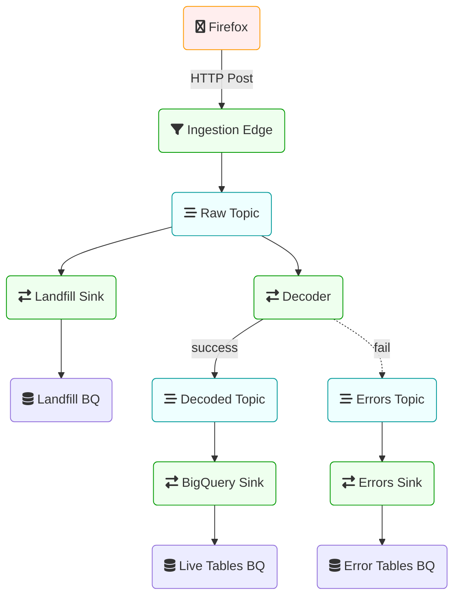

# An overview of Mozilla’s Data Pipeline

This post describes the architecture of Mozilla’s data pipeline,
which is used to collect Telemetry data from our products and logs from various services.

The bulk of the data handled by this pipeline is Firefox Telemetry data, but the
same tool-chain is used to collect, store, and analyze data coming from many
sources, including [Glean](../glean/glean.md) applications.

Here is a simplified diagram of how data is ingested into the data warehouse.

The code for the ingestion pipeline lives in the [`gcp-ingestion`][gcp-ingestion] repository.

## Firefox

There are different APIs and formats to [collect data] in Firefox, all suiting different use cases:

- [histograms] – for recording multiple data points;
- [scalars] – for recording single values;
- [timings] – for measuring how long operations take;
- [events] – for recording time-stamped events.

These are commonly referred to as _[probes]_.
Each probe must declare the [collection policy] it conforms to: either _release_ or _prerelease_.
When adding a new measurement data-reviewers carefully inspect the probe and eventually approve the requested collection policy:

- Release data is collected from all Firefox users.
- Prerelease data is collected from users on Firefox Nightly and Beta channels.

Users may choose to turn the data collection off in preferences.

A _session_ begins when Firefox starts up and ends when it shuts down.
As a session could be long-running and last weeks, it gets sliced into
smaller logical units called [subsessions].
Each subsession generates a batch of data containing the current state
of all probes collected so far, in the form of a [`main` ping], which is
sent to our servers.
The `main` ping is just one of the many [ping types] we support.
Developers can [create their own ping types] if needed.

_Pings_ are submitted via an [API] that performs a HTTP POST request to our edge servers.
If a ping fails to successfully [submit] (e.g. because of missing internet connection),
Firefox will store the ping on disk and retry to send it until the maximum ping age is exceeded.

## Ingestion

Submissions coming in from the wild hit a load balancer and then an
HTTP Server that [accepts POST requests](http_edge_spec.md) containing a
message body of optionally-gzipped JSON.

These messages are forwarded to a PubSub message queue with minimal processing,
and made available in a **Raw** topic.

A [Dataflow] job reads this topic and writes the raw messages to a BigQuery **Landfill** sink.
This Landfill data is not used for analysis, but is stored in its raw form for
recovery and backfill purposes.

If there is a processing error or data-loss downstream in the pipeline, this is an important fail-safe.

## Decoding

Once the raw data has been added to the PubSub queue, it's time to process it.

The decoder is implemented as a [Dataflow] job, and is written in Java.

The decoding process tackles decompression, parsing, validation, deduplication,
and enrichment of incoming messages.

After a message is decompressed and parsed as JSON, we apply [JSONSchema validation]
to ensure that submissions are well-formed.

Sometimes duplicate submissions are sent to the pipeline, either due to normal
networking failures or [weird behaviour] out there in the world.
We watch for duplicate submissions, and discard any subsequent occurrences of
already-seen records.

Submissions are also enriched with some metadata about the request itself,
including things like HTTP headers, GeoIP information, and submission timestamp.

Messages that pass _successfully_ through all these steps are written to another
PubSub **Decoded** topic.

A failure in any of these steps results in messages being sent to the **Errors** sink.
This separates invalid data from valid data, while still making it available for
monitoring and debugging.
This is a good way to keep an eye on the health of the pipeline and the data
flowing through.

## Data Warehouse

Decoded data is ultimately written out to BigQuery, which acts as the data warehouse.

By this time, incoming data has already been validated against the corresponding
JSONSchema specification for each document type.
Part of the decoding process above transforms this JSON structure into something
more easily represented in BigQuery.
One important transformation here is to convert all incoming fields from
`UPPER CASE` or `camelCase` to `snake_case`.
Another important transformation is to incorporate metadata about known probes
and metrics to generate more complete schemas.

This is handled by a combination of the decoder above, the [schema transpiler]
and the [schema generator].
The result are tables that contains SQL-friendly field names for all known
measures, as implemented in the [probe scraper].

A [Dataflow] job reads from the Decoded topic and writes out to
**[live ping tables][table layout]**.
These tables are updated frequently, and typically reflect data within a few
minutes of it being ingested. They are optimized for accessing recent data,
but are only guaranteed to contain a few days of history.

Historical raw ping data is stored in **[historical ping tables][table layout]**,
also known as **stable tables**.
These tables include only completed days of data, are populated once a day
shortly after midnight UTC.
Data in the Stable tables is partitioned by day, and optimized for accessing
larger time periods. It is also optimized for limiting analysis to a fraction
of the data using the [`normalized_channel`][norm] and [`sample_id`][sample_id] fields.

# Beyond the Data Warehouse

The diagram above shows the path data takes to get into the data warehouse.
After that, we have to start using it!

## Workflow Management and ETL

We use [Airflow] for workflow management.

It orchestrates the daily creation of the Stable tables described above,
as well as many other derived datasets.

The ETL code to create derived datasets is commonly implemented using queries in BigQuery.

Many examples can be found in the [bigquery-etl][bqe] repository.

Data in BigQuery is also accessible via Spark, and several ETL jobs also run via Dataproc.

These jobs produce data sets that are used for downstream analysis and data
applications (such as [measurement][tmo] and [stability][mc] dashboards,
[addon recommendation][taar], and other [data products]).

## Data Analysis

Once the data reaches our data warehouse in BigQuery it can be processed
in a number of ways as described in the [Accessing BigQuery] article.

Data analysis is most commonly done using [SQL queries][stmo] or using [Spark].

[collect data]: https://firefox-source-docs.mozilla.org/toolkit/components/telemetry/telemetry/collection/index.html
[histograms]: https://firefox-source-docs.mozilla.org/toolkit/components/telemetry/telemetry/collection/histograms.html
[scalars]: https://firefox-source-docs.mozilla.org/toolkit/components/telemetry/telemetry/collection/scalars.html
[timings]: https://firefox-source-docs.mozilla.org/toolkit/components/telemetry/telemetry/collection/measuring-time.html
[events]: https://firefox-source-docs.mozilla.org/toolkit/components/telemetry/telemetry/collection/events.html
[probes]: ../../datasets/new_data.md
[collection policy]: https://wiki.mozilla.org/Firefox/Data_Collection
[subsessions]: https://firefox-source-docs.mozilla.org/toolkit/components/telemetry/telemetry/concepts/sessions.html#subsessions
[main ping]: https://firefox-source-docs.mozilla.org/toolkit/components/telemetry/telemetry/data/main-ping.html
[ping types]: https://firefox-source-docs.mozilla.org/toolkit/components/telemetry/telemetry/concepts/pings.html#ping-types
[create their own ping types]: https://firefox-source-docs.mozilla.org/toolkit/components/telemetry/telemetry/collection/custom-pings.html
[api]: https://searchfox.org/mozilla-central/rev/501eb4718d73870892d28f31a99b46f4783efaa0/toolkit/components/telemetry/app/TelemetryController.jsm#231
[submit]: https://firefox-source-docs.mozilla.org/toolkit/components/telemetry/telemetry/concepts/submission.html#submission
[airflow]: https://github.com/mozilla/telemetry-airflow/
[tmo]: https://telemetry.mozilla.org/
[stmo]: https://sql.telemetry.mozilla.org/
[spark]: ../../tools/spark.md
[accessing bigquery]: ../../cookbooks/bigquery.md
[taar]: https://github.com/mozilla/taar
[mc]: https://missioncontrol.telemetry.mozilla.org
[data products]: ../../tools/projects.md#data-applications
[dataflow]: https://cloud.google.com/dataflow/docs/
[jsonschema validation]: https://json-schema.org/understanding-json-schema/
[weird behaviour]: https://chuttenblog.wordpress.com/2017/05/02/data-science-is-hard-anomalies-part-2/
[schema transpiler]: https://github.com/mozilla/jsonschema-transpiler
[schema generator]: https://github.com/mozilla/mozilla-schema-generator
[probe scraper]: https://github.com/mozilla/probe-scraper
[table layout]: ../../cookbooks/bigquery/querying.md#table-layout-and-naming
[sample_id]: ../sample_id.md
[norm]: ../channels/channel_normalization.md
[bqe]: https://github.com/mozilla/bigquery-etl
[gcp-ingestion]: https://github.com/mozilla/gcp-ingestion
