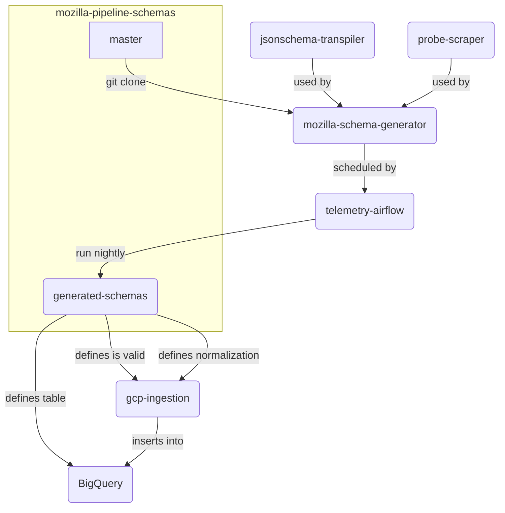
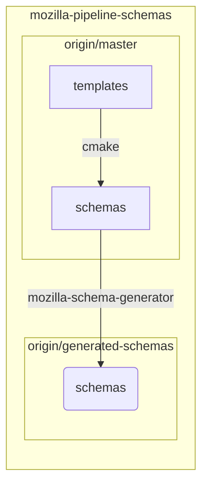
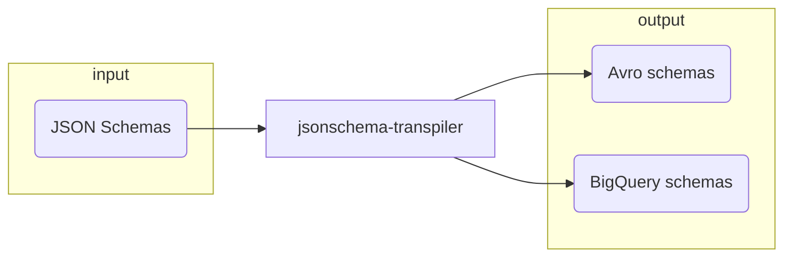
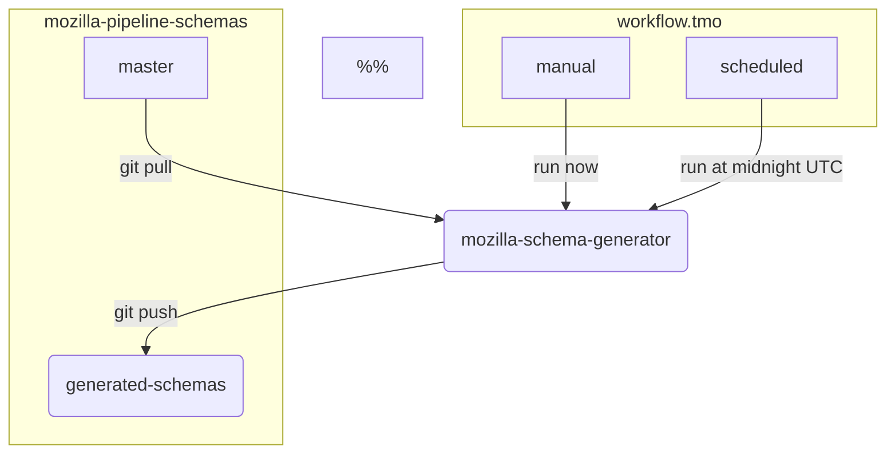
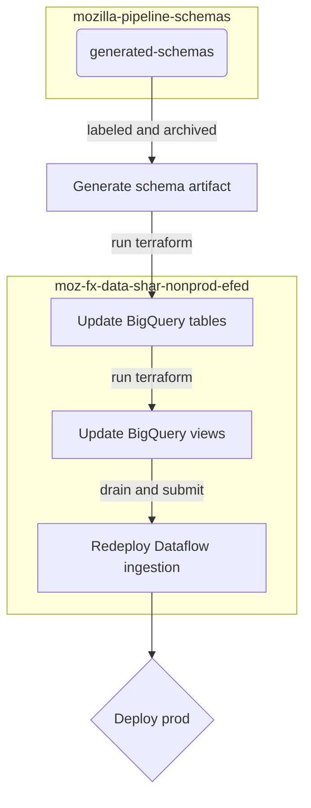

# Generated Schemas

## Overview

Schemas describe the structure of ingested data. They are used in the pipeline to validate the types
and values of data, and to define a table schema in a data store. We use a repository of JSON Schemas
to sort incoming data into [`decoded` and `error`
datasets](../../cookbooks/bigquery/querying.md#projects-with-bigquery-datasets). We also generate BigQuery
table schemas nightly from the JSON Schemas.

This section is intended for those who want to modify the process of generating and applying schemas
in various components of the data pipeline.



**Figure**: _An overview of generated schemas. Click on a node to navigate to the relevant
repository or documentation._

## Schema Repository



**Figure**: _Template schemas are built locally to generate static JSON Schema. On a regular basis,
the Mozilla Schema Generator is run to generate BigQuery schemas._

Refer to [Sending a Custom Ping](../../cookbooks/new_ping.md) for an in-depth guide for adding new
schemas to the repository.

### Schema Transpiler

The structure validated in JSON Schema can be mapped to BigQuery columns.
This is done by the `jsonschema-transpiler`, a Rust application for translating between schema formats.
[Data normalization as part of decoding](#decoding) is required before inserting into BigQuery e.g. snake casing and type casting.
These workarounds are based transformations that are done when importing Avro into BigQuery.



### Mozilla Schema Generator

The schema generator will populate schemas with metadata and insert generated sub-schemas at certain paths.
It generates JSON Schemas that are translated into BigQuery schemas, but _not_ used for validation.
It uses the probe information service to enumerate map-type fields.
These fields are converted into a structured column that can be accessed in BigQuery with [Standard SQL](https://cloud.google.com/bigquery/docs/reference/standard-sql/functions-and-operators).
Metadata includes fields added during [data ingestion](#data-ingestion) including fields like `submission_timestamp` and `sample_id`.

In addition to generating BigQuery schemas, schemas are aliased in several locations.
For example, the `first_shutdown` ping is a copy of the `main_ping`.
Schemas are also altered in the generator to accommodate various edge-cases in the data.
For example, a field that validates both boolean and integer types may be altered to assume a boolean type.

The main entry-point is a script that merges and generates `*.schema.json` under the `schemas` directory, then translates these to `*.bq`.
It commits the schema to the `generated-schemas` branch, with a change-log referencing commits in the `master` branch.

## Data Ingestion

### Validation

Data that fails validation is sent to the `payload_bytes_error` table. Each row contains an
information about the error that caused it, as well as the name of the job associated with it.

```sql
SELECT
  document_namespace,
  document_type,
  document_version,
  error_message,
  error_type,
  exception_class,
  job_name
FROM
  `moz-fx-data-shared-prod`.payload_bytes_error.telemetry
WHERE
  submission_timestamp > TIMESTAMP_SUB(current_timestamp, INTERVAL 1 hour)
  AND exception_class = 'org.everit.json.schema.ValidationException'
LIMIT 5
```

Column | Example Value | Notes
-|-|-
`document_namespace` | telemetry |
`document_type` | main |
`document_version` | null | The version in the `telemetry` namespace is generated after validation
`error_message` | `org.everit.json.schema.ValidationException: #/environment/system/os/version: #: no subschema matched out of the total 1 subschemas`
`error_type` | `ParsePayload` | The `ParsePayload` type is associated with schema validation or corrupt data
`exception_class` | `org.everit.json.schema.ValidationException `| Java [JSON Schema Validator](https://github.com/everit-org/json-schema) library
`job_name` | `decoder-0-0121192636-9c56ac6a` | Name of the Dataflow job that can be used to determine the version of the schema artifact

### Decoding

The BigQuery schemas are used to normalize relevant payload data and determine additional
properties. Normalization involves renaming field names and transforming certain types of data.
Snake casing is employed across all schemas and ensures a consistent querying experience.  Some data
must be transformed before insertion, such as map-types (a.k.a. dictionaries in Python), due to
limitations in BigQuery data representation. Other data may not be specified in the schema, and
instead placed into a specially constructed column named `additional_properties`.

#### Name Normalization

A reference [Python
implementation](https://github.com/acmiyaguchi/test-casing/blob/master/src/main.py) of the snake
casing algorithm is ensured to be compatible with the implementations in the decoder and transpiler using [a shared
test-suite](https://github.com/acmiyaguchi/test-casing/tree/master/test-cases). To illustrate the
transformation, consider the [`a11y.theme` keyed
scalar](https://probes.telemetry.mozilla.org/?view=detail&probeId=scalar%2Fa11y.theme) in the [main
ping](https://firefox-source-docs.mozilla.org/toolkit/components/telemetry/data/main-ping.html). In
the JSON document, as seen in `about:telemetry`, it is accessed as follows:

```python
# Python/Javascript syntax
ping["payload"]["processes"]["parent"]["keyedScalars"]["a11y.theme"]
```

The decoder will normalize the path with snake casing in BigQuery:

```sql
SELECT
  payload.processes.parent.keyed_scalars.a11y_theme
FROM `moz-fx-data-shared-prod`.telemetry.main
WHERE date(submission_timestamp) = date_sub(current_date, interval 1 day)
LIMIT 1
```

#### Data Structure Normalization

Thee decoder is also responsible for transforming the data to
accommodate BigQuery limitations in data representation. All transformations are defined in
[`ingestion-beam` under
`com.mozilla.telemtry.transforms.PubsubMessageToTableRow`](https://github.com/mozilla/gcp-ingestion/blob/master/ingestion-beam/src/main/java/com/mozilla/telemetry/transforms/PubsubMessageToTableRow.java).

The following transformations are currently applied:

Transformation | Description
-|-
Map Types | JSON objects that contain an unbounded number of keys with a shared value type are represented as a [repeated structure containing a `key` and `value` column](../../cookbooks/bigquery/querying.md#accessing-map-like-fields).
Nested Arrays | Nested lists are represented using a structure containing a repeated `list` column.
Tuples to Anonymous Structures | A [tuple of items](https://json-schema.org/understanding-json-schema/reference/array.html#tuple-validation) is represented as an anonymous structure with column names starting at `_0` up to `_{n}` where `n` is the length of the tuple.
JSON to String coercion | A sub-tree in a JSON document will be coerced to string if specified in the BigQuery schema. One example is of transformation is to [represent histograms in the main ping](../../cookbooks/bigquery/querying.md#accessing-histograms).
Boolean to Integer coercion | A boolean may be cast into an integer type.

Additional properties are fields within the ingested JSON document that are not found in the schema.
When all transformations are completed, any fields that were not traversed in the schema will be
reconstituted into the [top-level `additional_properties`
field](../../cookbooks/bigquery/querying.md#structure-of-ping-tables-in-bigquery).

## Deploying to BigQuery

In this section, we discuss deployment of generated schemas to BigQuery. Refer to [Table Layout and
Naming](../../cookbooks/bigquery/querying.md#table-layout-and-naming) for details about the resulting
structure of the projects.

Tables are updated on every push to `generated-schemas`. The schemas must be backwards
compatible, otherwise the checks in the staging Dataflow and BigQuery instances will fail. This must
be resolved by pushing a new tip to the `generated-schemas` branch in the schema repository. [Valid
changes to schemas](https://cloud.google.com/bigquery/docs/managing-table-schemas) include relaxing
a column mode from `REQUIRED` to `NULLABLE` or adding new columns.

Each table is tagged with the revision of schema repository attached. Consider the
`org_mozilla_fenix` namespace:

```bash
$ bq ls --max_results=3 moz-fx-data-shared-prod:org_mozilla_fenix_stable

       tableId        Type                   Labels                           Time Partitioning                 Clustered Fields
 ------------------- ------- --------------------------------------- ----------------------------------- -------------------------------
  activation_v1       TABLE   schema_id:glean_ping_1                  DAY (field: submission_timestamp)   normalized_channel, sample_id
                              schemas_build_id:202001230145_be1f11e
  baseline_v1         TABLE   schema_id:glean_ping_1                  DAY (field: submission_timestamp)   normalized_channel, sample_id
                              schemas_build_id:202001230145_be1f11e
  bookmarks_sync_v1   TABLE   schema_id:glean_ping_1                  DAY (field: submission_timestamp)   normalized_channel, sample_id
```

The `schema_id` is derived from the value of the `$schema` property of each JSON Schema.
The `schemas_build_id` label contains an identifier that includes the timestamp of the generated schema.
This label may be used to trace the last deployed commit from `generated-schemas`.

### Triggering `generated-schemas` push with Airflow



A new push to the `generated-schemas` branch is made every time the [`probe-scraper.schema_generator`](https://github.com/mozilla/telemetry-airflow/blob/master/dags/probe_scraper.py) task is run by Airflow.
`mozilla-schema-generator` runs in a container that commits snapshots of generated schemas to the remote repository.
Generated schemas may change when `probe-scraper` finds new probes in defined repositories e.g. `hg.mozilla.org` or [`glean`](https://github.com/mozilla/probe-scraper/blob/master/repositories.yaml).
It may also change when the `master` branch contains new or updated schemas under the `schemas/` directory.

To manually trigger a new push, clear the state of a single task in the workflow admin UI.
To update the schedule and dependencies, update the DAG definition.

### Modifying state of the pipeline



Jenkins is used to automate deploys of the pipeline in the `nonprod` and `prod` projects.
Jenkins polls the `generated-schemas` branch for new commits.
The tip of the branch will be labeled and archived into an artifact that is used during deploys.
The artifact is first used update the table schemas in the `nonprod` project.
This staging step will stop on schema incompatible changes, such as removing a schema or a column in a schema.
Once the tables are up to date, the Dataflow job will be drained and redeployed so it is writing to the updated tables.
Once schemas have successfully deployed to the `nonprod` project, then it may be manually promoted to production by an operator.
