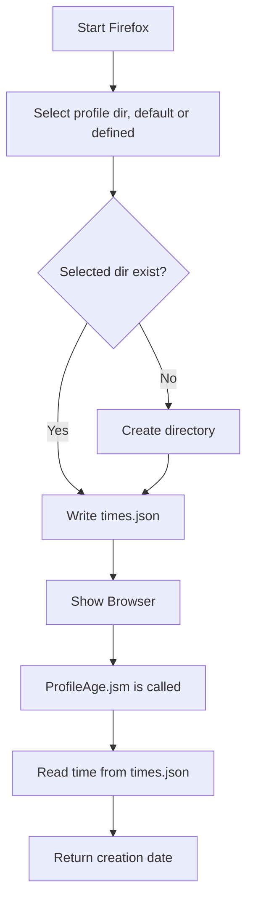
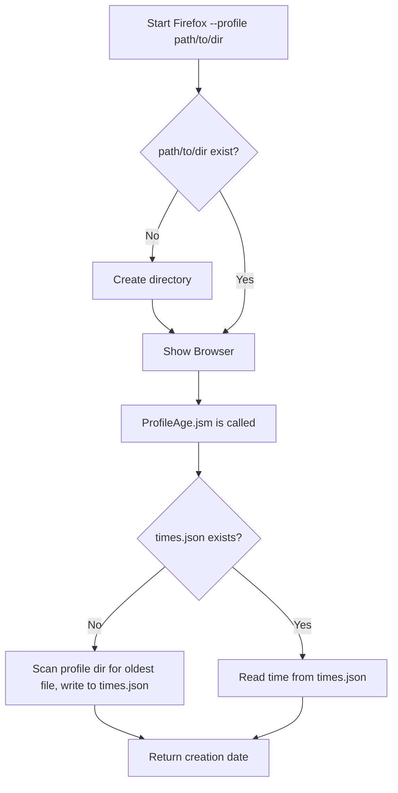

# Profile Creation - The technical part

<!-- toc -->

## What is a profile?

All of the changes a user makes in Firefox, like the home page, what toolbars you use, installed addons, saved passwords and your bookmarks, are all stored in a special folder, called a profile.
Telemetry stores archived and pending pings in the profile directory as well as metadata like the client ID.

Every run of Firefox needs a profile. However a single installation can use multiple profiles for different runs.
The profile folder is stored in a separate place from the Firefox program so that, if something ever goes wrong with Firefox, the profile information will still be there.

Firefox also comes with a Profile Manager, a different run mode to create, migrate and delete the profiles.

## Profile Behaviors

In order to understand the behavior of users and base analysis on things like the profile creation date,
it is essential to understand how a profile is created and identified by the browser.
Also, it is important to understand how user actions with and within profiles affect our ability to reason about profiles from a data perspective.
This includes resetting or deleting profiles or opting into or out of sending Telemetry data.

The different cases are described in more detail in the following sections.

### Profile Creation

There are multiple ways a Firefox profile can be created.
Some of these behave slightly differently.

Profiles can be created and managed by the Firefox Profile Manager:

- New profile on first launch
- New profile from Profile Manager
- `--createprofile` command line argument

Profiles can be created externally and not be managed by the Firefox Profile Manager:

- `--profile` command line argument

#### Managed: First use

When Firefox is opened for the first time after a fresh install, without any prior Firefox profile on disk visible to Firefox, it will create a new profile.
Firefox uses "Default User" as the profile name, creates the profile's directory with a random suffix and marks the new profile as default for subsequent starts of Firefox.
Read [where Firefox stores your profile data](https://support.mozilla.org/en-US/kb/profiles-where-firefox-stores-user-data).

#### Managed: Profile Manager creation

The user can create a new profile through the Profile Manager.
This can either be done on `about:profiles` in a running Firefox or by starting Firefox with the `--ProfileManager` flag.
The Profile Manager will ask for a name for the profile and picks a new directory for it.
The Profile Manager allows the user to create a new profile from an existing directory (in which case any files will be included) or from scratch (in which case the directory will be created).

The `--createprofile` flag can be used from the command line and works the same as creating a profile through the Profile Manager.

#### Unmanaged: Command-line start

Firefox can be started on the command line with a path to a profile directory: `firefox --profile path/to/directory`.
If the directory does not exist it will be created.

A profile created like this will not be picked up by the Profile Manager.
Its data will persist after Firefox is closed, but the Profile Manager will not know about it.
The profile will not turn up in `about:profiles`.

### Profile Reset

A user can reset the profile (see [Refresh Firefox - reset addons and settings](https://support.mozilla.org/en-US/kb/refresh-firefox-reset-add-ons-and-settings)).
This will copy over most user data to a new directory, keeping things like the history, bookmarks and cookies, but will remove extensions, modified preferences and added search engines.

A profile reset will not change the Telemetry `clientID`.
The date of the most recent profile reset is saved and will be contained in Telemetry pings in the `profile.resetDate` field.

### Profile Deletion

A profile can be deleted through the Profile Manager, which will delete all stored data from disk.
The profile can also be deleted by simply removing the profile's directory.
We will never know about a deletion. We simply won't see that profile in new Telemetry data anymore.

Uninstalling the Firefox installation will not remove any profile data.

**Note:** Removing a profile's directory while it is in use is not recommended and will lead to a corrupt state.

### Telemetry opt-out

The user can opt out of sending Telemetry data.
When the user opts out, Telemetry sends a ["deletion-request" ping](https://firefox-source-docs.mozilla.org/toolkit/components/telemetry/data/deletion-request-ping.html), containing an empty payload.
The local `clientID` is reset to a fixed value.

When a user opts into sending Telemetry data, a new `clientID` is generated and used in subsequent pings.
The profile itself and the profile creation date are unaffected by this.

## Profile Creation Date

The _profile creation date_ is the assumed date of initial profile creation.
However it proved to be not reliable for all cases.
There are multiple ways this date is determined.

### Managed: During Profile Creation

When a profile is created explicitly the profile directory is created and a `times.json` containing a timestamp of the current time is stored inside that profile directory[^1].
It is read at later times when the profile creation date is used.

[^1]: Relevant parts in the code: [`nsAppRunner::SelectProfile`](https://searchfox.org/mozilla-central/rev/292d295d6b084b43b70de26a42e68513bb7b36a3/toolkit/xre/nsAppRunner.cpp#2394-2395,2397-2398,2527-2533) calling [`nsToolkitProfileService::CreateProfile`](https://searchfox.org/mozilla-central/rev/196560b95f191b48ff7cba7c2ba9237bba6b5b6a/toolkit/profile/nsToolkitProfileService.cpp#789-793).

### Unmanaged: Empty profile directory

When `--profile path/to/directory` is passed on the command line, the directory is created if it does not exist, but no `times.json` is written[^2].
On the first access of the profile creation date (through `ProfileAge.jsm`) the module will detect that the `times.json` is missing.
It will then iterate through all files in the current profile's directory, reading file creation or modification timestamps.
The oldest of these timestamps is then assumed to be the profile creation date and written to `times.json`.
Subsequent runs of Firefox will then use this date.

[^2]: Relevant part in the code: [`nsAppRunner::SelectProfile`](https://searchfox.org/mozilla-central/rev/292d295d6b084b43b70de26a42e68513bb7b36a3/toolkit/xre/nsAppRunner.cpp#2357-2363) creating the directory.
