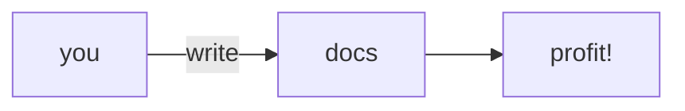

# Contributing

Documentation is critical to making a usable data platform.
In surveys of users of the Mozilla Data Platform,
the most common complaint has been lack of documentation.
It is therefore important to expand and improve the documentation as often as possible.

<!-- toc -->

## Bug reports

If you see an error in the documentation or want to extend a chapter,
[file a bug](https://bugzilla.mozilla.org/enter_bug.cgi?assigned_to=nobody%40mozilla.org&bug_file_loc=http%3A%2F%2F&bug_ignored=0&bug_severity=normal&bug_status=NEW&cf_fx_iteration=---&cf_fx_points=---&component=Documentation%20and%20Knowledge%20Repo%20%28RTMO%29&contenttypemethod=autodetect&contenttypeselection=text%2Fplain&defined_groups=1&flag_type-4=X&flag_type-607=X&flag_type-800=X&flag_type-803=X&flag_type-916=X&form_name=enter_bug&maketemplate=Remember%20values%20as%20bookmarkable%20template&op_sys=Linux&priority=--&product=Data%20Platform%20and%20Tools&rep_platform=x86_64&target_milestone=---&version=unspecified).

## Fixing minor problems

For smaller issues (for example, a typo or minor inaccuracy), it is not necessary to file a bug or even
check out the source.
Instead, use the `Edit on GitHub` button on the bottom of any page, make your changes, and file a pull request entirely from the GitHub interface.

## Building the Documentation

This documentation is stored as [CommonMark Markdown](https://commonmark.org/help/) in the
[`data-docs` repository](https://github.com/mozilla/data-docs) on GitHub.
To build a local copy, fork the repository and check out your copy. Then, [see the README](https://github.com/mozilla/data-docs/blob/master/README.md#building-the-documentation) for up-to-date information on how to build the documentation.

## Adding a new article

You should read the [style guide](./style_guide.md) before adding a new article: it will help you write material that is more useful and fits cohesively into the rest of the documentation.

Be sure to link to your new article from `SUMMARY.md`, or mdBook will not render the file.

The structure of the repository is outlined in [this article](./structure.md).

This documentation is under active development,
so we may already be working on the documentation you need.
Take a look at
[this bug component](https://bugzilla.mozilla.org/buglist.cgi?product=Data%20Platform%20and%20Tools&component=Documentation%20and%20Knowledge%20Repo%20%28RTMO%29&resolution=---)
to check.

## Review

Once you're happy with your contribution, open a pull request (PR). Give your PR a meaningful commit message
(see [this article on commit message guidelines](https://chris.beams.io/posts/git-commit/) for some suggestions).
If there is a bug associated with your documentation, title it in the form of `Bug 1234 - <descriptive one-liner>` - that way, the [Bugzilla PR linker](https://github.com/mozilla/github-bugzilla-pr-linker) will pick up the PR and attach it to the bug.

After filing your PR, assign the appropriate person for review (GitHub will usually provide some suggestions), assuming you have permissions to do so yourself.
If you do not have permission to assign a reviewer, see [getting help](../concepts/getting_help.md).

## Supported Plugins

### Table of contents

You can insert a table of contents in any article by using the `toc` shorthand. For example:

```
# My fine title

This article describes how to perform action X.

<!-- toc -->

## Section 1

...

## Section 2
```

For an example of what the rendered table of contents looks like, see the beginning of this article.

### Mermaid

You can use [`mermaid.js`](https://mermaidjs.github.io/) diagrams in code blocks. For example:

````md

````

... is rendered as:


## Publishing

The documentation is hosted on [Github Pages](https://pages.github.com/).

Updates to the documentation are automatically published to
[docs.telemetry.mozilla.org](https://docs.telemetry.mozilla.org).
