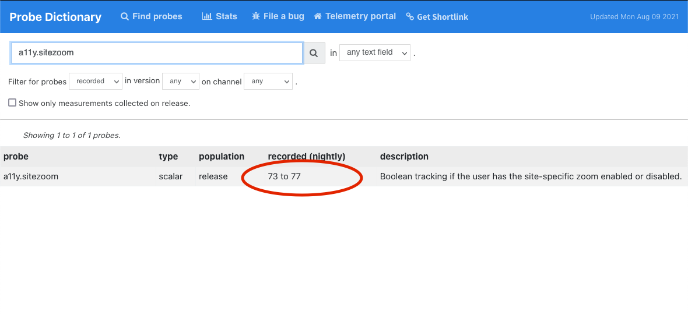
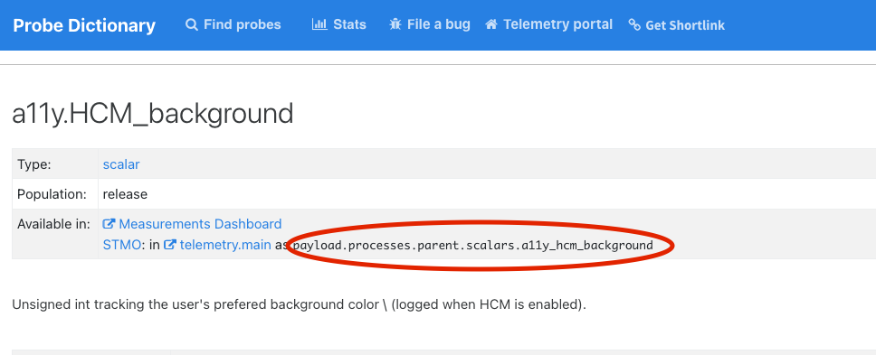

# Using the Probe Dictionary

The Probe Dictionary is a web-based tool that allows you to look up information on all the probes defined in Firefox's source code.
Until [Firefox on Glean] is finished, the Probe Dictionary is the best way to look up what data is submitted by Firefox.

Note that the Probe Dictionary has not kept pace with many changes that have made to the Mozilla data platform in the last couple of years.
However, with some knowledge of how Firefox and the data platform work, you can still quickly find the data that you need.
If you have questions, don't hesitate to [ask for help].

## How to use

You can visit the Probe Dictionary at [`probes.telemetry.mozilla.org`](https://probes.telemetry.mozilla.org/).
As its content is generated entirely from publicly available source code in Firefox, there is no access control.

From the top level, you can search for a probe by name, descriptive, or other category by entering the appropriate text in the search box.

If you click on a probe, you can get more information on it including a reference to its definition in the source code as well as information on how to get the data submitted by this probe in some of our data tools like STMO and the Telemetry Dashboard.

## Common Questions

### How can I tell if a probe is still active?

Look at the "recorded (nightly)" column after the probe definition in the summary.
If it gives a range and it ends before the current release, the probe is not active anymore.
For example, the `a11y.sitezoom` probe was only recorded in Nightly from Firefox 73 to 77.



### How can I go from a probe to querying it in BigQuery?

Look in the "available in" section underneath the probe.



You can use this information to query the data submitted by the probe in BigQuery using [STMO] or other tools.
For example, for example this query gives you the counts of the distinct values for `a11y.hcm_background`:

```sql
SELECT payload.processes.parent.scalars.a11y_hcm_background AS a11y_hcm_background,
       count(*) AS COUNT
FROM telemetry.main_1pct
WHERE DATE(submission_timestamp)='2021-08-01' group by 1;
```

[`STMO#81415`](https://sql.telemetry.mozilla.org/queries/81415/source)

Other measurement types may require more complicated queries.
For information on querying exponential histograms, see [Visualizing Percentiles of a Main Ping Exponential Histogram](../main_ping_exponential_histograms.md).

Note that the metric's information may also appear in derived datasets, not just the raw ping tables which we are talking about above.
For more information on this (and how to explore data stored in derived data sets), see [Accessing Desktop Data].

### For keyed scalars, how can I find out what the keys mean?

First, check the probe description: basic documentation is often there. For example, in the `a11y.theme` probe it says:

```
OS high contrast or other accessibility theme is enabled. The result is split into keys which represent the values of browser.display.document_color_use: "default", "always", or "never".
```

If this is not given, your best option is probably to look at the Firefox source code using [Searchfox] (a link to a sample query is provided by Probe Dictionary).
Again, feel free to [ask for help] if you need it.

[firefox on glean]: https://firefox-source-docs.mozilla.org/toolkit/components/glean/index.html
[stmo]: ../../tools/stmo.md
[ask for help]: ../../concepts/getting_help.md
[accessing desktop data]: ../bigquery/accessing_desktop_data.md
[searchfox]: https://searchfox.org/
