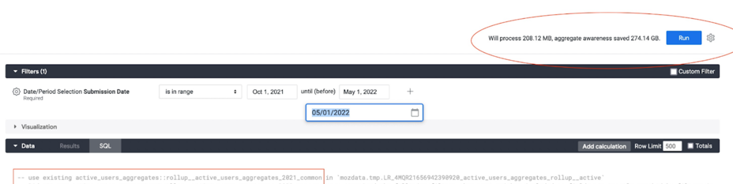

# Using aggregates for cost saving and performance improvement

A good approach to better performance and reduced cost is reducing the amount of data scanned in queries, which can be achieved by summarizing and pre-calculating data in aggregates.

This doc is about when to use different options to aggregate data, their limitations, benefits, and examples.

<!-- TOC -->

- [What are the options available?](#what-are-the-options-available)
  - [BigQuery Aggregate Tables](#bigquery-aggregate-tables)
  - [BigQuery Materialized Views](#bigquery-materialized-views)
  - [Looker PDTs & aggregate awareness](#looker-pdts--aggregate-awareness)
- [Important considerations:](#important-considerations)
- [When to use each of these aggregates?](#when-to-use-each-of-these-aggregates)
  - [A BigQuery aggregate table is suitable when:](#a-bigquery-aggregate-table-is-suitable-when)
  - [A Materialized View is suitable when:](#a-materialized-view-is-suitable-when)
  - [A Looker PDT is suitable when:](#a-looker-pdt-is-suitable-when)
- [How to measure the benefit and savings?](#how-to-measure-the-benefit-and-savings)
<!-- TOC -->

## What are the options available?

#### BigQuery Aggregate Tables

Aggregates tables contain pre-aggregated results of scheduled queries running some business logic. These tables are created and maintained by the Data Team and scheduled to get updated periodically via Airflow.

- [Process to create an aggregate table in BigQuery](https://mozilla.github.io/bigquery-etl/cookbooks/common_workflows/#adding-a-new-scheduled-query).

#### [BigQuery Materialized Views](https://cloud.google.com/bigquery/docs/materialized-views-intro)

These are views defined by the developer and then created, managed and incrementally updated by BigQuery, reading _only_ the changes in the base table to compute results. Materialized view definitions [_do not support_ certain BigQuery features and expressions](https://cloud.google.com/bigquery/docs/materialized-views-intro#limitations), such as UDFs, certain aggregate functions, backfilling or nesting.

- [Template to create a Materialized View](https://console.cloud.google.com/bigquery?ws=!1m7!1m6!12m5!1m3!1smozdata!2sus-central1!3s8403c62c-e243-4e57-8d91-5c1fcdf26828!2e1).

- Example.

  ```
  CREATE MATERIALIZED VIEW `moz-fx-data-shared-prod.monitoring_derived.suggest_click_rate_live_v1`
  OPTIONS
  (enable_refresh = TRUE, refresh_interval_minutes = 5)
  AS
  SELECT
   TIMESTAMP_TRUNC(submission_timestamp, minute) AS submission_minute,
   COUNT(*) AS n,
   COUNTIF(release_channel = "release") AS n_release,
   COUNTIF(release_channel = "beta") AS n_beta,
   COUNTIF(release_channel = "nightly") AS n_nightly,
   COUNT(request_id) AS n_merino,
   COUNTIF(request_id IS NOT NULL AND release_channel = "release") AS n_merino_release,
   COUNTIF(request_id IS NOT NULL AND release_channel = "beta") AS n_merino_beta,
   COUNTIF(request_id IS NOT NULL AND release_channel = "nightly") AS n_merino_nightly,
  FROM
   `moz-fx-data-shared-prod.contextual_services_live.quicksuggest_click_v1`
  WHERE
   DATE(submission_timestamp) > '2010-01-01'
  GROUP BY
   1
  ```

#### [Looker PDTs & aggregate awareness](https://cloud.google.com/looker/docs/aggregate_awareness)

These are aggregations that a developer defines in an Explore file (`explore.lkml`). From this definition, Looker creates a table in BigQuery's `mozdata.tmp` using the naming convention`scratch schema + table status code + hash value + view name` and runs the scheduled update of the data.
Looker's PDTs and aggregate awareness are _only_ referenced in Looker when at least one of the columns is used in a Looker object. These aggregates can be particularly beneficial to avoid having to rebuild dashboards after a schema change.

- Template to create aggregate awareness in a Looker Explore, replacing the text inside <> with the actual values:

  ```
  aggregate_table: <aggregate_name: Descriptive name of this aggregation.> {
    query: {
    dimensions: [<table>.<columns>]
    measures: [<table>.<columns>]
    filters: [<table>.<partition_column>: "<Period to materialize in the aggregate e.g. 2 years>"]
    }
    materialization: {
    sql_trigger_value: SELECT CURRENT_DATE() ;;
    increment_key: <table>.<partition_column>
    increment_offset: <INT: number of periods to update, recommended is 1.> }
    }
  ```

- [Example of aggregate awareness in a Looker Explore](https://mozilla.cloud.looker.com/projects/spoke-default/files/combined_browser_metrics/explores/active_users_aggregates.explore.lkml)

## Important considerations

- [Store the business logic in BigQuery](https://docs.telemetry.mozilla.org/cookbooks/data_modeling/where_to_store), preferably in a client_id level table to aggregate from.
- All aggregates are version controlled in the git repositories `bigquery-etl` and `spoke-default`.
- All aggregates require a backfill or update when the source data changes:
  - BigQuery aggregate tables are backfilled using the managed-backfill process.
  - Materialized views cannot be backfilled, instead a materialized view needs to be re-created. Schema changes in base tables also invalidate the view and requires it to be re-created. Materialized views scan all historical data of their referenced base tables by default, so _ensure to set a date filter to reduce the amount of data to be scanned_.
    - Add a date filter to materialized views to limit the amount of data to be scanned when these views get deployed initially. Otherwise, they will scan the entire data in referenced base tables.
  - Looker PDTs require following the [protocol to backfill described in the [Mozilla Looker Developers course](https://mozilla.udemy.com/course/looker-training-for-developers/learn/lecture/35440216#overview).
- Indices, partition and clustering are allowed for all cases. Looker PDTs and aggregates require that these are defined in the base table.
- There is a limit of 20 materialized views per table.
- When considering materialized views, a common practice is to use a combination of an aggregate table to store historical data (e.g. older than 2 days) and use a materialized view to track data in real-time (e.g. aggregate data that is just coming in). This allows to run backfills on the aggregate table.
- BigQuery retries the update of materialized views when it fails, which results in _increased costs_ due to querying data multiple times. Monitor for broken materialized views in the [BigQuery Usage Explore](https://mozilla.cloud.looker.com/x/uTZhF7sqlOOvrV4o7It1Cc).

## When to use each of these aggregates?

#### A BigQuery aggregate table is suitable when:

- The results should not be unexpectedly affected by Shredder.
- The metric requires strict change control.
- A scheduled alert is required in case of failure or data out of sync. Airflow sends emails and alerts on failure for BigQuery aggregate tables, which are addressed daily by the Data Engineering team during the Airflow Triage.
- The table will be queried directly or used as a source for other analysis. Looker PDTs are not designed to be queried directly.
- The query requires full flexibility to use DML, data types, aggregation functions and different types of JOIN.

#### A Materialized View is suitable when:

- Your goal is to aggregate data in real-time (for example, for implementing real-time monitoring of certain metrics)
- The results can be based on shredded data (tables with client_id).
- The view will be queried directly or used as a source for other analysis.
- Change control is _not_ required or is already implemented in the base table. This can be verified by looking for the label `change_controlled: true` in the table's metadata.
- A scheduled alert on failure is not required. Failures must be actively monitored in the [BigQuery Usage Explore](https://mozilla.cloud.looker.com/x/uTZhF7sqlOOvrV4o7It1Cc).
- The metric does _not_ require non-deterministic functions that are not supported: RAND(), CURRENT_TIMESTAMP, CURRENT_DATE(), or CURRENT_TIME().
- The query does _not_ require UDFs, UNNESTING arrays, COUNT DISTINCT, ORDER BY or any DML operation different from SELECT.
- The query uses a WITH clause, COUNTIF, INNER JOIN or TIMESTAMP_ADD. These are all supported.
- The data does not need to be backfilled.

#### A Looker PDT is suitable when:

- Your goal is to improve the performance and query response time in Dashboard by pre-aggregating common query patterns and not having to re-create the dashboard when the base table changes.
- The results can be based on shredded data (tables with client_id).
- Change control is not required or is already implemented in the base table. This can be verified by looking for the label `change_controlled: true` in the metadata.
- A scheduled alert on failure is _not_ required. Failures must be monitored in the [PDT Admin Dashboard](https://mozilla.cloud.looker.com/admin/pdts) or in the [Errors and Broken Content Dashboard](https://mozilla.cloud.looker.com/dashboards/system__activity::errors_and_broken_content).
- The metrics defined in the Explore use only any of these aggregations: SUM, COUNT, COUNTIF, MIN, MAX or AVERAGE.
- The metrics defined in the Explore use only any of these data types: NUMBER, DATE, STRING or YESNO.
- The aggregate uses a DISTINCT COUNT _and_ the query matches exactly the Explore query.
- The base table for the Explore is expected to change with added columns and Looker Explore will require modifications that also require re-creating the dashboards. When using aggregate awareness this re-create is _not_ neccesary.

## How to measure the benefit and savings?

- Looker displays the amount of data that will be processed with and without using the aggregates, in the top right corner of a view or explore when in development mode.
  

- BigQuery displays also in the top right corner of the window, the amount of data that will be scanned by a query written in the console.

- Alternatively, query the information schema to return the bytes processed and cost. With this information is possible to compare and calculate the savings that result from using an aggregate instead of querying the base table directly. Using sample data for the comparison will save costs.

  ```
   SELECT destination_table.project_id AS project_id,
        destination_table.dataset_id AS dataset,
        SUBSTR(destination_table.table_id, 0, INSTR(destination_table.table_id, '$') -1) AS table_id,
        SUM(total_bytes_processed/(1024*1024*1024)) as TB_processed,
        SUM((total_slot_ms * 0.06) / (60 * 60 * 1000)) AS cost
   FROM `moz-fx-data-shared-prod`.`region-us`.INFORMATION_SCHEMA.JOBS_BY_PROJECT
   WHERE EXTRACT(DATE FROM  creation_time) BETWEEN <ini_date> AND CURRENT_DATE
        AND destination_table.dataset_id = <dataset_name>
        AND user_email = <user_email>
        AND destination_table.table_id = <table_name>
   GROUP BY ALL;
  ```
