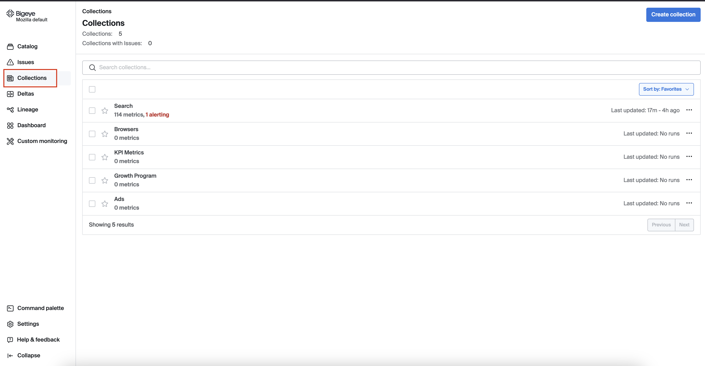

## Collections in Bigeye

Collections help you organize and focus on specific areas of interest, making it simpler to track and address data quality across different segments of your data landscape. This feature enhances efficiency by allowing users to monitor grouped entities in a cohesive manner.

### Creating a new collection

If you don’t find a collection that meets your product or requirements, admins can create a new collection.

<iframe width="560" height="315" src="https://www.youtube.com/embed/YTOOTFw5MLw?si=X3VybaWasts-sdjw" title="YouTube video player" frameborder="0" allow="accelerometer; autoplay; clipboard-write; encrypted-media; gyroscope; picture-in-picture; web-share" referrerpolicy="strict-origin-when-cross-origin" allowfullscreen></iframe>

If you're not an admin, please [submit a Jira ticket](https://mozilla-hub.atlassian.net/browse/DENG-4726) with the necessary details.

### Adding metrics to collection

To add metrics to a collection in Bigeye, navigate to the collection you want to update and click "Add Metrics." You can search or filter for specific metrics that align with your monitoring goals.

<iframe width="560" height="315" src="https://www.youtube.com/embed/ZFRAaeX6z8w?si=ba3jYHTQNZPDi9ua" title="YouTube video player" frameborder="0" allow="accelerometer; autoplay; clipboard-write; encrypted-media; gyroscope; picture-in-picture; web-share" referrerpolicy="strict-origin-when-cross-origin" allowfullscreen></iframe>

### Adding notifications to collection

One useful feature of collections is the ability to add notifications. To set this up, click the "Edit" button, then navigate to the "Notifications" tab in the modal that appears.

<iframe width="560" height="315" src="https://www.youtube.com/embed/QH37mnkkuW8?si=7cMx8eJq_wgbSFX_" title="YouTube video player" frameborder="0" allow="accelerometer; autoplay; clipboard-write; encrypted-media; gyroscope; picture-in-picture; web-share" referrerpolicy="strict-origin-when-cross-origin" allowfullscreen></iframe>
