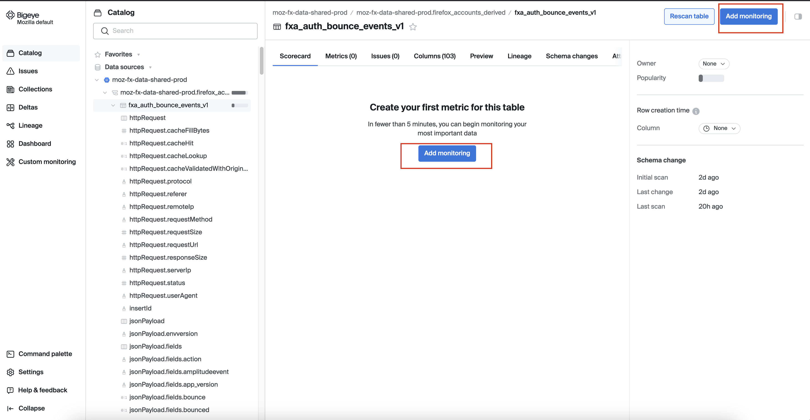
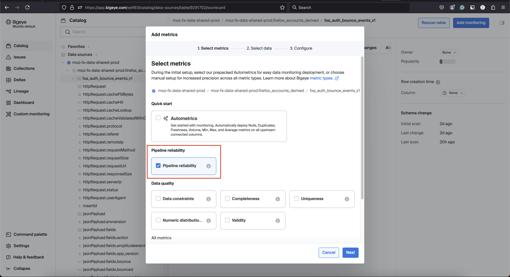

## Deploying Metrics

To deploy metrics in Bigeye, navigate to a schema, table, or column and click "Add Monitoring."
You can choose to add metrics via 4 options

1. Freshness and Volume (Pipeline Reliability)
2. Data Quality
3. All metrics
4. Custom SQL, and select the metrics you wish to deploy.

Next, choose the columns to monitor, set schedules, thresholds, and filters, and confirm your selections.
You can assign the metrics to the relevant collection, grouping related metrics for easier management and monitoring.
Once deployed, the metrics appear under the Metrics tab on the relevant schema, table, or column page.
We can backfill the metrics for up to 28 days in the past.

<iframe width="560" height="315" src="https://www.youtube.com/embed/LRhbxFMPTwI?si=yJ98NhvlmGt02eq7" title="YouTube video player" frameborder="0" allow="accelerometer; autoplay; clipboard-write; encrypted-media; gyroscope; picture-in-picture; web-share" referrerpolicy="strict-origin-when-cross-origin" allowfullscreen></iframe>

For more details, please refer to the Bigeye documentation on [how to deploy metrics](https://docs.bigeye.com/docs/deploy-metrics).

Watch the Bigeye tutorial on [how to use the metrics page](https://www.youtube.com/watch?v=jNzSki59AWQ)

### Freshness and Volume (Pipeline Reliability)

Bigeye tracks data quality by monitoring the timeliness (freshness) and completeness (volume) of your data and checks them hourly.
Initially, it looks back 28 days, then 2 days for subsequent runs. For volume, it aggregates row counts into hourly buckets, using the same lookback periods. We have an option to select [`manual`](https://docs.bigeye.com/docs/manual-thresholds) thresholds vs [`Autothresholds`](https://docs.bigeye.com/docs/autothresholds) that learn typical patterns and alert on anomalies.

Only one Freshness and one Volume metric can be deployed per table.
**Cost Consideration** Freshness and Volume metrics are included by default for each table and are free of charge.

Please refer to Bigeye documentation for more details on [Freshness and Volume metrics](https://docs.bigeye.com/docs/freshness-and-volume-pipeline-reliability-copy).

### List of available metrics

Bigeye offers a range of available metrics to monitor data quality and reliability across your data pipelines.
These metrics cover areas such as data freshness, volume, distribution, schema changes, and anomalies. You can deploy these metrics to track key performance indicators and ensure your data meets expected standards.

Please refer to the Bigeye documentation for [list of available metrics](https://docs.bigeye.com/docs/available-metrics).

Watch the Bigeye tutorial on the [metrics types](https://www.youtube.com/watch?v=jNzSki59AWQ)

### Autometrics

Autometrics are suggested metrics that monitor anomalies in column-level data, automatically generated for all new datasets in Bigeye. They can be found under the Autometrics tab in the Catalog when viewing a source, schema, table, or column page.

> :warning: **Try to avoid this option!**: On tables with many columns a large number of monitors might get deployed. This increases noise and cost. Instead, it is recommended to [choose relevant metrics from the list of available metrics](#list-of-available-metrics) manually.

### Custom SQL

Custom rules are useful for addressing unique data quality requirements that standard metrics may not cover. Once set, these rules integrate into your monitoring workflow.

### Recommendations / Best Practices to deploying metrics

- It's recommended to avoid deploying Autometrics extensively, as this could result in a high signal-to-noise ratio, leading to unnecessary alerts and potential distraction.

- When deploying metrics on search tables, we observed that the `median` calculation using the BigQuery function does not work as expected. Due to this limitation, it is recommended to avoid using the median metric in these scenarios to ensure accurate results.

- Autothresholds are recommended for freshness and volume metrics, as they automatically adjust based on typical patterns. For other metrics, it's advisable to manually set thresholds to ensure accuracy and relevance.

- It is recommended to add metrics at the view level rather than directly on tables. This ensures that even if a table becomes obsolete or is upgraded, unnecessary checks on previous versions are avoided. The only exception to this rule is for freshness and volume metrics, which must be deployed directly on tables.
