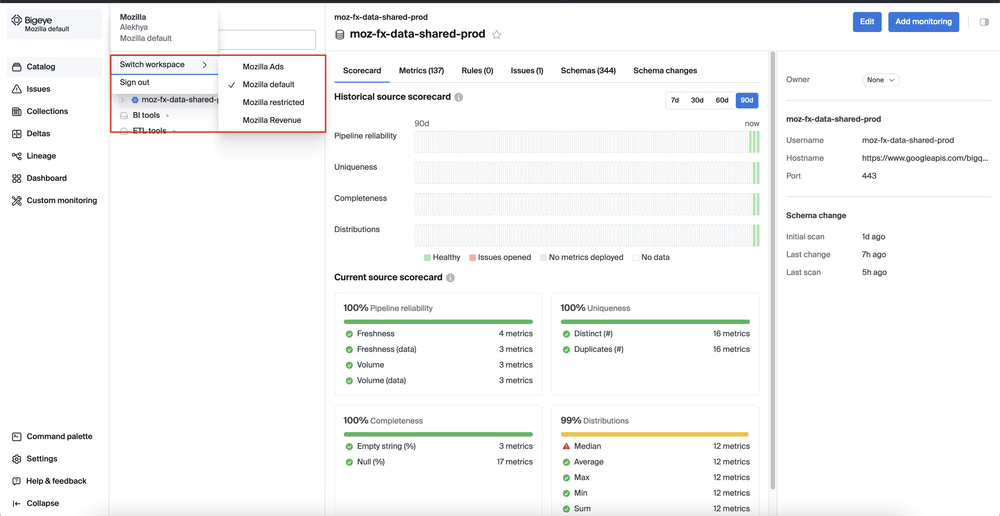

# Bigeye Interface

## Catalog

The Catalog tab in the left-hand menu offers a comprehensive view of all data sources connected to Bigeye, making it simple to navigate and manage your entire data ecosystem.

If you are an admin, you will have access to the "Add Source" button, allowing you to easily integrate new data sources and BI tools.

The Bigeye catalog refreshes automatically every 24 hours to detect new datasets and schema changes. You can also manually refresh the catalog anytime by clicking 'Rescan' on the schema changes tab.

For more detailed information about the Catalog, please refer to the [Catalog documentation page](https://docs.bigeye.com/docs/catalog)

Watch the [Bigeye tutorial](https://www.youtube.com/watch?v=8DWyZuU-w1c&t=9s) on how to navigate Bigeye Catalog.

## Workspaces

Workspaces in Bigeye allow multiple teams to collaborate simultaneously, with each team managing and monitoring their own data independently.
Each Bigeye workspace includes its own Catalog, BI tools, and ETL tools, Metrics and issues, Templates and schedules, Collections, Deltas.

We are in the process of setting up user workspaces that will align with our existing data access restrictions.

If you do not find a suitable workspace, please submit a [Jira ticket](https://mozilla-hub.atlassian.net/browse/DENG-4727)

## Collections

Collections in Bigeye allow you to group related metrics, making it easier to manage and monitor them together.

If you don’t find a collection that meets your product or requirements, admins can create a new collection.
If you're not an admin, please submit a [Jira ticket](https://mozilla-hub.atlassian.net/browse/DENG-4726) with the necessary details.

Watch the [Bigeye tutorial](https://www.youtube.com/watch?v=4H5AM0a71bs&list=PLUmsPWeo8j4U9SpGCnAe9syilD4_jBgSI&index=8) on how to navigate Bigeye Catalog.

## Issues

Bigeye's Issues feature helps you track and manage data quality issues detected by the platform.
You can assign, prioritize, and resolve issues within the platform, ensuring that your data quality remains high. Issues can be categorized and filtered to streamline the resolution process across teams.

For more details, refer to the Bigeye documentation on [Issues page](https://docs.bigeye.com/docs/issues)

## Dashboard

Users can monitor the data quality metrics and issues in a centralized view. It highlights key features such as customizable widgets, real-time metric tracking, and the ability to visualize data health at a glance. Users can configure dashboards to focus on specific metrics or tables and receive immediate insights into their data pipelines' performance.

For additional guidance on using Bigeye Dashboard, please refer to the following documentation:

- [How to set filters](https://docs.bigeye.com/docs/dashboard#set-filters)
- [Monitoring Coverage](https://docs.bigeye.com/docs/dashboard#monitoring-coverage)
- [Tracking Data Quality](https://docs.bigeye.com/docs/dashboard#data-quality)
- [Issue Response Metrics](https://docs.bigeye.com/docs/dashboard#issue-response)
