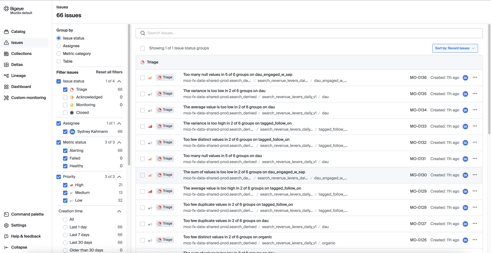
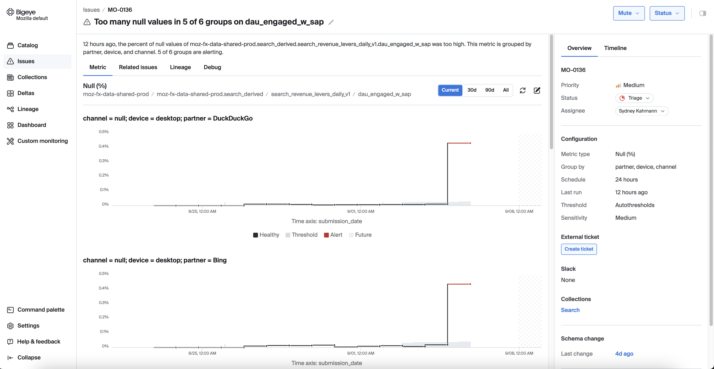
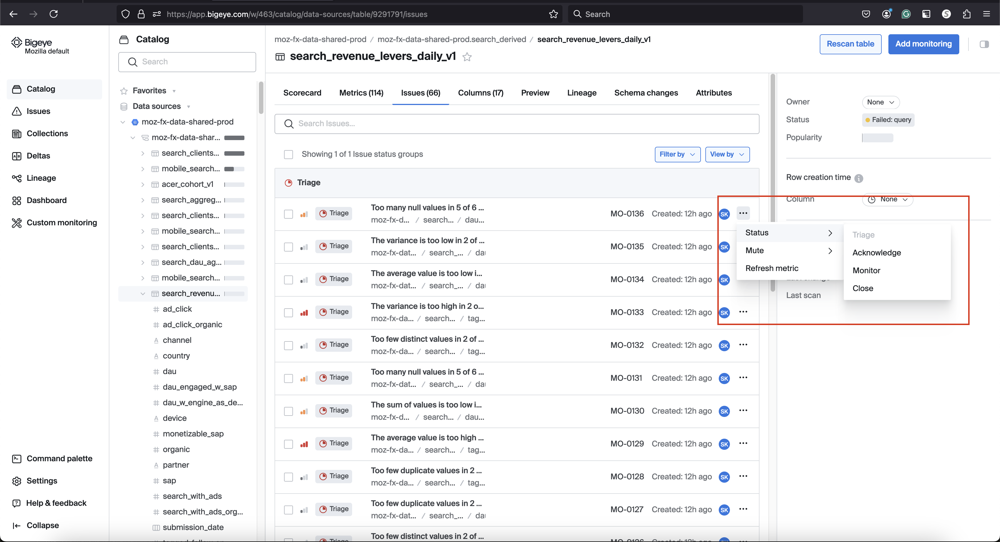

# Issues management

The `Issues` tab allows filtering issues by parameters like severity or date, and reviewing details such as impacted metrics and tables.

## View issue details

Once we click on the issue we can view a metric chart that displays a time series visualization of the alerting metric.

The metric chart in Bigeye displays a time series visualization of the alerting metric

## Status of Issue

Users can change the status to "Active," "Resolved," "Muted," or "Dismissed," depending on the issue's current state. This allows for better tracking and management of issues across data pipelines. Status updates are reflected in the timeline, providing a clear history of the issue's progression.

Use the Mute button above the timeline to mute an issue and stop being notified about subsequent issue alerts. The available mute options in the Bigeye are Unmute, 1 hour, 4 hours, 12 hours, 24 hours, or 1 week

For more details, refer to the [Bigeye documentation](https://docs.bigeye.com/docs/change-the-issue-status).

## Debug

Use the queries in the Debug tab to troubleshoot your issue.

<iframe width="560" height="315" src="https://www.youtube.com/embed/rSWAl7f8vcc?si=YA2HgEcRIyL0FKMC" title="YouTube video player" frameborder="0" allow="accelerometer; autoplay; clipboard-write; encrypted-media; gyroscope; picture-in-picture; web-share" referrerpolicy="strict-origin-when-cross-origin" allowfullscreen></iframe>

## Jira Integration

The Bigeye integration with Jira enables teams to track critical data quality issues seamlessly through Jira's flexible interface. The bi-directional integration ensures that updates made in either Jira or Bigeye are synced across both systems. Once a Jira ticket is created in Bigeye, any status changes or comments are automatically reflected in both platforms, keeping all team members informed.

<iframe width="560" height="315" src="https://www.youtube.com/embed/5UtAkwvjt5U?si=wnpb6fqhQMPvS6wO" title="YouTube video player" frameborder="0" allow="accelerometer; autoplay; clipboard-write; encrypted-media; gyroscope; picture-in-picture; web-share" referrerpolicy="strict-origin-when-cross-origin" allowfullscreen></iframe>

## Slack Integration [Coming Soon]

Bigeye enables users to take direct actions on issues on Slack messages without needing to navigate to the Bigeye web interface.
Users can resolve, mute, or dismiss alerts directly from Slack messages, ensuring efficient workflows and quick responses to data quality issues.
