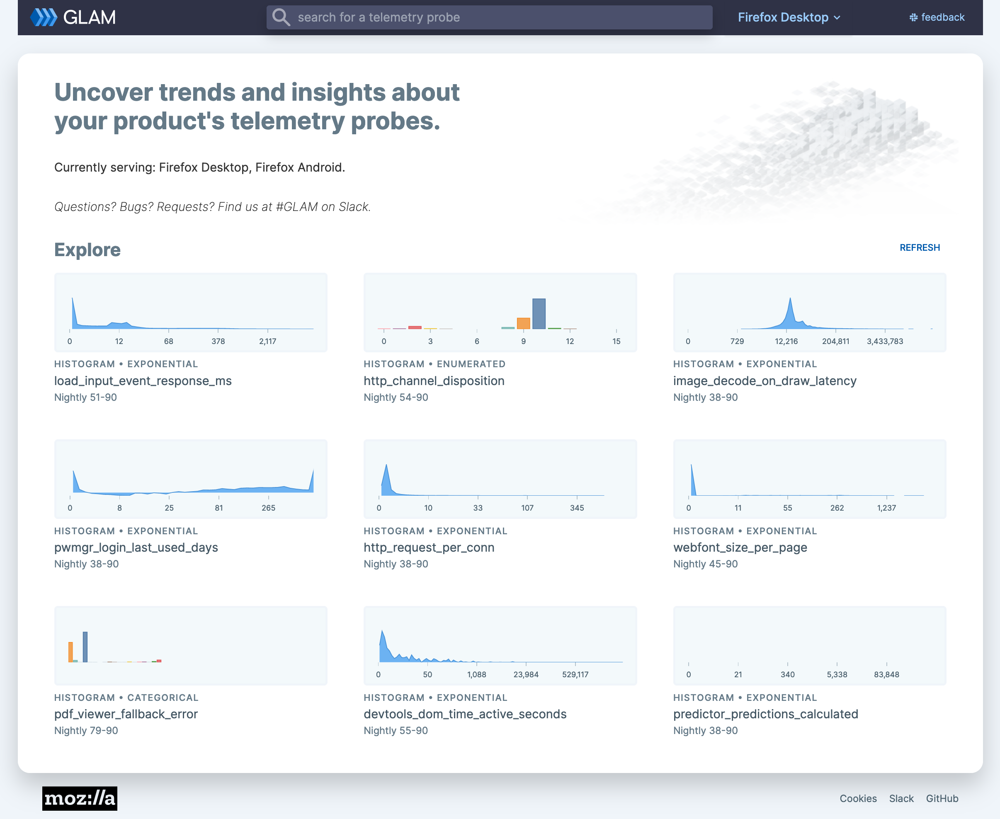

# Introduction to GLAM

GLAM was built to help Mozillians answer their data questions without needing data analysis or coding skills. It contains a visualization layer meant to answer most "easy" questions about how a probe or metric has changed over build ids and releases.

GLAM is one of several high-level data tools that we provide at Mozilla. For more information, see [Tools for Data Analysis](../introduction/tools.md).

Access to GLAM is currently limited to Mozilla employees and designated contributors (this [may change in the future](https://bugzilla.mozilla.org/show_bug.cgi?id=1712353)). For more information, see [gaining access](../concepts/gaining_access.md).

## How to use GLAM

You can visit GLAM at [`glam.telemetry.mozilla.org`](https://glam.telemetry.mozilla.org).

### Front page

The front page includes two main sections: the search bar and the random probe explorer. Fuzzy tech search is implemented to let users search not only by the probe title, but also by the full description.

GLAM is currently serving data for Firefox Desktop and Firefox for Android.

### Individual probe/metric page

Clicking on a probe or metric name takes you to the individual explorer, where most of the analysis happens. As this page is packed with data, we make sure that it's self-documented as much as possible: every button, surface, menu item, is tool-tipped with description and links.

**`(1)`** The left column shows metadata about the probe or metric: what kind, what channels it's active in, a description, associated bugs with its implementation. As our goal is to make GLAM a self-educating tool, we try to provide as much information as available, and link out to other resources where applicable ([Glean Dictionary](https://dictionary.telemetry.mozilla.org/), Looker, etc.)

**`(2)`** For convenience, we provide two utility features:

- `View SQL Query`: if you want to dig more deeply into the data than the GLAM UI allows, “View SQL Query” parses SQL that can be copied and then pasted into our [STMO Redash instance](../tools/stmo.md).
- `Export to JSON`: exports JSON data to be used in Jupyter notebook or similar services.

**`(3)`** A set of dimensions (qualitative attributes of data) to subset on

**`(4)`** `Time Horizon` lets users choose how much data they want to investigate: week, month, quarter, or all (note that we only keep data from the last three versions.)

**`(5)`** Probe or metric distribution and percentiles over time:

- `Percentiles` shows the percentiles of the probe over time. To perform analysis, set a reference point by clicking on a target date, then hover along the graph to see the recorded differences. See attached `tooltips` on the page for more instruction.
- The `compare` violin plot shows the comparison between two (vertical) normal distributions
- `Summary` table provides the exact numeric values of the percentiles of the median changes between Build IDs.

**`(6)`** shows the volume of clients with each given Build ID

## Going deeper

For more information about the datasets that power GLAM, see [GLAM Datasets](../datasets/glam.md).

If you have a question that can't be easily answered by the GLAM GUI, you can access the raw GLAM datasets using [`sql.telemetry.mozilla.org`](../tools/stmo.md).

## Getting help

If you have further questions, please reach out on the #GLAM slack channel.
