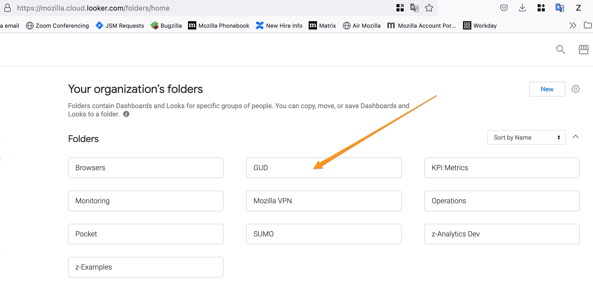
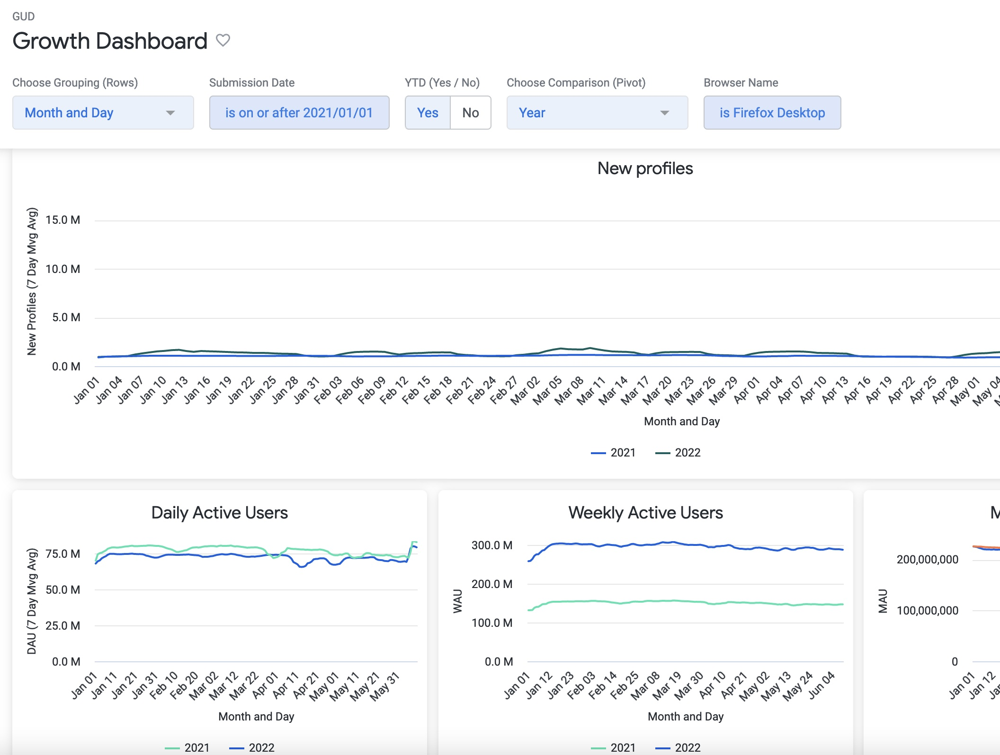
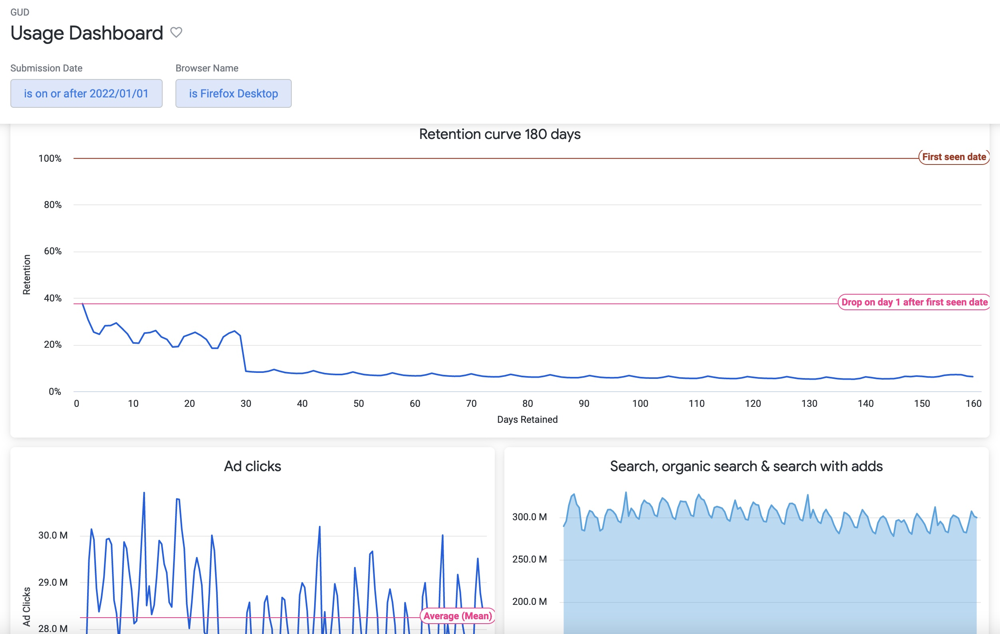
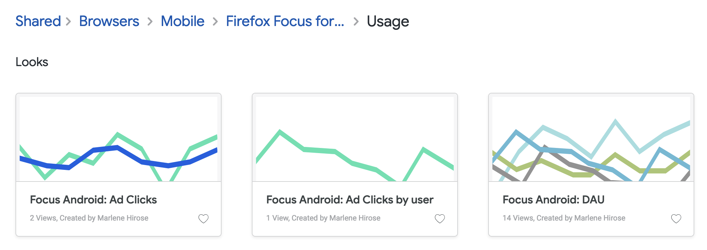

# Growth and Usage dashboards

The Mozilla Growth & Usage dashboards (GUD) are visualizations of growth metrics in a standard way across Mozilla’s products.

The dashboards have been migrated to Looker from the [previous GUD Dashboard](https://mozilla.github.io/gud/) as part of the Looker onboarding in Mozilla.

> Looker can be accessed from the SSO Dashboard.

## Growth Dashboard

This dashboard contains:
- The visualizations of daily, weekly and monthly active users in comparison with the previous year.
- The visualization of new profiles also in comparison with the previous period.

## Usage Dashboard

This dashboard contains:
- The retention curve for cohorts over a period of 180 days from the first seen date.
- The visualization of search, organic search and search with adds counts.
- The visualization of Ad clicks counts. 

## Browser views

If you want to explore each individual view for the browsers, find the location in the relevant `browser name` folder in Looker.

	Shared > Browsers > Mobile > _Browser_Name_ > Usage

The example below shows the location of the views for Firefox Focus for Android:

## Source
The dashboards and views for growth and usage are based on the `telemetry.active_users_aggregates` table, which contains the dimensions and metrics for desktop and mobile, as calculated from the `clients_last_seen` tables.
