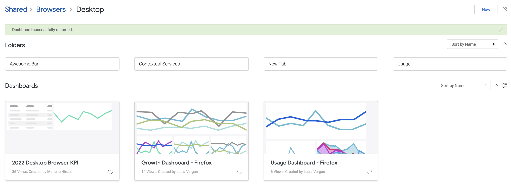
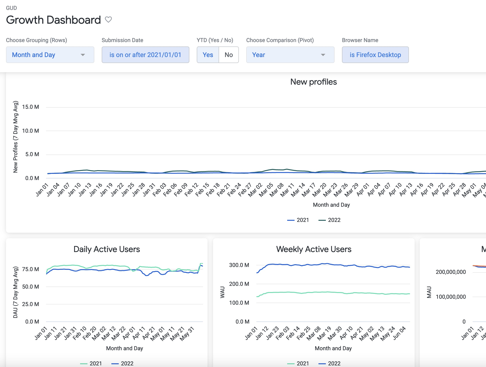
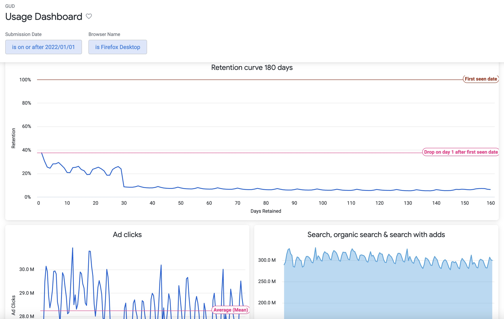
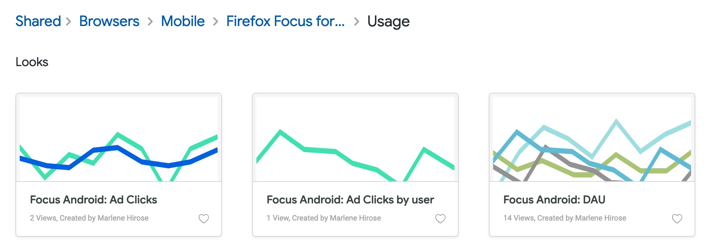

# Growth and Usage dashboards

The Mozilla Growth & Usage dashboards (GUD) are visualizations of growth metrics in a standard way across Mozilla’s products.

In Looker home screen go to `Shared > Browsers` and find the Desktop and Mobile consolidated dashboards inside the corresponding folder.

> ⚠️ Find Looker in the SSO Dashboard.

## Growth Dashboard

Find in this dashboard:
- The visualizations of daily, weekly and monthly active users in comparison with the previous year.
- The visualization of new profiles in comparison with the previous period.

## Usage Dashboard

Find in this dashboard:
- The retention curve for cohorts over a period of 180 days from the first seen date.
- The visualization of search, organic search and search with adds.
- The visualization of Ad clicks behaviour.

## Browser Looks

If you want to explore each individual visualization in Looker for the browsers, find them in the `Usage` folder inside the relevant `browser name` folder:

	Shared > Browsers > Desktop > Usage
	Shared > Browsers > Mobile > Firefox Focus for Android > Usage
	Shared > Browsers > Mobile > Firefox Focus for iOS > Usage
	Shared > Browsers > Mobile > Firefox for Android > Usage
	Shared > Browsers > Mobile > Firefox for iOS > Usage

The example below shows the location of the Looks for Firefox Focus for Android:

## Source
The dashboards and views for growth and usage are based on the `moz-fx-data-shared-prod.telemetry.active_users_aggregates` table, which contains the dimensions and metrics for desktop and mobile, as calculated from the `clients_last_seen` and `mobile_search_clients_daily_v1` tables.

	Note. The dashboards have been migrated to Looker from the previous GUD Dashboard at https://mozilla.github.io/gud/ as part of the Looker on-boarding and with the purpose of enhancement with new dimensions of analysis and improved performance.
