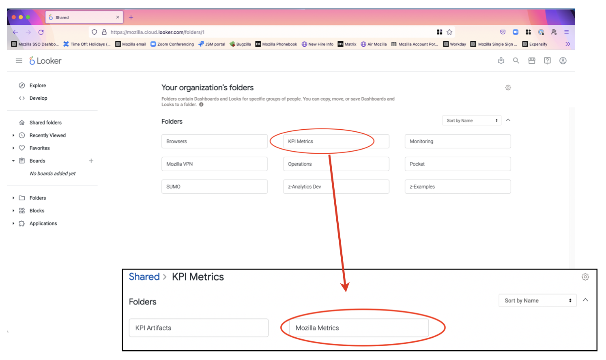
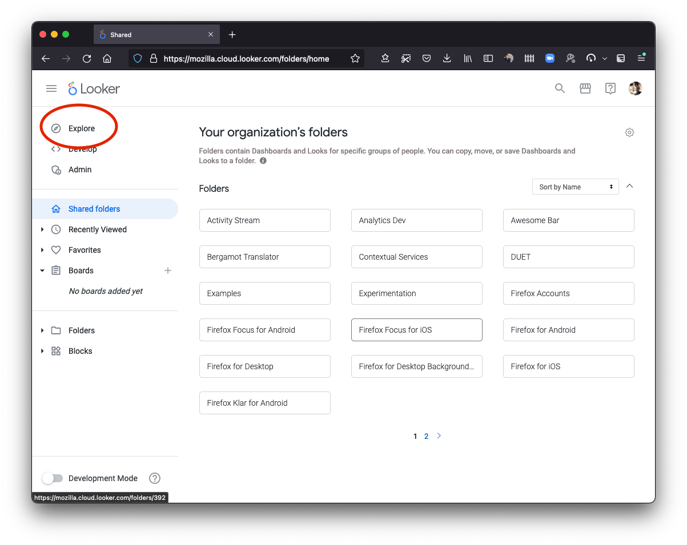
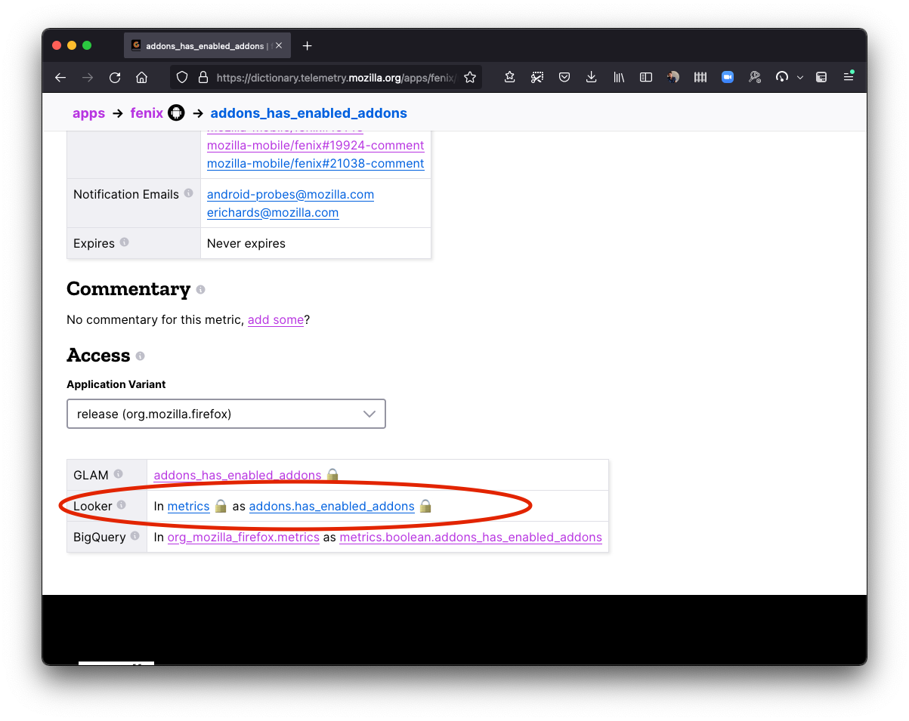

# Introduction to Looker

In 2020, Mozilla chose [Looker](https://looker.com/) as its primary tool for analyzing data.
It allows data exploration and visualization by experts and non-experts alike.

Access to Looker is currently limited to Mozilla employees and designated contributors. For more information, see [gaining access](../../concepts/gaining_access.md).

## Table of Contents

<!-- toc -->

## Accessing Looker

You can access Mozilla's instance of Looker at [`mozilla.cloud.looker.com`](https://mozilla.cloud.looker.com).

## Getting Started

### Front page

By default, on the front page you will see a list of default folders, which contain links to dashboards.
These are organized by project.
Of particular note is the [Mozilla Metrics folder], which includes several Data-produced and vetted dashboards like the Firefox Corporate KPI Dashboard.

[mozilla metrics folder]: https://mozilla.cloud.looker.com/folders/63

### Explores

One of the core concepts of Looker are [Explores].
These allow you to quickly explore datasets (both ping-level and derived datasets) within an intuitive user interface.

You can access the full list of explores available in Looker.
From the main page on the left, select "Explore".
From there, you can select an explore to view.
Most explores are grouped by application.
For example, there are a set of explores for both "Firefox Desktop" and "Firefox for Android".

[explores]: https://docs.looker.com/exploring-data/exploring-data

### Using the Glean Dictionary with Looker

The above list of explores can sometimes be overwhelming.
If your application uses [Glean] to collect data, one very viable workflow is to look up information on the metric(s) you're interested in using the [Glean Dictionary], then use the "Access" section at the bottom, which links directly out to the Looker explore(s) where you can access the data.

The following video demonstrates this workflow in detail:

<iframe width="560" height="315" src="https://www.youtube.com/embed/B635wgZy7Iw" title="YouTube video player" frameborder="0" allow="accelerometer; autoplay; clipboard-write; encrypted-media; gyroscope; picture-in-picture" allowfullscreen></iframe>

[glean]: ../../concepts/glean/glean.md
[glean dictionary]: ../analysis/glean_dictionary.md

## Going Deeper

If you want to explore Looker more deeply, you can check out:

- ["Looker Connect" training hub](https://connect.looker.com/library): A collection of self-paced video training courses for new users. Full courses are free, but require registration, but course descriptions contain preview videos that are useful on their own.
- [Looker Documentation](https://docs.looker.com/): Extensive text and video documentation, a “textbook” reference on how the product works.
- [Looker Help Center](https://help.looker.com/): Contains articles on common problems, specific use cases, error messages, and best practices.
- [Looker Community](https://community.looker.com/) has customer-written material, broadcasts from Looker employees (primarily release notes), and topics written by Looker employees that are not officially supported by Looker.

You can find additional Looker training resources on the [Looker Training Resources] mana page (LDAP access required).

[looker training resources]: https://mana.mozilla.org/wiki/display/DATA/Looker+Training+Resources
