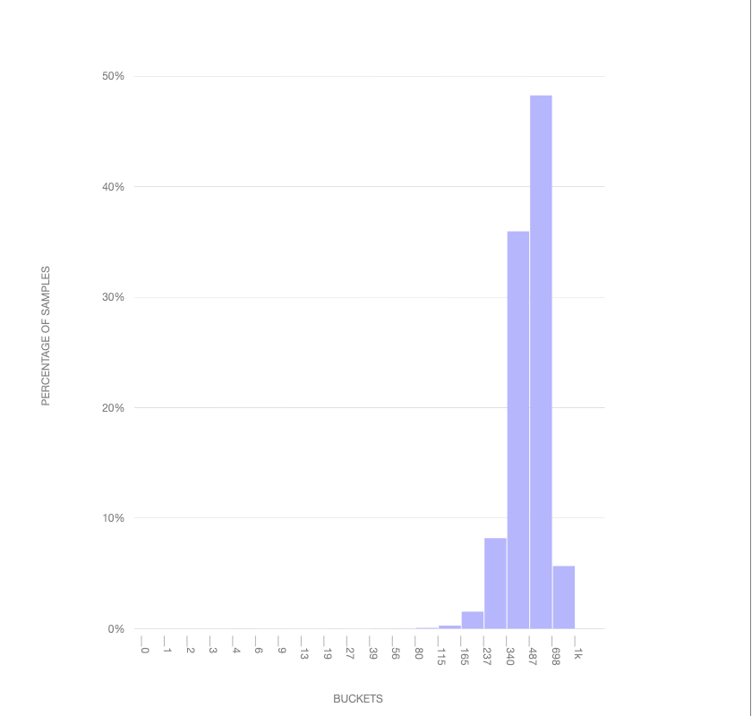
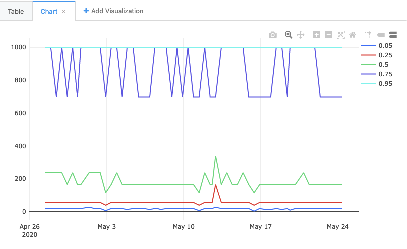
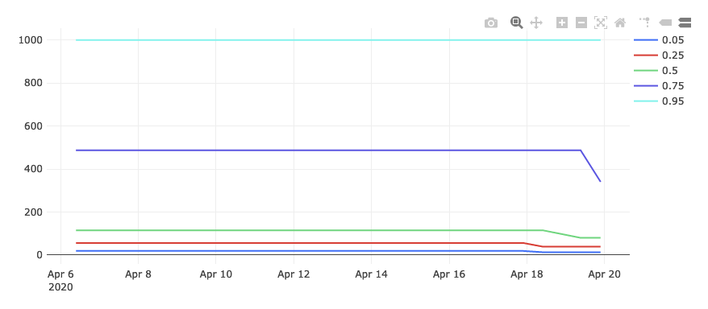
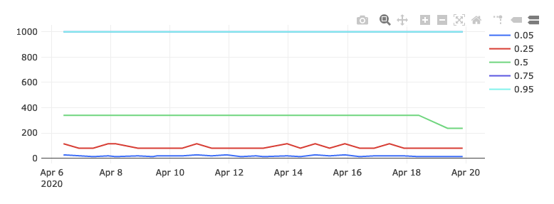

# Visualizing Percentiles of a Main Ping Exponential Histogram

[GLAM](https://glam.telemetry.mozilla.org/) is great if you want to check out the behaviour of a histogram over a large population across a curated set of dimensions, but what if you have a follow-up question that doesn't fit into its UI model? This tutorial will go into the guts of how to reproduce a GLAM-like view using `sql.telemetry.mozilla.org` (STMO), along with some suggestions on how to dig deeper.

This tutorial tries to build up an understanding and intuition of how things work on a low-level before it gets to its main act of reproducing GLAM. If you don't care about the details, you can probably skip the earlier sections in this document.

Assumptions: 
    - You have some idea of what a histogram is (if not, the [Wikipedia article](https://en.wikipedia.org/wiki/Histogram) is a great place to start), have at least skimmed over [the Firefox documentation on histograms](https://firefox-source-docs.mozilla.org/toolkit/components/telemetry/collection/histograms.html)
    - You have read [the introduction to STMO](../tools/stmo.md).
    - You understand the [main ping tables](../datasets/main_ping_tables.md) (`telemetry.main_1pct` and `telemetry.main_nightly`).

## Table of Contents

<!-- toc -->

## Setting the stage: tab spinners duration

For the purposes of this tutorial, let's look at a typical performance-oriented histogram: [`FX_TAB_SWITCH_SPINNER_VISIBLE_MS`](https://probes.telemetry.mozilla.org/?view=detail&probeId=histogram%2FFX_TAB_SWITCH_SPINNER_VISIBLE_MS) which we use to count the number of times a tab spinner appears after a switch tab operation in Firefox, along with the duration of
its appearance in milliseconds (ms). This is an unwanted operation (especially if it's long), as it makes the browser appear unresponsive and [confuses / disturbs users](https://support.mozilla.org/en-US/questions/1198062).

`FX_TAB_SWITCH_SPINNER_VISIBLE_MS` is what's called an [exponential histogram](https://firefox-source-docs.mozilla.org/toolkit/components/telemetry/collection/histograms.html#exponential): it represents an exponentially increasing distribution of values in each of its "buckets". It's probably easier to visualize this using the histogram viewer than describe:


[link](https://telemetry.mozilla.org/histogram-simulator/#low=1&high=1000&n_buckets=20&kind=exponential&generate=normal)

This visualization above shows how a [normal distribution](https://en.wikipedia.org/wiki/Normal_distribution) would map into the buckets: you'll see that it skews towards the end: the point of the exponential histogram is to be sensitive to lower values (which one would assume would be more frequent, so long as the tab spinner doesn't come up too frequently!). Each "tick" represents the range of a bucket (in milliseconds): so we have a bucket representing values between `1ms` and `2ms`, `2ms` and `3ms`, and so on. You'll note that this distribution caps out at 1000: any values greater than or equal to this will wind up in this bucket but we won't know their value with any precision. For tracking values higher than this, a separate histogram ([`FX_TAB_SWITCH_SPINNER_VISIBLE_LONG_MS`](https://probes.telemetry.mozilla.org/?view=detail&probeId=histogram%2FFX_TAB_SWITCH_SPINNER_VISIBLE_LONG_MS)) was created.

## Getting client-level data

Before we move on, let's do up a quick example of getting some client-level data using an SQL query, hopefully building up some intuition on how this stuff works on a low-level. From there, we can build up to aggregating it in interesting ways.

As of this writing, each main ping histogram is encoded as a JSON string inside the `telemetry.main` table inside BigQuery.

```sql
SELECT
  payload.histograms.FX_TAB_SWITCH_SPINNER_VISIBLE_MS AS histogram_json,
FROM
  telemetry.main_nightly -- Use telemetry.main_1pct for a 1% sample across channels
WHERE
  sample_id = 42
  AND normalized_channel = 'nightly' -- Only technically necessary if using telemetry.main or telemetry.main_1pct (see above)
  AND DATE(submission_timestamp) = '2020-04-20'
  AND payload.histograms.FX_TAB_SWITCH_SPINNER_VISIBLE_MS IS NOT NULL
LIMIT
  3
```

[link](https://sql.telemetry.mozilla.org/queries/71333/source)

Running this query on STMO, we get the following output:

| `histogram_json`                                                                                          |
| --------------------------------------------------------------------------------------------------------- |
| `{"bucket_count":20,"histogram_type":0,"sum":118,"range":[1,1000],"values":{"80":0,"115":1,"165":0}}`     |
| `{"bucket_count":20,"histogram_type":0,"sum":19145,"range":[1,1000],"values":{"237":0,"340":1,"1000":1}}` |
| `{"bucket_count":20,"histogram_type":0,"sum":1996,"range":[1,1000],"values":{"698":0,"1000":1}}`          |

In this representation, `bucket_count` and `range` represent the number of buckets and the range of possible values. `histogram_type` is an enumerated value that describes whether the histogram has linear, exponential, or categorical buckets; the values are [defined in the Firefox source code](https://searchfox.org/mozilla-central/rev/0c682c4f01442c3de0fa6cd286e9cadc8276b45f/toolkit/components/telemetry/core/nsITelemetry.idl#18-32).
`values` represents the number of instances in each of the buckets while `sum` represents the sum total of all histogram values recorded.
Note how the first column has one bucket with no elements in it (the "165" bucket), this is because Firefox adds a zero-count bucket on the left and right edges of the data (unless that would be one of the extremes and that bucket already has a count in it, as is the case for the "1000" bucket in the last two examples).

In general, it is best not to rely on this representation of the histogram in production code (it is quite likely to change in the future). Instead, use the [`mozfun.hist.extract`](https://mozilla.github.io/bigquery-etl/mozfun/hist/#extract) user-defined-function (UDF) and extract out the fields you need: for example, to just get the `sum` for all the histograms above, you could modify the query above to something like:

```sql
WITH intermediate AS (
  SELECT
    udf.json_extract_histogram(payload.histograms.FX_TAB_SWITCH_SPINNER_VISIBLE_MS) AS histogram,
  FROM
    telemetry.main_nightly -- Use telemetry.main_1pct for a 1% sample across channels
  WHERE
    sample_id = 42
    AND normalized_channel = 'nightly' -- Only technically necessary if using telemetry.main or telemetry.main_1pct (see above)
    AND DATE(submission_timestamp) = '2020-04-20'
    AND payload.histograms.FX_TAB_SWITCH_SPINNER_VISIBLE_MS IS NOT NULL
  LIMIT
    3
)
SELECT
  histogram.sum,
  histogram.bucket_count
FROM
  intermediate;
```

[link](https://sql.telemetry.mozilla.org/queries/71408/source)

Which yields:

| `sum` | `bucket_count` |
| ----- | -------------- |
| 118   | 20             |
| 19145 | 20             |
| 1996  | 20             |

Note that these are the same values in the JSON histogram above.

Obviously this by itself is not particularly useful or meaningful - generally we are interested in _aggregate_ behaviour across a larger set of clients. Let's look at how we might get that.

## Getting percentiles from a set of histograms

Often, questions around histograms are framed as "what's the 99th percentile?" -- that is, what is the _maximum_ value that 99% of users experience: this helps give perspective on data which may have a number of weird outliers (a.k.a the _Bill Gates walks into a bar and everyone inside becomes a millionaire_ effect). Let's take an initial stab of grabbing some percentiles of the data we were looking at earlier using the [`mozfun.hist.merge`](https://mozilla.github.io/bigquery-etl/mozfun/hist/#merge) and [`mozfun.hist.percentiles`](https://mozilla.github.io/bigquery-etl/mozfun/hist/#percentiles) UDFs:

```sql
WITH merged_histogram AS (
  SELECT
    udf.histogram_merge(
      ARRAY_AGG(udf.json_extract_histogram(payload.histograms.FX_TAB_SWITCH_SPINNER_VISIBLE_MS))
    ) AS spinner_visible_ms,
  FROM
    telemetry.main_nightly -- Use telemetry.main_1pct for a 1% sample across channels
  WHERE
    normalized_channel = 'nightly' -- Only technically necessary if using telemetry.main or telemetry.main_1pct (see above)
    AND normalized_os = 'Windows'
    AND DATE(submission_timestamp) = '2020-04-20'
),
percentiles AS (
  SELECT
    udf.histogram_percentiles(spinner_visible_ms, [.05, .25, .5, .75, .95]) AS percentile_nested
  FROM
    merged_histogram
)
SELECT
  percentile,
  value
FROM
  percentiles
CROSS JOIN
  UNNEST(percentiles.percentile_nested);
```

[link](https://sql.telemetry.mozilla.org/queries/71410/source)

Which gives us this set of results:

| Percentile | Value |
| ---------- | ----- |
| 0.05       | 13    |
| 0.25       | 56    |
| 0.50       | 165   |
| 0.75       | 698   |
| 0.95       | 1,000 |

So we see for this set of results that 95th percentile is `1000ms`, the 75th percentile is `698ms`, and so on.

There's a bit of intermediate-to-advanced SQL in the above query, due to the fact that the `histogram_percentiles` UDF returns an _array_ of results in a column (rather than a full-blown table) -- we wrangle the results into something we can handle using the [`UNNEST`](https://cloud.google.com/bigquery/docs/reference/standard-sql/query-syntax#unnest) operator combined with a cross-join at the end. If you don't immediately understand this, don't worry: it's just an implementation detail.

## Viewing change of percentiles over time

Knowing the approximate distribution of results on a given day is sort of interesting, but probably not what we really want: what we're usually interested in is the evolution of results _over time_. In particular, segmenting by `build_id` (a date-like structure in the `main` ping representing when Firefox was built) is a useful technique, as it allows us to see if changes to Firefox itself may have caused the distribution to change.

We can do this simply by _grouping by_ the build id field, and then merging the histograms corresponding to each:

```sql
WITH per_build_day AS (
  SELECT
    PARSE_DATETIME("%Y%m%d%H%M%S", application.build_id) AS build_id,
    KEY,
    SUM(value) AS value,
  FROM
    telemetry.main_nightly -- Use telemetry.main_1pct for a 1% sample across channels,
    UNNEST(
      udf.json_extract_histogram(
        payload.histograms.FX_TAB_SWITCH_SPINNER_VISIBLE_MS
      ).VALUES
    )
  WHERE
    normalized_channel = 'nightly' -- Only technically necessary if using telemetry.main or telemetry.main_1pct (see above)
    AND normalized_os = 'Windows'
    AND application.build_id > FORMAT_DATE("%Y%m%d", DATE_SUB(CURRENT_DATE, INTERVAL 2 WEEK))
    AND application.build_id <= FORMAT_DATE("%Y%m%d", CURRENT_DATE)
    AND DATE(submission_timestamp) >= DATE_SUB(CURRENT_DATE, INTERVAL 2 WEEK)
    AND DATE(submission_timestamp) <= CURRENT_DATE
  GROUP BY
    KEY,
    build_id
),
per_build_day_as_struct AS (
  SELECT
    build_id,
    STRUCT(ARRAY_AGG(STRUCT(KEY, value)) AS VALUES) AS spinner_visible_ms
  FROM
    per_build_day
  GROUP BY
    build_id
)
SELECT
  build_id,
  percentile,
  value
FROM
  per_build_day_as_struct
CROSS JOIN
  UNNEST(
    udf.histogram_percentiles(
      spinner_visible_ms,
      [.05, .25, .5, .75, .95]
    )
  )
```

[link](https://sql.telemetry.mozilla.org/queries/71472/source)

As an implementation note, observe that we don't use `histogram_merge` here as we do above: doing so would require using [`ARRAY_AGG`](https://cloud.google.com/bigquery/docs/reference/standard-sql/functions-and-operators#array_agg) which can break down when processing large amounts of data. Instead we create an intermediate result (the `per_build_day` `WITH` statement) and then reprocess it into a structured representation. If you're curious what the version using `histogram_merge` would look like, see [this example](https://sql.telemetry.mozilla.org/queries/71413/source).

In any case, rendering the data this query returns, we get a chart like this:



You'll note that the 75th and the 95th percentiles are often the same. Which is to say: in 25% of cases, the value was somewhere between `698ms` and `1000ms`. Does this mean that 25% of the time people are seeing a _very_ long-running tab spinner? _No!_ It actually points to a flaw in our methodology, which GLAM was explicitly designed to address. For the last part our tutorial, let's look into how it does it, and how to reproduce its approach.

## Percentiles from client-normalized histograms

The example above basically created one _giant_ histogram and then gathered the percentiles out of each one. But histograms are not created equal! At the extreme end of things for the tab spinner, consider a user on an extremely old computer with various kinds of malware installed, constantly interacting with complex and slow web sites. Such a condition is going to trigger the tab spinner frequently, and for long periods. But it is not representative of the overall population, and probably shouldn't _overtly_ influence our decision-making process.

A solution used by GLAM is to give each client "one vote": that is, the aggregate histogram for a client over a day must sum up to one. Even in the extreme case where all tab spinner measurements fall between `658ms` and `1000ms` (the range of the highest bucket), the _maximum_ number for that bucket is just "1".

We can reproduce this approach by using the [`mozfun.hist.normalize`](https://mozilla.github.io/bigquery-etl/mozfun/hist/#normalize) UDF, which explicitly takes a set of histograms and makes sure that the values for each one sum up to exactly one:

```sql
WITH per_build_client_day AS (
  SELECT
    PARSE_DATETIME("%Y%m%d%H%M%S", application.build_id) AS build_id,
    client_id,
    udf.histogram_normalize(
      udf.histogram_merge(
        ARRAY_AGG(
          udf.json_extract_histogram(
            payload.histograms.FX_TAB_SWITCH_SPINNER_VISIBLE_MS
          )
        )
      )
    ) AS tab_switch_visible_ms
  FROM
    telemetry.main_nightly -- Use telemetry.main_1pct for a 1% sample across channels
  WHERE
    normalized_channel = 'nightly' -- Only technically necessary if using telemetry.main or telemetry.main_1pct (see above)
    AND normalized_os = 'Windows'
    AND application.build_id > FORMAT_DATE("%Y%m%d", DATE_SUB(CURRENT_DATE, INTERVAL 14 DAY))
    AND application.build_id <= FORMAT_DATE("%Y%m%d", CURRENT_DATE)
    AND DATE(submission_timestamp) >= DATE_SUB(CURRENT_DATE, INTERVAL 14 DAY)
    AND DATE(submission_timestamp) <= CURRENT_DATE
  GROUP BY
    build_id,
    client_id
),
merged_histograms AS (
  SELECT
    build_id,
    KEY,
    SUM(value) AS value,
  FROM
    per_build_client_day,
    UNNEST(per_build_client_day.tab_switch_visible_ms.VALUES)
  GROUP BY
    KEY,
    build_id
),
as_struct AS (
  SELECT
    build_id,
    STRUCT(ARRAY_AGG(STRUCT(KEY, value)) AS VALUES) AS spinner_visible_long_ms
  FROM
    merged_histograms
  GROUP BY
    build_id
),
percentiles AS (
  SELECT
    build_id,
    udf.histogram_percentiles(
      spinner_visible_long_ms,
      [.05, .25, .5, .75, .95]
    ) AS percentile_nested
  FROM
    as_struct
)
SELECT
  build_id,
  percentile,
  value
FROM
  percentiles
CROSS JOIN
  UNNEST(percentiles.percentile_nested);
```

[link](https://sql.telemetry.mozilla.org/queries/71489/source)

You'll notice this query groups by `client_id` in addition to `build_id` before `histogram_normalize`. Grouping by `client_id` gives each user equal representation and prevents "power users" from skewing the result.

In any case, the result of this query is this graph:



Things are looking much better! The 95th percentile is still capped out at 1000, but the other percentiles are much lower.

## Slicing along arbitrary dimensions

OK, so we've reproduced GLAM, but that isn't particularly exciting in and of itself: if you just wanted to see a GLAM-like view of things, GLAM by itself is going to do a better job. The power of writing SQL comes when you want to see how things look on an arbitrary set of dimensions. Let's look at an arbitrary question: what do the tab spinner percentiles look like for Windows 7? These are likely to be much older machines, so we'd expect things to look worse. But how much?

We can filter our query to _just_ that group of users by adding a `AND normalized_os_version="6.1"` clause to our query above:

```sql
WITH per_build_client_day AS (
  SELECT
    PARSE_DATETIME("%Y%m%d%H%M%S", application.build_id) AS build_id,
    client_id,
    udf.histogram_normalize(
      udf.histogram_merge(
        ARRAY_AGG(
          udf.json_extract_histogram(
            payload.histograms.FX_TAB_SWITCH_SPINNER_VISIBLE_MS
          )
        )
      )
    ) AS tab_switch_visible_ms
  FROM
    telemetry.main_nightly -- Use telemetry.main_1pct for a 1% sample across channels
  WHERE
    normalized_channel = 'nightly' -- Only technically necessary if using telemetry.main or telemetry.main_1pct (see above)
    AND normalized_os = 'Windows'
    AND normalized_os_version = "6.1"
    AND application.build_id > FORMAT_DATE("%Y%m%d", DATE_SUB(CURRENT_DATE, INTERVAL 14 DAY))
    AND application.build_id <= FORMAT_DATE("%Y%m%d", CURRENT_DATE)
    AND DATE(submission_timestamp) >= DATE_SUB(CURRENT_DATE, INTERVAL 14 DAY)
    AND DATE(submission_timestamp) <= CURRENT_DATE
  GROUP BY
    build_id,
    client_id
),
merged_histograms AS (
  SELECT
    build_id,
    KEY,
    SUM(value) AS value,
  FROM
    per_build_client_day,
    UNNEST(per_build_client_day.tab_switch_visible_ms.VALUES)
  GROUP BY
    KEY,
    build_id
),
as_struct AS (
  SELECT
    build_id,
    STRUCT(ARRAY_AGG(STRUCT(KEY, value)) AS VALUES) AS spinner_visible_long_ms
  FROM
    merged_histograms
  GROUP BY
    build_id
),
percentiles AS (
  SELECT
    build_id,
    udf.histogram_percentiles(
      spinner_visible_long_ms,
      [.05, .25, .5, .75, .95]
    ) AS percentile_nested
  FROM
    as_struct
)
SELECT
  build_id,
  percentile,
  value
FROM
  percentiles
CROSS JOIN
  UNNEST(percentiles.percentile_nested);
```

[link](https://sql.telemetry.mozilla.org/queries/71437/source)

If we do this, we see this chart:



As you can see, both the 75th and 100th percentile are now in the highest bucket, and the 50th percentile is much higher as well. From this we can intuit that the user experience for these users is likely considerably worse, which is exactly what we would have expected.
