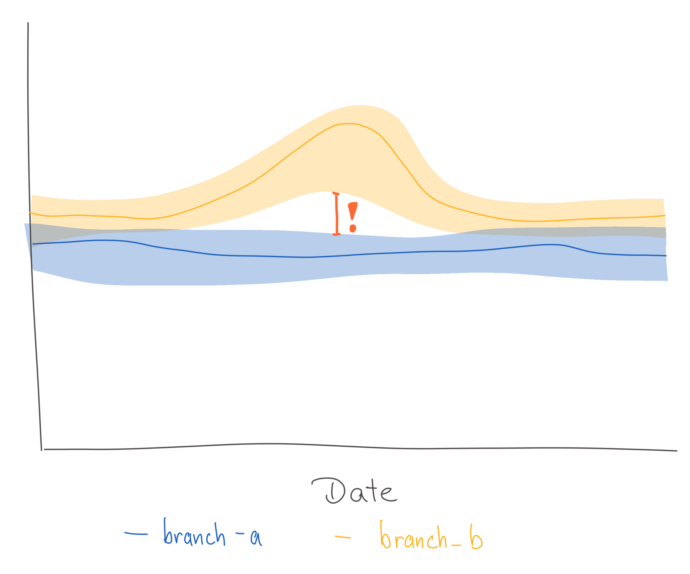
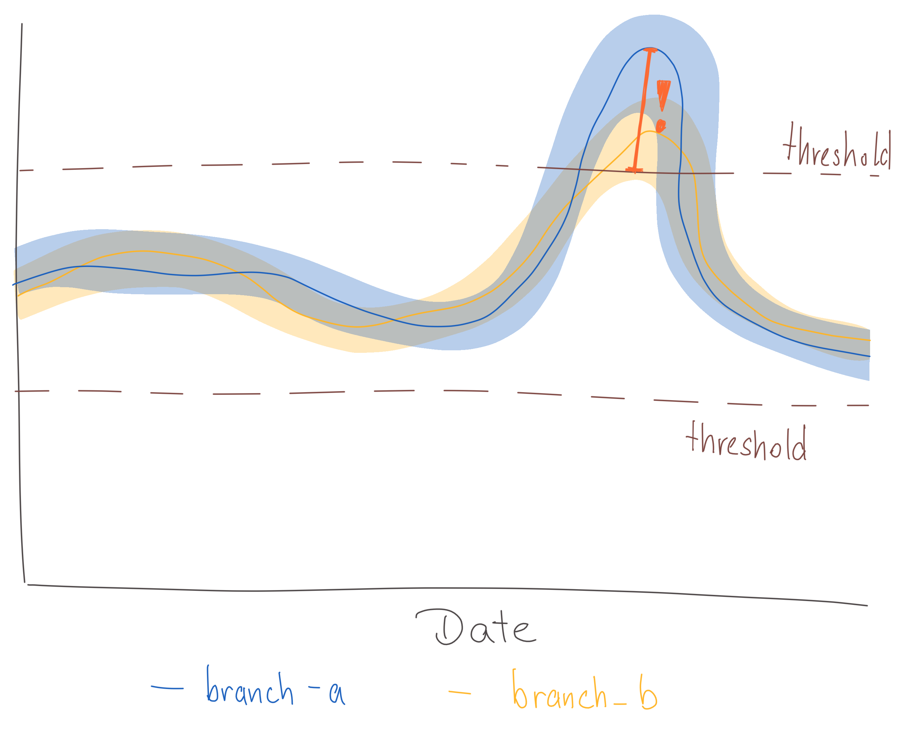
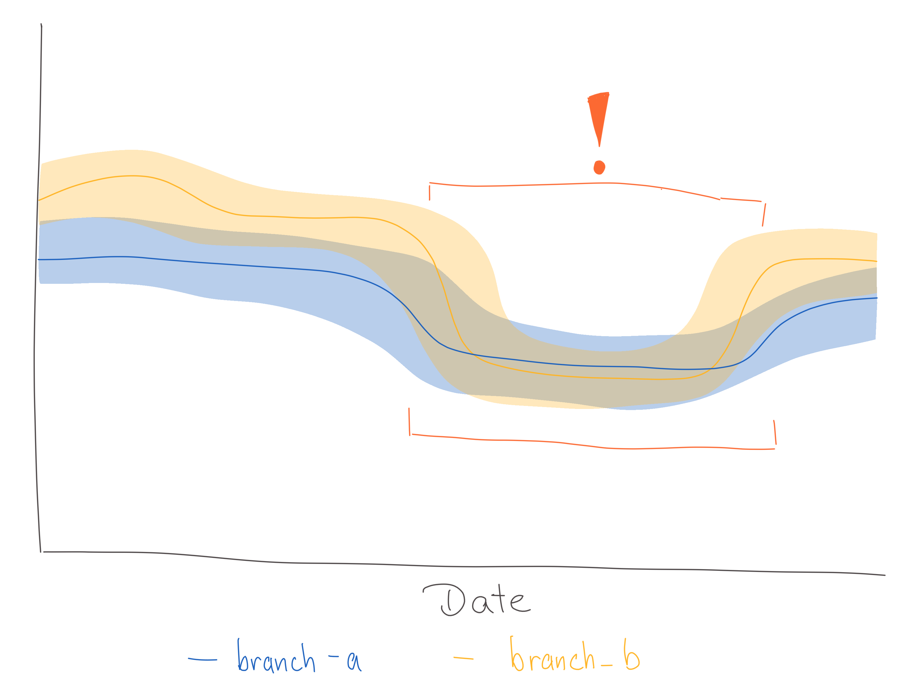
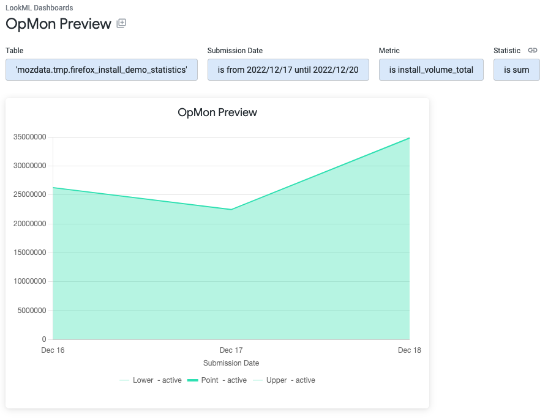
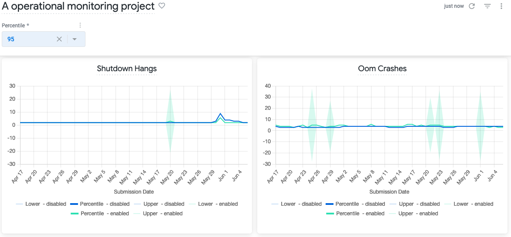
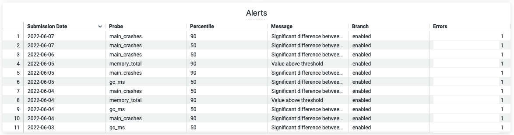
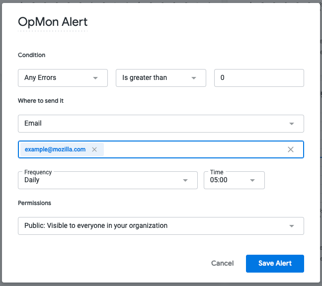

# Operational Monitoring (OpMon)

[Operational Monitoring (OpMon)](https://github.com/mozilla/opmon) is a self-service tool that aggregates and summarizes operational metrics that indicate the health of software.
OpMon can be used to continuously monitor rollouts, experiments (including experiments with continuous enrollments) or the population of a specific product (for example, Firefox Desktop).
OpMon automatically generates Looker dashboards that will provide insights into whether landing code changes impact certain metrics in a meaningful way.

A couple of specific use cases are supported:

1. Monitoring build over build. This is typically used for Nightly where one build may contain changes that a previous build doesn't and we want to see if those changes affected certain metrics.
2. Monitoring by submission date over time. This is helpful for a rollout in Release for example, where we want to make sure there are no performance or stability regressions over time as a new build rolls out.

The monitoring dashboards produced for these use cases are available in [Looker](https://mozilla.cloud.looker.com/folders/lookml).
OpMon does not emit real-time results. Dashboards and related datasets get updated on a daily basis.

Access to the Looker Operational Monitoring dashboards is currently limited to Mozilla employees and designated contributors. For more information, see [gaining access](../concepts/gaining_access.md).

## Configuring a Operational Monitoring project

To add or update a project configuration, open a pull request against the `opmon/` directory in [metric-hub](https://github.com/mozilla/metric-hub/tree/main/opmon).
Consider using and adding metric definitions to the [metric-hub](https://github.com/mozilla/metric-hub) that should be available for use across other tools, such as [Jetstream](https://experimenter.info/deep-dives/jetstream/overview), as well.

CI checks will validate the columns, data sources, and SQL syntax. Once CI completes, the pull request gets automatically approved and can be merged. Results for the new project will be available within the next 24 hours.

Project configurations files are written in [TOML](https://toml.io/en/). To reuse configurations across multiple projects, project configurations can reference configurations from definition files.
These definitions files are platform-specific and located in the [`opmon/definitions/` directory in metric-hub](https://github.com/mozilla/metric-hub/tree/main/opmon/definitions) or in the [metric-hub](https://github.com/mozilla/metric-hub) repository. Platform-specific configuration files follow the same format and structure as project configuration files.

If the project is used to monitor a rollout or experiment, then the configuration files should have the same name as the slug that has been assigned in [Experimenter](https://experimenter.services.mozilla.com/).
Generally, configuration files have four main sections: `[project]`, `[data_sources]`, `[metrics]`, and `[dimensions]`. All of these sections are optional.

Examples of every value you can specify in each section are given below. **You do not need to, and should not, specify everything!**
OpMon will take values from Experimenter (for rollouts and experiments) and combine them with a reasonable set of defaults.

Lines starting with a `#` are comments and have no effect.

### `[project]` Section

This part of the configuration file is optional and allows to:

- specify the metrics that should be analyzed
- define the clients that should be monitored
- indicate if/how the client population should be segmented, and
- override some values from Experimenter

This section is usually not specified in definition configuration.

```toml
[project]
# A custom, descriptive name of the project.
# This will be used as the generated Looker dashboard title.
name = "A new operational monitoring project"

# The name of the platform this project targets.
# For example, "firefox_desktop", "fenix", "firefox_ios", ...
platform = "firefox_desktop"

# Specifies the type of monitoring desired as described above.
# Either "submission_date" (to monitor each day) or "build_id" (to monitor build over build)
xaxis = "submission_date"

# Both start_date and end_date can be overridden, otherwise the dates configured in
# Experimenter will be used as defaults.
start_date = "2022-01-01"

# Whether to skip the analysis for this project entirely.
# Useful for skipping rollouts for which OpMon projects are generated automatically otherwise.
skip = false

# Whether the project is related to a rollout.
is_rollout = false

# Ignore the default metrics that would be computed.
skip_default_metrics = false

# Whether to have all the results in a single tile on the Looker dashboard (compact)
# or to have separate tiles for each metric.
compact_visualization = false

# Metrics, that are based on metrics, to compute.
# Defined as a list of strings. These strings are the "slug" of the metric, which is the
# name of the metric definition section in either the project configuration or the platform-specific
# configuration file.
# See [metrics] section on how these metrics get defined.
metrics = [
    'shutdown_hangs',
    'main_crashes',
    'startup_crashes',
    'memory_unique_content_startup',
    'perf_page_load_time_ms'
]

alerts = [
    "ci_diffs"
]

# This section specifies the clients that should be monitored.
[project.population]

# Slug/name of the data source definition section in either the project configuration or the platform-specific
# configuration file. This data source refers to a database table.
# See [data_sources] section on how this gets defined.
data_source = "main"

# The name of the branches that have been configured for a rollout or experiment.
# If defined, this configuration overrides boolean_pref.
branches = ["enabled", "disabled"]

# A SQL snippet that results in a boolean representing whether a client is included in the rollout or experiment or not.
boolean_pref = "environment.settings.fission_enabled"

# The channel the clients should be monitored from: "release", "beta", or "nightly".
channel = "beta"

# If set to "true", the rollout and experiment configurations will be ignored and instead
# the entire client population (regardless of whether they are part of the experiment or rollout)
# will be monitored.
# This option is useful if the project is not associated to a rollout or experiment and the general
# client population of a product should be monitored.
monitor_entire_population = false

# References to dimension slugs that are used to segment the client population.
# Defined as a list of strings. These strings are the "slug" of the dimension, which is the
# name of the dimension definition section in either the project configuration or the platform-specific
# configuration file. See [dimensions] section on how these get defined.
dimensions = ["os"]

# A set of metrics that should be part of the the same visualization
[project.metric_groups.crashes]
friendly_name = "Crashes"
description = "Breakdown of crashes"
metrics = [
    "main_crashes",
    "startup_crashes",
]
```

#### Metric Groups

Metrics groups allow to specify a set of existing metric definitions that should be displayed in the same visualization (like a graph, for example) as separate lines. Often these metrics are related to each other in some way and having them in a single graph simplifies visual comparison.

Metric groups are different from `dimensions`. Dimensions segment the population based on a specific criteria (for example a table field). Depending on the selected segment only data for this slice of the population is shown for all specified metrics.
Metric groups do not influence how metrics are computed, they only have an impact on how metrics are visualized.

### `[data_sources]` Section

Data sources specify the tables data should be queried from.

In most cases, it is not necessary to define project-specific data sources, instead data sources can be specified in and referenced from the
platform-specific definition configurations.

```toml
[data_sources]

[data_sources.main]
# FROM expression - often just a fully-qualified table name. Sometimes a subquery.
from_expression = "mozdata.telemetry.main"

# SQL snippet specifying the submission_date column
submission_date_column = "DATE(submission_timestamp)"

[data_sources.events_memory]
# FROM expression - subquery
from_expression = """
    (
        SELECT
            *
        FROM `moz-fx-data-shared-prod.telemetry.events`
        WHERE
            event_category = 'memory_watcher'
    )
"""
submission_date_column = "DATE(submission_date)"
```

### `[metrics]` Section

The metrics sections allows to specify metrics based on metrics that should be monitored.

In most cases, it is not necessary to define project-specific metrics, instead metrics can be specified and referenced from the
platform-specific definition configurations.

A new metric can be defined by adding a new section with a name like:

`[metrics.<new_metric_slug>]`

```toml
[metrics]

[metrics.memory_pressure_count]

# The data source to use. Use the slug of a data source defined in a platform-specific config,
# or else define a new data source (see above).
data_source = "events_memory"

# A clause of a SELECT expression with an aggregation
select_expression = "SUM(SAFE_CAST(SPLIT(event_string_value, ',')[OFFSET(1)] AS NUMERIC))"

# Type of the metric to be evaluated.
# This is used to determine the method of aggregation to be applied.
# Either "scalar" or "histogram".
type = "scalar"

# A friendly metric name displayed in dashboards.
friendly_name = "Memory Pressure Count"

# A description that will be displayed by dashboards.
description = "Number of memory pressure events"

# This can be any string value. It's currently not being used but in the future, this could be used to visually group different metrics by category.
category = "performance"
```

Statistics reduce observations of many clients to one or many rows describing the population.

Any summarization of the client-level data can be implemented as a statistic.

There is a fixed set of statistics available:

- `sum`
- `percentile` (default)
- `mean`
- `count`

```toml
# Specify which statistic to use for a metric
[metrics.memory_pressure_count.statistics]
sum = {}
mean = {}
```

New statistics need to be implemented in OpMon. Some statistics allow to specify additional parameters.

### `[dimensions]` Section

Dimensions define how the client population should be segmented.

For example:

```toml
[dimensions]

[dimensions.os]
# The data source to use. Use the slug of a data source defined in a platform-specific config,
# or else define a new data source (see above).
data_source = "main"

# SQL snippet referencing a field whose values should be used to segment the client population.
select_expression = "normalized_os"
```

The `os` dimension will result in the client population being segmented by operation system. For each dimension a filter is being added to the resulting
dashboard which allows to, for example, only show results for all Windows clients.

### `[alerts]` Section

Different types of alerts can be defined for metrics:

```toml
[alerts]

[alerts.ci_diffs]
# Alert for large differences between branches:
# an alert is triggered if confidence interval of different branches
# do not overlap
type = "ci_overlap"
metrics = [      # metrics to monitor
    "gc_ms",
    "startup_crashes",
]
percentiles = [50, 90]  # percentiles to monitor

[alerts.crash_tresholds]
# Thresholds based aler:
# an alert is triggered if defined thresholds are exceeded/subceeded
type = "threshold"
metrics = [  # metrics to monitor
    "oom_crashes",
    "gpu_crashes"
]
min = [0]    # lower thresholds
max = [10]   # upper thresholds

[alerts.historical_diff]
# Deviation from historical data:
# an alert is triggered if the average of the specified window deviates
# from the average of the previous window
type = "avg_diff"
metrics = [  # metrics to monitor
    "memory_total",
]
window_size = 7 # window size in days
max_relative_change = 0.5   # relative change that when exceeded triggers an alert
percentiles = [50, 90]  # percentiles to monitor
```

Currently, there are 3 different types of alerts:

- **Large differences between branches:** Whenever the confidence intervals of different branches for a specific metric no longer overlap, it indicates that there is potentially some significant difference.
- **Thresholds:** Comparing the values of a metric to a user-defined threshold.
- **Deviation from historical data:** Detect anomalous behaviour of a metric based on previously collected data.

#### Large differences between branches

The OpMon dashboards show the values for specific metrics as a line chart with confidence intervals. Each line represents the metric values for a different branch. Whenever the confidence intervals of the branches do not overlap, it is considered a critical change. See:



#### Thresholds

In some cases the expected value of a metric is known and any large deviation from that expected value is considered a critical change. Fixed thresholds can be used to specify when a value is too large or too low. See:



#### Deviation from historical data

An alert should be triggered for certain metrics if their value deviates significantly from historical records. Sudden changes could, for example, happen after a new version gets released. See:



It is not always possible to define a specific threshold, so instead previously recorded data should be used to detect significant deviations.

This check is the most complicated and computation-intensive one with potentially the highest number of false positives. There are a lot of different anomaly detection algorithms out there, but OpMon uses an approach which compares the average value of a metric of the past `n` days to the average value of the `n` days before. If the relative difference between these two values exceeds a defined threshold an alert will be triggered.

The main downside of this approach is that whenever spikes happen, alerts will be sent even after the spike has gone down since it will inflate the average values for a while.

## Previews

When iterating on configurations, it is sometimes useful to get a preview of what computed data on the final dashboard would look like. A preview can be generated by installing the [OpMon CLI tooling locally](https://github.com/mozilla/opmon#local-installation).

Once installed `opmon preview` can be run for a specific configuration or rollout:

```
> opmon preview --help
Usage: opmon preview [OPTIONS]

  Create a preview for a specific project based on a subset of data.

Options:
  --project_id, --project-id TEXT
                                  Project to write to
  --dataset_id, --dataset-id TEXT
                                  Temporary dataset to write to
  --derived_dataset_id, --derived-dataset-id TEXT
                                  Temporary derived dataset to write to
  --start_date, --start-date YYYY-MM-DD
                                  Date for which project should be started to
                                  get analyzed. Default: current date - 3 days
  --end_date, --end-date YYYY-MM-DD
                                  Date for which project should be stop to get
                                  analyzed. Default: current date
  --slug TEXT                     Experimenter or Normandy slug associated
                                  with the project to create a preview for
                                  [required]
  --config_file, --config-file PATH
                                  Custom local config file
  --config_repos, --config-repos TEXT
                                  URLs to public repos with configs
  --private_config_repos, --private-config-repos TEXT
                                  URLs to private repos with configs
  --help                          Show this message and exit.

> gcloud auth login --update-adc
> gcloud config set project mozdata
> opmon preview --slug=firefox-install-demo --config_file='/local/path/to/opmon/firefox-install-demo.toml'
Start running backfill for firefox-install-demo: 2022-12-17 to 2022-12-19
Backfill 2022-12-17
...
A preview is available at: https://mozilla.cloud.looker.com/dashboards/operational_monitoring::opmon_preview?Table='mozdata.tmp.firefox_install_demo_statistics'&Submission+Date=2022-12-17+to+2022-12-20
```

Once preview data has been computed, a link to a Looker dashboard will be printed where data for each metric and statistic is visualized.



The preview data gets written into the `tmp` dataset in the `mozdata` project by default. Data written to this dataset gets automatically removed after 7 days.

## Reading Results

Generated dashboards are available in [Looker](https://mozilla.cloud.looker.com/folders/494).



Dashboards have filters for selecting a percentile and for filtering based on the dimensions that have been configured.
For each metric results are visualized on separate tiles, with results being grouped by branches. Depending on the project configuration, the x-axis will either be by submission date or by Build ID.

Results are visualized as line charts with confidence intervals. Since Looker does only support simple line chart visualizations, the upper and lower bounds of the confidence intervals are shown in lighter colors while the median value for a specific branch is shown in a darker color.

Results are divided into different percentiles that can be changed through the dashboard filter:

- The 50th percentile represents the median value across all clients for a metric
- The 90th/95th/99th/... percentile are referring to the top 10%/5%/1%/... based on the measured metric. For example, in the screenshot above the 80th percentile is selected, so the top 20% of clients based on the _Perf Page Load Time Ms_ metric that are enrolled in the _enabled_ branch have a load time of around 6,600 ms.

Usually places where the confidence intervals of different branches have a gap between them - if the higher bound of one metric is below the lower bound of another metric - means there is a high likelihood that there is an actual difference between the measurement for the groups.

Each dashboard tile also allows to explore the data for a specific metric in more detail by clicking on _Explore from here_.

## Subscribing to Alerts

If alerts have been configured for a OpMon project, then the generated dashboard will show any triggered alerts in a table at the bottom of the dashboard:



To receive email or Slack notification whenever new alerts are being triggered, click on the _Alerts_ icon that is in the right corner of the _Alerts_ table.
Configure the alert by setting the condition, email addresses or Slack channels alerts should be sent to and the frequency of when checks should be performed:



## Data Products

OpMon writes monitoring results and metadata to BigQuery. OpMon runs as part of the nightly ETL job (see [Scheduling](#scheduling) below).

### Result Tables

The result tables that back the Looker dashboards are available in the `operational_monitoring_derived` dataset in `moz-fx-data-shared-prod`.
Result tables are named like:

`<slug>_v<version>`

`<slug>` is referring to the slug that has been set for the project and a separate table is created for metrics, statistics and alerts. The schema for metric tables is flexible and depends on the metrics configured to be computed.

Views for each tables are also created in the `operational_monitoring` dataset. These views are used by the Looker dashboards.

#### Metric tables

| Column name       | Type     | Description                         |
| ----------------- | -------- | ----------------------------------- |
| `submission_date` | `DATE`   | Date the monitoring results are for |
| `client_id`       | `STRING` | Client's telemetry `client_id`      |
| `branch`          | `STRING` | Branch client is enrolled in        |
| `build_id`        | `STRING` | Build the client is on              |

The result table will have additional columns for each metric and dimension that has been defined.

#### Statistic Tables

| Column name       | Type     | Description                         |
| ----------------- | -------- | ----------------------------------- |
| `submission_date` | `DATE`   | Date the monitoring results are for |
| `client_id`       | `STRING` | Client's telemetry `client_id`      |
| `branch`          | `STRING` | Branch client is enrolled in        |
| `build_id`        | `STRING` | Build the client is on              |

The result table will have additional columns for each metric and dimension that has been defined.

### Metadata

The table `projects_v1` in `operational_monitoring_derived` contains metadata about the configured projects that is required for generating the dashboards. The table is updated after each ETL run for a specific project.

| Column name  | Type     | Description                                                                              |
| ------------ | -------- | ---------------------------------------------------------------------------------------- |
| `slug`       | `STRING` | Project slug                                                                             |
| `name`       | `STRING` | Descriptive name of the project used as dashboard title                                  |
| `xaxis`      | `STRING` | Specifies which column should be used as x-axis (either "submission_date" or "build_id") |
| `branches`   | `ARRAY`  | List of branch names                                                                     |
| `dimensions` | `ARRAY`  | List of dimension slugs                                                                  |
| `start_date` | `DATE`   | Date for when monitoring should start for the project                                    |
| `end_date`   | `DATE`   | Date for when monitoring should end for the project                                      |
| `metrics`    | `RECORD` | Repeated record with the metric slug and aggregation type                                |

### Scheduling

OpMon is updated nightly by telemetry-airflow. It is invoked by the [operational_monitoring DAG](https://github.com/mozilla/telemetry-airflow/blob/main/dags/operational_monitoring.py).

## Experiments vs OpMon

The requirements for Operational Monitoring are related to, but mostly distinct from those for experiments:

- With an A/B experiment, the goal is to determine with confidence whether a single change (i.e. the treatment) has an expected impact on a metric or small number of metrics. The change is only applied to a sample of clients for a fixed period of time.
- With operational monitoring, a project team is making many changes over a long but indeterminate period of time and must identify if any one change or set of changes (e.g., changes in a given Nightly build) moves a metric in the target population. An identified metric impact may result in a change being backed out, but may also be used to guide future project work.

OpMon can be used to monitor experiments. For experiments with continuous enrollments or no fixed end date, OpMon will provide insights that would otherwise not be available. Other experiments, that are interested in looking at operational metrics could also benefit from OpMon.

## Going Deeper

To get a deeper understanding of what happens under the hood, please see the [opmon repository and developer documentation](https://github.com/mozilla/opmon).

## Getting Help

If you have further questions, please reach out on the [#data-help](https://mozilla.slack.com/archives/C4D5ZA91B) Slack channel.
