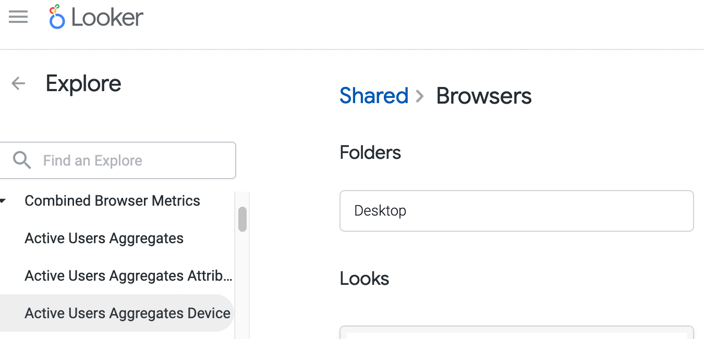

# Active Users Aggregates reference

<!-- toc -->

## Introduction

The `active_users_aggregates` is a set of 3 tables designed to analyze clients activity on a daily basis, starting from the date of installation.
These aggregates are created to support the migration of the Growth and Usage Dashboard GUD. Link to the [proposal](https://docs.google.com/document/d/1qvWO49Lr_Z_WErh3I3058A3B1YuiuURx19K3aTdmejM/edit?usp=sharing).

## Contents and access to the data

You can access each aggregate directly in BigQuery by querying the view name or in Looker using the link to the corresponding Looker explore.

#### telemetry.active_users_aggregates
This aggregates contains the metrics of daily, weekly and montly active users, as well as new profile and search counts aggregated by Mozilla product and business dimensions: attribution parameters, channel, country, city, date, device model, distribution_id, os details and segment.

[Explore active_users_aggregates in Looker](https://mozilla.cloud.looker.com/explore/combined_browser_metrics/active_users_aggregates)

#### telemetry.active_users_aggregates_device
This aggregate contains the metrics of daily, weekly and monthly active users as well as new profiles and search counts in the context of analysing per device.

The reason to have this aggregate in addition to active_users_aggregates is to improve the query performance for final users, by separating the analysis per device, which is the biggest size column in the table, as most devices have a unique identifiers.

[Explore active_users_aggregates_device in Looker](https://mozilla.cloud.looker.com/explore/combined_browser_metrics/active_users_aggregates_device)

#### telemetry.active_users_aggregates_attribution
This aggregate contains the metrics of daily, weekly and monthly active users as well as new profiles and search counts in the context of analysing where the installations come from and the cohorts behaviour. This information is retrieved by the attribution parameters and complemented with the core dimensions: country, submission_date, app_name and whether the browser is set to default or not.
Here is the documentation about [Adjust parameters](https://help.adjust.com/en/article/tracker-urls#campaign-structure-parameters).

The reason to have this aggregate in addition to active_users_aggregates is to improve the query performance for final users, by separating the analysis of the numerous attribution parameters, which is required with less regularity than other dimensions and mostly for specific purposes. E.g. During investigations or marketing campaigns.

[Explore active_users_aggregates_attribution in Looker](https://mozilla.cloud.looker.com/explore/combined_browser_metrics/active_users_aggregates_attribution)

### Pre-built visualizations in Looker:

The `Usage` folder for [Mobile and Desktop browsers](https://mozilla.cloud.looker.com/folders/748) includes a set of visualizations that you can access directly and are enhanced with the period over period analysis.

## Scheduling

This datasets is scheduled in the Airflow DAG [bqetl_analytics_aggregations](https://workflow.telemetry.mozilla.org/home?search=bqetl_analytics_aggregations) and updated daily.

## Code Reference

The query and metadata for the aggregates is defined in the corresponding subfolder in bigquery-etl under [telemetry_derived](https://github.com/mozilla/bigquery-etl/tree/main/sql/moz-fx-data-shared-prod/telemetry_derived).
