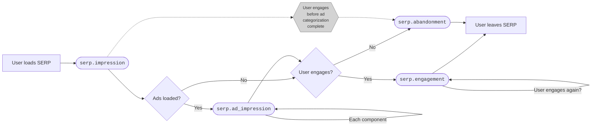

# SERP Events

## Table of Contents

<!-- toc -->

## Introduction

The `serp_events` table, derived from Glean `serp` events, provides a source
for understanding user interactions with search engine result pages (SERPs).
It is structured around SERP page loads and engagements
with different UI components on the SERP.
This data is Desktop-only.

## SERP impression model

A **SERP impression** consists of a SERP page load,
together with any user engagements with the links and UI features displayed on the page.
It starts from when the SERP is loaded.
Soon after the page loads, the browser runs a scan to detect sponsored search results (i.e. ads).
The user may engage with the page by clicking on a link or UI element.
The SERP impression ends when the user navigates away or closes the page.

The following diagram outlines the flow through a SERP impression,
along with the Glean events which are sent at different points.



A SERP impression is considered **engaged** if the user clicks at least once
on a search result link or UI component (out of the ones we track).
If the user leaves the SERP without engaging, the impression is considered **abandoned**.

### Ad detection and visibility

Depending on the search provider, ads may displayed across different
[display components](https://docs.google.com/document/d/1OxixC4r7hytWtwsHY0tDkq3rlY9vocmf5o0ija07A9o/edit#bookmark=id.nzlxxwj74kro)
(areas of the SERP with specific UI treatments), such as inline sponsored results,
a carousel showing result tiles streaming horizontally across the top,
a sidebar with result tiles laid out in a grid.
The ad detection procedure scans each of these components to check whether ad links are present.

Ad detection checks for ad links that are **loaded**, i.e. present in the DOM.
Loaded ad links may or may not be visible to the user.

- Ad links are considered **visible** or **showing** if the user has an opportunity to see them,
  i.e. display properties of the DOM element containing the ad link make them visible,
  and they are in the area of the page showing on the user's screen.
- They are considered **blocked** if the display properties of the DOM element
  containing the ad link appear to have been altered by an ad blocker so as to make it invisible.
- Ad links that are neither visible nor explicitly blocked are considered **not showing**.
  These may be hidden by the SERP or outside of the area of the page the user has seen,
  e.g. "below the fold", or additional results in the carousel the user needs to scroll to.

Usually, if an ad blocker is in use, all loaded ads will be blocked.
In such cases, we infer an **ad blocker to be in use**.

## Measurement

Measurement for SERP impressions is collected through Glean `serp` category events.
All events include the `impression_id` field in their event extras,
which is used to link together events associated with the same SERP impression.
SERP events are only implemented for specific search engines:
`google`, `bing`, `duckduckgo`, `ecosia`.

When a user loads a SERP, a
[`serp.impression`](https://dictionary.telemetry.mozilla.org/apps/firefox_desktop/metrics/serp_impression)
event is recorded with a newly-generated `impression_id`,
containing some top-level information about the impression and the search that led to it.
Note that a "SERP impression" means a single page load,
not a sequence of pages associated with the same search term
(which might be called a "search session").
If the user loads Page 2 of the search results, or opens the Shopping results page,
that is considered a separate SERP impression and generates a new `impression_id`.

When ad detection runs, a
[`serp.ad_impression`](https://dictionary.telemetry.mozilla.org/apps/firefox_desktop/metrics/serp_ad_impression)
event is generated for each display component containing at least 1 loaded ad link.
It lists counts of:

- loaded ads: `ads_loaded`
- ad links which are visible to the user: `ads_visible`
- ad links which appear to have been blocked: `ads_hidden`.

These counts have the following properties:

- `ads_loaded > 0`
- `0 <= ads_visible + ads_hidden <= ads_loaded`
- Usually `ads_hidden = 0` or `= ads_loaded`.

Beyond the main ad display components, `ad_impression` events are also reported
for a few additional shopping-related features
(which don't themselves contain ad links and are not monetizable):
the shopping tab, and Google's refined search buttons.
For these, `ads_loaded` tracks whether the feature was on the page, and is either 0 or 1.

A separate
[`serp.engagement`](https://dictionary.telemetry.mozilla.org/apps/firefox_desktop/metrics/serp_engagement)
event is recorded each time the user clicks on one of the instrumented UI components.
These include the ad components, as well as any non-ad link on the page,
and the in-content search box at the top.
Along with clicks on links, some components report additional engagement types,
such as the Expand (right arrow) button for the carousel,
and submitting a new search from the search box.

The following table summarizes impressions and engagements instrumented for each component:

<div class="table-wrapper">
<table>
  <thead>
    <tr>
      <th></th>
      <th>Component</th>
      <th>Impression reported</th>
      <th>Possible engagement actions</th>
      <th>Search engines supported</th>
    </tr>
  </thead>
  <tbody>
    <tr>
      <th rowspan="5">Ad components</th>
      <td><code>ad_carousel</code></td>
      <td><code>serp.ad_impression</code></td>
      <td><code>clicked</code>, <code>expanded</code></td>
      <td>all</td>
    </tr>
    <tr>
      <td><code>ad_image_row</code></td>
      <td><code>serp.ad_impression</code></td>
      <td><code>clicked</code></td>
      <td>all</td>
    </tr>
    <tr>
      <td><code>ad_link</code></td>
      <td><code>serp.ad_impression</code></td>
      <td><code>clicked</code></td>
      <td>all</td>
    </tr>
    <tr>
      <td><code>ad_sidebar</code></td>
      <td><code>serp.ad_impression</code></td>
      <td><code>clicked</code></td>
      <td>all except Ecosia</td>
    </tr>
    <tr>
      <td><code>ad_sitelink</code></td>
      <td><code>serp.ad_impression</code></td>
      <td><code>clicked</code></td>
      <td>all</td>
    </tr>
    <tr>
      <th rowspan="4">Other page components</th>
      <td><code>refined_search_buttons</code></td>
      <td><code>serp.ad_impression</code></td>
      <td><code>clicked</code>, <code>expanded</code></td>
      <td>Google only</td>
    </tr>
    <tr>
      <td><code>shopping_tab</code></td>
      <td><code>serp.ad_impression</code></td>
      <td><code>clicked</code></td>
      <td>all</td>
    </tr>
    <tr>
      <td><code>incontent_searchbox</code></td>
      <td>None (impression assumed)</td>
      <td><code>clicked</code>, <code>submitted</code></td>
      <td>all</td>
    </tr>
    <tr>
      <td><code>non_ads_link</code></td>
      <td>None (impression assumed)</td>
      <td><code>clicked</code></td>
      <td>all</td>
    </tr>
  </tbody>
</table>
</div>

If the user leaves the page without making an engagement,
a
[`serp.abandonment`](https://dictionary.telemetry.mozilla.org/apps/firefox_desktop/metrics/serp_abandonment)
event is generated, indicating the `reason` for abandonment:
navigating to a different page, or closing the tab or window.

One subtlety here is that there is no explicit signal for when an engaged SERP impression ends.
The user may leave the SERP open a long time and keep clicking on different links or components.
To count engagements, we need to aggregate all `engagement` events for that `impression_id`,
and these may come in over some undefined period of time.
We handle this by imposing a 2-day maximum SERP impression length at ETL time,
as described [below](#assumptions-on-event-sequences).

### Limitations of ad impression detection

As the ad detection procedure runs at most once for a SERP impression
against a snapshot of the page,
ad impression and click reporting will be subject to some small systematic bias.
This is important to be aware of, although no explicit correction is used at present.

As a user continues to interact with the SERP,
it is possible for additional ads to become visible and for the user to engage with those.
For example, if the user keeps scrolling further down the page,
they may begin to see ads which were considered "not showing" by ad detection.
Engagements with these ads will be recorded, but the impressions may not,
meaning that the number of visible ad links may be undercounted.

There is also an edge case in which the user may click on a result
before ad detection has time to complete;
such impressions are reported as abandoned, and ad impressions and clicks are ignored.

Note that the Legacy Telemetry ad click measurement will count all of these cases as ad clicks,
since it checks links for ads at click time rather than taking a snapshot.
This means that the `serp` events will undercount ad clicks somewhat relative to Legacy Telemetry.

The different cases are described in the following table:

| Engagement target                                                                                                                                              | Click reporting                             | Link impression reporting                                                                        |
| -------------------------------------------------------------------------------------------------------------------------------------------------------------- | ------------------------------------------- | ------------------------------------------------------------------------------------------------ |
| Non-ad component                                                                                                                                               | `serp.engagement` for target                | No explicit reporting, impression assumed                                                        |
| Ad detected as visible                                                                                                                                         | `serp.engagement` for ad component          | Included in `ads_visible` count of `serp.ad_impression` for component                            |
| Ad detected but not visible<p>Eg. user scrolls to reveal an ad that was on the page but not in the visible area when ad detection was run                      | `serp.engagement` for ad component          | Included in `ads_loaded` count but not `ads_visible` count of `serp.ad_impression` for component |
| Ad not previously detected<p>Eg. user scrolls down and more results are loaded automatically. Includes ads that were not on the page when ad detection was run | `serp.engagement` for `non_ad_link`         | Not included in `serp.ad_impression`                                                             |
| Engagement before ad detection completed                                                                                                                       | None. A `serp.abandonment` is sent instead. | None                                                                                             |

## Ad impressions and clicks

One of the main applications of this data is to compute ad impressions and clicks per SERP impression.
As discussed above, a SERP impression may include several ad links across different display components,
as well as nonsponsored links, and see multiple engagements with any of these.
Depending on the use case, ad impressions and clicks may be viewed either per-component or per-SERP impression.

Also, to count impressions and clicks, we can either count individual ads and clicks,
or the number of page loads with least one ad or click.
The latter is usually preferred, since the former could give CTR counts larger than 1
and is more susceptible to issues described [above](#limitations-of-ad-impression-detection).
The rate of individual ad impressions per component may be of interest as well.

A display component in a SERP impression is said to have:

- an **ad impression** if it had at least 1 visible ad
- a **click** if it had at least 1 visible ad and at least 1 click engagement.

This means that, for a given SERP impression and display component,
_ad impression_ and _click_ are both binary 0/1 variables.
**CTR** for ads is then defined as `clicks / ad impressions`, and will be between 0 and 1.
We can also compute CTR for components that don't have explicit impression reporting,
such as organic results, by assuming 1 impression per SERP.

Impressions, clicks and CTR can be computed per SERP impression instead
by considering an impression or click to have occurred if at least 1 display component had one.

If a component has ads loaded, and they are all hidden,
an **ad blocker is inferred** to be in use on the component.
At the SERP level, ad ad blocker is inferred to be in use if is it inferred on at least 1 ad component.

## SERP events table

The
[`mozdata.firefox_desktop.serp_events`](https://github.com/mozilla/bigquery-etl/blob/main/sql_generators/serp_events/templates/desktop_query.sql)
table has **multiple rows per SERP impression** (indexed by `impression_id`),
**1 row for each unique display component** that had either an ad impression or an engagement.
SERP impressions with neither have 1 row with a component value of `null`.
Each row aggregates multiple underlying Glean events.
Rows for submission date `D` represent all SERP impressions
whose `serp.impression` event has submission date `D`.

The table contains columns pulling information from all 4 event types.
Values computed from `impression` and `abandonment` events are repeated
down all rows associated with the `impression_id`.
This example table shows a summary view of the schema:

| `impression_id` | Impression info | `abandon_reason` | `component` | Engagement counts | Ad impression counts |
| --------------- | --------------- | ---------------- | ----------- | ----------------- | -------------------- |
| `123`           | `abc`           | `null`           | `C1`        | `N1`              | `M1`                 |
| `123`           | `abc`           | `null`           | `C2`        | `N2`              | `M2`                 |
| `456`           | `def`           | `A`              | `C1`        | 0                 | `M3`                 |
| `456`           | `def`           | `A`              | `C3`        | 0                 | `M4`                 |
| `789`           | `ghi`           | `B`              | `null`      | 0                 | 0                    |

In this example:

- Impression `123` is engaged, and had ad impressions and engagements for components `C1` and `C2`.
  Component `C3` had neither ad impressions nor engagements on this SERP impression,
  so there is no corresponding row.
- Impression `456` is abandoned, but had some ad impressions for components `C1` and `C3`.
- Impression `789` is abandoned and had no ad impressions.

### Ad impression counts

Ad impression counts should generally be read from the `num_ads_showing` and `num_ads_notshowing` columns.
These are computed from the raw counts reported in the events,
which are included in the `num_ads_loaded_reported`/`num_ads_visible_reported`/`num_ads_hidden_reported` columns,
according to the following logic.
The `ad_blocker_inferred` column indicates whether we assume an ad blocker was in use on a display component.

| `num_ads_hidden_reported` case        | `num_ads_showing`                                      | `num_ads_notshowing`                                                             | `ad_blocker_inferred` |
| ------------------------------------- | ------------------------------------------------------ | -------------------------------------------------------------------------------- | --------------------- |
| `== 0`                                | `= num_ads_visible_reported`                           | `= num_ads_loaded_reported - num_ads_visible_reported`                           | `false`               |
| `== num_ads_loaded_reported`          | `0`                                                    | `0`                                                                              | `true`                |
| `> 0` and `< num_ads_loaded_reported` | `= num_ads_visible_reported + num_ads_hidden_reported` | `= num_ads_loaded_reported - num_ads_visible_reported - num_ads_hidden_reported` | `false`               |

The last row represents an edge case in which some but not all loaded ads are blocked.
Per Engineering, this is best interpreted as a shortcoming of the detection method
rather than an ad blocker operating selectively.
In this case, ads reported as "blocked" are considered to actually be visible.

### Assumptions on event sequences

We expect to see the following events reported for a given `impression_id`:

- 1 `serp.impression` event
- Either 1 `serp.abandonment` event or else 1 or more `serp.engagement` events
- 0 or more `serp.ad_impression` events, with at most 1 per component

Impression IDs for events which don't meet these requirements
are excluded from the table (this only affects a handful of impressions).

As discussed above,
a user could potentially keep a SERP open in their browser for multiple days
and keep recording clicks over that time,
as impression IDs don't have an inherent expiration.
In filling the table,
we only allow events for an impression ID to span at most **2 consecutive submission dates**:
`serp` events with a submission date 2 or more days after
the first submission date observed for that impression ID are ignored[^1].
As a result, the `serp_events` table has a **2-day lag** in its data
rather than the 1-day lag present for most other datasets.

On day `D`, the ETL logic looks like the following:

1. Pull all `serp` events with submission dates `D-2` or `D-1`
2. Retain event sequences (sharing a common `impression_id`)
   meeting the above requirements whose `serp.impression` event has submission date `D-2`
3. Compute 1 or more rows for each event sequence and insert into the table
   with submission date `D-2`.

### Gotchas

- To count number of SERP impressions that had X, use `COUNT(DISTINCT impression_id)`.
- Use `num_ads_showing` and `num_ads_notshowing` to count ad impressions.
- The table fills at a 2-day lag: the most recent submission date in the table is 2 days ago, not yesterday.
- `ad_blocker_inferred` applies individually to the display component,
  and a single `impression_id` may have different values of `ad_blocker_inferred` across components.
  To compute a per-SERP impression version of `ad_blocker_inferred`,
  check if any component had `ad_blocker_inferred = true`.
- Ad blocker use can only be inferred when ads are loaded
  (which is a minority of all SERP impressions).
  If ads are not loaded, `ad_blocker_inferred` will report `false`,
  but really there is not enough information to make a determination.
- Currently `is_ad_component` and `has_ads_loaded` refers to all components
  reported in the `ad_impression` event, which includes `refined_search_buttons` and `shopping_tab`.
  To compute monetizable ad impressions or clicks, these need to be filtered out.

### Example queries

Number of engaged and abandoned SERP impressions:

```sql
SELECT
  IF(is_engaged, 'engaged', 'abandoned') AS session_type,
  COUNT(DISTINCT impression_id) AS num_serp
FROM
  `mozdata.firefox_desktop.serp_events`
GROUP BY
  1
```

Number of SERP impressions with ads loaded:

```sql
SELECT
  component IN ('ad_carousel', 'ad_image_row', 'ad_link', 'ad_sidebar', 'ad_sitelink')
    AND num_ads_loaded_reported > 0 AS has_ads_loaded,
  COUNT(DISTINCT impression_id) AS num_serp
FROM
  `mozdata.firefox_desktop.serp_events`
GROUP BY
  1
```

Number of SERP impression-level ad impressions and clicks

```sql
SELECT
  COUNT(DISTINCT impression_id) as num_with_ad_impression,
  COUNT(DISTINCT IF(num_clicks > 0, impression_id, NULL)) as num_with_ad_click,
FROM
  `mozdata.firefox_desktop.serp_events`
WHERE
  component IN ('ad_carousel', 'ad_image_row', 'ad_link', 'ad_sidebar', 'ad_sitelink')
  AND num_ads_showing > 0
```

Proportion of loaded ads that are visible, by search engine & component:

```sql
SELECT
  search_engine,
  component,
  SAFE_DIVIDE(SUM(num_ads_showing), SUM(num_ads_loaded_reported)) as prop_visible
FROM
  `mozdata.firefox_desktop.serp_events`
GROUP BY
  1,
  2
ORDER BY
  1,
  2
```

Number of SERP impressions with ads loaded and an ad blocker in use:

```sql
SELECT
  ad_blocker_inferred,
  COUNT(DISTINCT impression_id) as num_serp
FROM
  `mozdata.firefox_desktop.serp_events`
WHERE
  has_ads_loaded
GROUP BY
  1
```

Ad impression rates, among sessions with ads showing:

```sql
SELECT
  component,
  SAFE_DIVIDE(SUM(num_ads_showing), COUNT(DISTINCT impression_id)) AS ad_imp_rate
FROM
  `mozdata.firefox_desktop.serp_events`
WHERE
  component IN ('ad_carousel', 'ad_image_row', 'ad_link', 'ad_sidebar', 'ad_sitelink')
  AND num_ads_showing > 0
```

Abandonment reason distribution:

```sql
SELECT
  abandon_reason,
  COUNT(DISTINCT impression_id) AS num_sessions
FROM
  `mozdata.firefox_desktop.serp_events`
WHERE
  NOT is_engaged
GROUP BY
  1
```

### Column descriptions

As described above, the table has multiple rows for each SERP impression, 1 row per display component.
The first few columns hold properties of the SERP impression;
the values in each of these columns will be the same down all rows
corresponding to the same `impression_id`.
The remaining columns hold properties of each display component on the SERP.

| Column                     | Description                                                                                                                                                                                                                                                                         |
| -------------------------- | ----------------------------------------------------------------------------------------------------------------------------------------------------------------------------------------------------------------------------------------------------------------------------------- |
| `impression_id`            | UUID identifying SERP page loads. The table may have multiple rows with the same `impression_id`, 1 row per `component`. Use `COUNT(DISTINCT impression_id)` to count unique SERP loads.                                                                                            |
| `event_timestamp`          | Glean event timestamp for the `serp.impression` event corresponding to the SERP page load.                                                                                                                                                                                          |
| `is_shopping_page`         | Is the SERP a shopping page, resulting from clicking on the "Shopping" tab?                                                                                                                                                                                                         |
| `search_engine`            | `google`, `bing`, `duckduckgo`, `ecosia` (only these support SERP events currently)                                                                                                                                                                                                 |
| `sap_source`               | How the user arrived at the SERP [e.g. `urlbar`, `follow_on_from_refine_on_SERP`]                                                                                                                                                                                                   |
| `is_tagged`                | Whether the search is tagged (`true`) or organic (`false`)                                                                                                                                                                                                                          |
| `is_engaged`               | Did the SERP have at least 1 engagement (`clicked`, `expanded` or `submitted`)?                                                                                                                                                                                                     |
| `abandon_reason`           | Why the SERP is deemed abandoned: `tab_close`, `window_close`, `navigation`, or `null` if not abandoned.                                                                                                                                                                            |
| `ping_seq`                 | `ping_info.seq` from the events ping. Use together with `event_timestamp` for event sequencing.                                                                                                                                                                                     |
| `has_ads_loaded`           | Did the SERP have at least 1 ad loaded (across all `ad_impression` components)?                                                                                                                                                                                                     |
| `component`                | SERP display component corresponding to ad impression or engagement counts [e.g. `ad_link`, `non_ads_link`]. This includes both ad components and non-ad components. Different components support different engagement types, and only ad components support ad impressions.        |
| `is_ad_component`          | Is the component covered by `serp.ad_impression` events?                                                                                                                                                                                                                            |
| `num_clicks`               | Number of clicks recorded on `component` for the SERP page load. All components support clicks.                                                                                                                                                                                     |
| `num_expands`              | Number of expands recorded on `component` for the SERP page load. Only `ad_carousel`, `refined_search_buttons` support expands.                                                                                                                                                     |
| `num_submits`              | Number of submits recorded on `component` for the SERP page load. Only `incontent_searchbox` supports submits.                                                                                                                                                                      |
| `num_ads_loaded_reported`  | Number of ads loaded in `component` for the SERP page load. They may or may not be visible on the page.                                                                                                                                                                             |
| `num_ads_visible_reported` | Number of ads visible to the user in `component` for the SERP page load, as reported in the event. Use `num_ads_showing` instead to count visible ads.                                                                                                                              |
| `num_ads_hidden_reported`  | Number of ads hidden by an ad blocker in `component` for the SERP page load, as reported in the event. Use `num_ads_notshowing` instead to count ads loaded but not showing.                                                                                                        |
| `ad_blocker_inferred`      | Can we infer an ad blocker is in use on `component`? `true` if all loaded ads in the `component` are blocked, `false` otherwise. A single SERP page load can have `ad_blocker_inferred = true` for one ad component and `ad_blocker_inferred = false` for a different ad component. |
| `num_ads_showing`          | Inferred number of ads visible to the user in `component` for the SERP page load. Use this to count "visible ads".                                                                                                                                                                  |
| `num_ads_notshowing`       | Inferred number of ads that are loaded but not visible, and not blocked by an ad blocker. For example, ads in the carousel that will be shown on clicking "Expand" button. Use this to count "ads that are available but not visible".                                              |

### Scheduling

This dataset is scheduled on Airflow and updated daily.

### Schema

The data is partitioned by `submission_date`.

### Code reference

This table is
[generated](https://github.com/mozilla/bigquery-etl/blob/main/sql_generators/serp_events/__init__.py)
from a templated query defined under
[`bigquery_etl/sql_generators`](https://github.com/mozilla/bigquery-etl/blob/main/sql_generators/serp_events/templates/desktop_query.sql).

<!-- prettier-ignore -->
[^1]: This limit of 2 days was chosen as a trade-off between data completeness and lag time.
A previous analysis showed that, even if we allow events for an impression ID to span up to 7 days,
99.5% of impression IDs only have events spanning 1 or 2 consecutive days.
