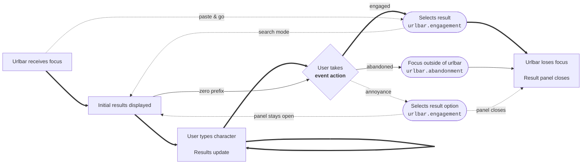

# Urlbar Events

## Table of Contents

<!-- toc -->

## Introduction

The `urlbar_events` table, derived from Glean `urlbar` events,
provides a data source for understanding user interactions with the urlbar and search.
Its structure and fields are designed around the notion of urlbar search sessions.
This data is Desktop-only.

## Urlbar search sessions

A **urlbar search session** is a sequence of interactions with the
[urlbar](https://firefox-source-docs.mozilla.org/browser/urlbar/nontechnical-overview.html),
starting from when the urlbar receives focus,
and ending when the user navigates to a new page or focuses outside of it,
causing the result panel to close.
In this context, **search** means _using the urlbar to search for a page_,
not specifically _using a search engine_.

The following diagram shows the user interaction flow through a search session.
The most common case ("user types a query and clicks on a result") is shown with **bold** arrows.
Unusual cases are shown with dotted lines.



A search session includes one or more **event actions** taken by the user,
usually in response to the results that are displayed.
There are 3 types of event action:

- **Engaged:** the user selects a result.
  This includes pressing Enter after typing, which has the effect of selecting the first result.
- **Abandoned:** the user focuses outside of the urlbar without selecting a result.
- **Annoyance:** the user selects an auxiliary option associated with a result,
  e.g. `Dismiss` in the meatball menu.

The search session ends if the event action causes the panel to close, e.g. by navigating to a new page.
Most search sessions see the user typing some characters and selecting a result,
ending the session after one event action.

However, in some instances the event action leaves the panel open for further interaction,
e.g. selecting the `Dismiss` annoyance signal.
In such cases, the search session will contain multiple event actions.
Also, in some search sessions, the user can take an event action without typing any characters
or without results being displayed, e.g. using the `Paste & Go` context menu option.

An event action is called **terminal** if it causes the session to end.
Whether or not an event action is terminal is determined _a posteriori_ from its characteristics.
For the complete logic on terminal event actions, see
[this code](https://github.com/mozilla/bigquery-etl/blob/main/sql_generators/urlbar_events/templates/desktop_query.sql#L30).

### Measurement

Measurement for search sessions is collected through Glean
[`urlbar.engagement`](https://dictionary.telemetry.mozilla.org/apps/firefox_desktop/metrics/urlbar_engagement)
and
[`urlbar.abandonment`](https://dictionary.telemetry.mozilla.org/apps/firefox_desktop/metrics/urlbar_abandonment)
events, which record one event for each event action.
(There is also a
[`urlbar.impression`](https://dictionary.telemetry.mozilla.org/apps/firefox_desktop/metrics/urlbar_impression)
event, but it is not currently used for data analysis).

These contain a snapshot of the urlbar state at the moment when the event action was taken,
such as the types of results that were showing, and the result that was selected (if any).
This means that we have information about the final set of results from which the user made a selection,
but not the intermediate result sets shown on each keystroke.

A search session with multiple event actions will generate multiple Glean events.
There is currently no "session ID" linking these together,
as the majority of search sessions generate only 1 event,
and the analytical focus is on counting occurrences rather than event sequences.
Also, the events do not contain an indicator of whether they are terminal.
This determination is made at ETL time based on the event contents.

### Summary

This table summarizes key information about the 3 types of event action:

| Event action | Terminal?                                                                                                  | Glean event          | Event extra fields of interest                                                                                                                                                                                                                                  |
| ------------ | ---------------------------------------------------------------------------------------------------------- | -------------------- | --------------------------------------------------------------------------------------------------------------------------------------------------------------------------------------------------------------------------------------------------------------- |
| Engaged      | <ul><li>Usually yes (e.g. clicking on a result)</li><li>Sometimes no (e.g. entering search mode)</li></ul> | `urlbar.engagement`  | <ul><li>Ordered list of displayed results: `results`</li><li>Selected result type: `selected_result`</li><li>Selected result position (1-indexed): `selected_position`</li></ul>                                                                                |
| Abandoned    | Yes                                                                                                        | `urlbar.abandonment` | Ordered list of displayed results: `results`                                                                                                                                                                                                                    |
| Annoyance    | <ul><li>Sometimes yes (e.g. "Learn More")</li><li>Sometimes no (e.g. "Dismiss")</li></ul>                  | `urlbar.engagement`  | <ul><li>Ordered list of displayed results: `results`</li><li>Selected result type: `selected_result`</li><li>Selected result position (1-indexed): `selected_position`</li><li>Annoyance signal (the option selected for a result): `engagement_type`</li></ul> |

## Results, impressions and clicks

The primary use case for this data is calculating click and impression rates
for different types of urlbar search results in order to answer Product questions.
The [Urlbar Events Looker explore](https://mozilla.cloud.looker.com/explore/firefox_desktop/urlbar_events)
is built on top of the `urlbar_events` table to serve this need.

The `results` and `selected_result` fields in the Glean event extras report "raw" result types,
which are sometimes more granular than Product needs.
Product has developed a
[mapping](https://github.com/mozilla/bigquery-etl/blob/main/sql/mozfun/norm/result_type_to_product_name/udf.sql)
which translates these raw values into interpretable **Product result types** (e.g. "search suggestion").
All columns in the `urlbar_events` table containing raw result types (e.g. `selected_result`)
have a corresponding Product version (e.g. `product_selected_result`) with the mapped values.
If a raw result type does not map to any Product result type, the mapping returns `other`.

An **impression** is defined as a result that is showing in the result panel at event action time.
This means:

- We only consider 1 set of impressions per event action. As the user types characters,
  they will see intermediate result sets, as the result panel updates on each keystroke.
  However, these are currently not taken into account.
- At event action time, there are usually multiple results showing, i.e. multiple impressions.
  Many impression sets have 10 impressions (the default number).
  The number of impressions shown on an event action is given in the `num_total_results` column.
- An impression set may have multiple impressions of the same type.
  e.g. multiple search suggestions are usually surfaced for a typed query.

The ordered list of result impressions for each event action is given in the array-valued column `results`.

A **click** occurs when the user selects a result, i.e. taking an engaged event action.

- We use this as standard terminology, even though the user may not have physically clicked a mouse.
- The majority of clicks are terminal: they cause a page to be loaded and the search session to end.
  In a few rare cases, a click is not terminal.

The type of result selected is given in the `selected_result`/`product_selected_result` columns.

**CTR** can be computed in 2 ways for a given result type:

1. num clicks / total num impressions
2. num clicks / num search sessions with at least 1 such impression

We generally use (2.) for Product-focused analyses and experiments, including the
[Looker explore](https://mozilla.cloud.looker.com/explore/firefox_desktop/urlbar_events).
For result types that have at most 1 impression per result set (e.g. navigational),
these will be the same.
For types that tend to have multiple impressions per result set (e.g. search suggestions),
(1.) could be much lower than (2.).

An **annoyance** occurs when the user selects an option associated with a result, e.g. "Dismiss",
without selecting the result itself.
These are usually found in the meatball menu next to the displayed result.
The `annoyance_signal_type` column gives the type of annoyance option that was selected,
and `selected_result`/`product_selected_result` give the result type with which the annoyance is associated.

For more examples of previously used metrics, see the
[Firefox Suggest Jetstream outcome](https://github.com/mozilla/metric-hub/blob/main/jetstream/outcomes/firefox_desktop/firefox_suggest.toml).

## Urlbar events table

The [`mozdata.firefox_desktop.urlbar_events`](https://github.com/mozilla/bigquery-etl/tree/main/sql_generators/urlbar_events/templates)
table contains 1 row for each Glean event (i.e. 1 row per event action) reported across all Desktop users.

As discussed above, most search sessions only have 1 associated row, but some have multiple.
There is no session identifier linking rows associated with the same session
(although it may be possible to infer such linkage from event sequencing).
However, the `is_terminal` column indicates whether the event action was terminal.
The event action type is listed in the `event_action` column.

Most of the Glean event extras fields are included in separate columns.
Additionally:

- The array-valued `results` column lists the ordered results showing at event action time.
  Each array element is a struct with `result_type`, `product_result_type`, `position`, and `result_group`.
- `selected_result`, `product_selected_result`, `selected_position` give the selected result
  associated with an engagement or annoyance.
- `annoyance_signal_type` gives the annoyance option selected, if any.
- `event_id` is a row identifier UUID. This is mainly useful when unnesting the `results` column.
- `glean_client_id`, `seq` (from the event's `ping_info`), `event_timestamp` can be used
  to build event sequences and interlace with SERP events.

This table summarizes the main column values associated with each event action:

| Event action | `event_action` | `is_terminal`     | `selected_result`                             | `annoyance_signal_type`                       |
| ------------ | -------------- | ----------------- | --------------------------------------------- | --------------------------------------------- |
| Engaged      | `engaged`      | `true` or `false` | `selected_result` from Glean engagement event | `null`                                        |
| Abandoned    | `abandoned`    | `true`            | `null`                                        | `null`                                        |
| Annoyance    | `annoyance`    | `true` or `false` | `selected_result` from Glean engagement event | `engagement_type` from Glean engagement event |

### Gotchas

- Each search session may have multiple associated rows.
  To count **unique search sessions** (the most common use case), condition on `is_terminal = true`.
- To work with impressions, `UNNEST` the `results` column.

### Example queries

To count number of search sessions:

```sql
SELECT
  COUNT(*)
FROM
  `mozdata.firefox_desktop.urlbar_events`
WHERE
  is_terminal
```

Engagement rate (proportion of search sessions ending with an engaged action):

```sql
SELECT
  COUNTIF(event_action = 'engaged') / COUNT(*)
FROM
  `mozdata.firefox_desktop.urlbar_events`
WHERE
  is_terminal
```

Impression rate for history (proportion of search sessions that ended with a history impression showing):

```sql
SELECT
  COUNT(DISTINCT IF(r.product_result_type = 'history', event_id, NULL))
    / COUNT(DISTINCT event_id)
FROM
  `mozdata.firefox_desktop.urlbar_events`,
  UNNEST(results) AS r
WHERE
  is_terminal
```

Number of clicks on a history result:

```sql
SELECT
  COUNT(*)
FROM
  `mozdata.firefox_desktop.urlbar_events`
WHERE
  is_terminal
  AND event_action = 'engaged'
  AND product_selected_result = 'history'
```

CTR for history (denominator is search sessions that had an impression,
not number of impressions):

```sql
SELECT
  COUNT(DISTINCT IF(event_action = 'engaged' AND product_selected_result = 'history', event_id, NULL))
    / COUNT(DISTINCT IF(r.product_result_type = 'history', event_id, NULL))
FROM
  `mozdata.firefox_desktop.urlbar_events`,
  UNNEST(results) AS r
WHERE
  is_terminal
```

Number of result dismissals (annoyance):

```sql
SELECT
  COUNT(*)
FROM
  `mozdata.firefox_desktop.urlbar_events`
WHERE
  event_action = 'annoyance'
  AND annoyance_signal_type = 'dismiss'
```

### Scheduling

This dataset is scheduled on Airflow and updated daily.

### Schema

The data is partitioned by `submission_date`.

### Code Reference

This table is
[generated](https://github.com/mozilla/bigquery-etl/blob/main/sql_generators/urlbar_events/__init__.py)
from a templated query defined under
[`bigquery_etl/sql_generators`](https://github.com/mozilla/bigquery-etl/blob/main/sql_generators/urlbar_events/templates/desktop_query.sql).
