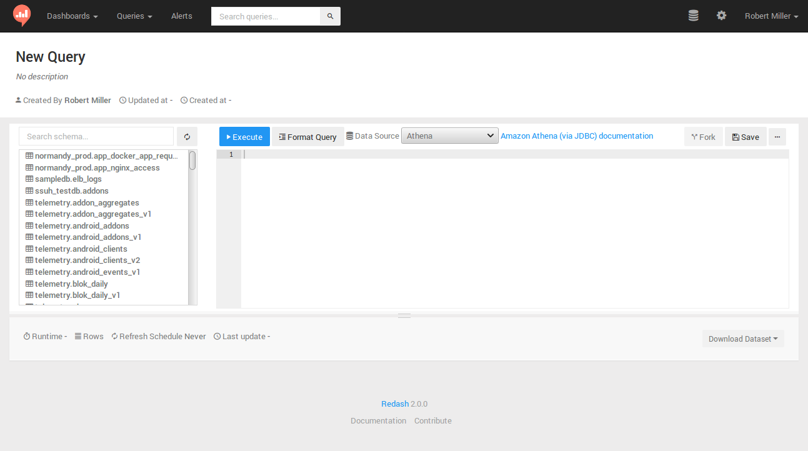
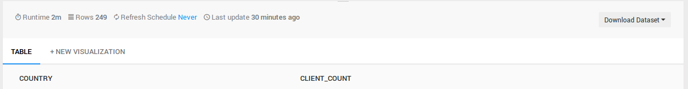
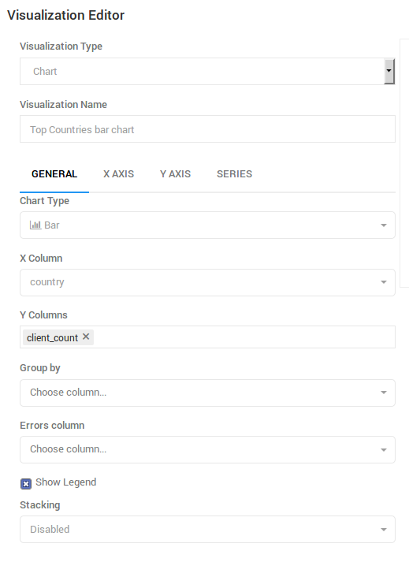
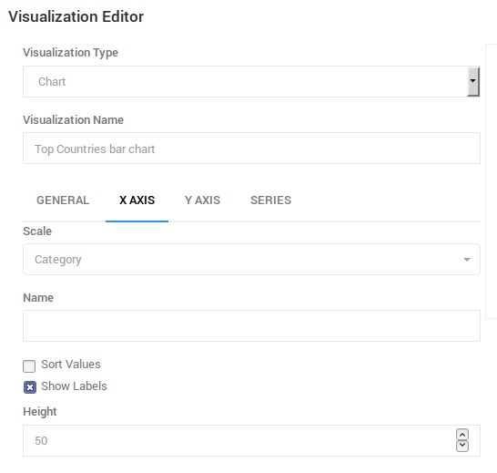
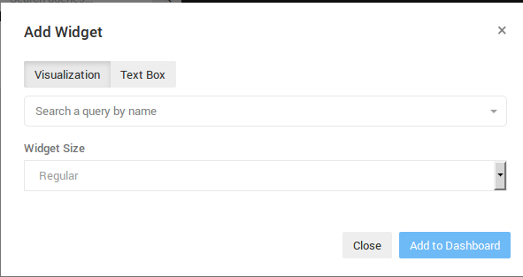
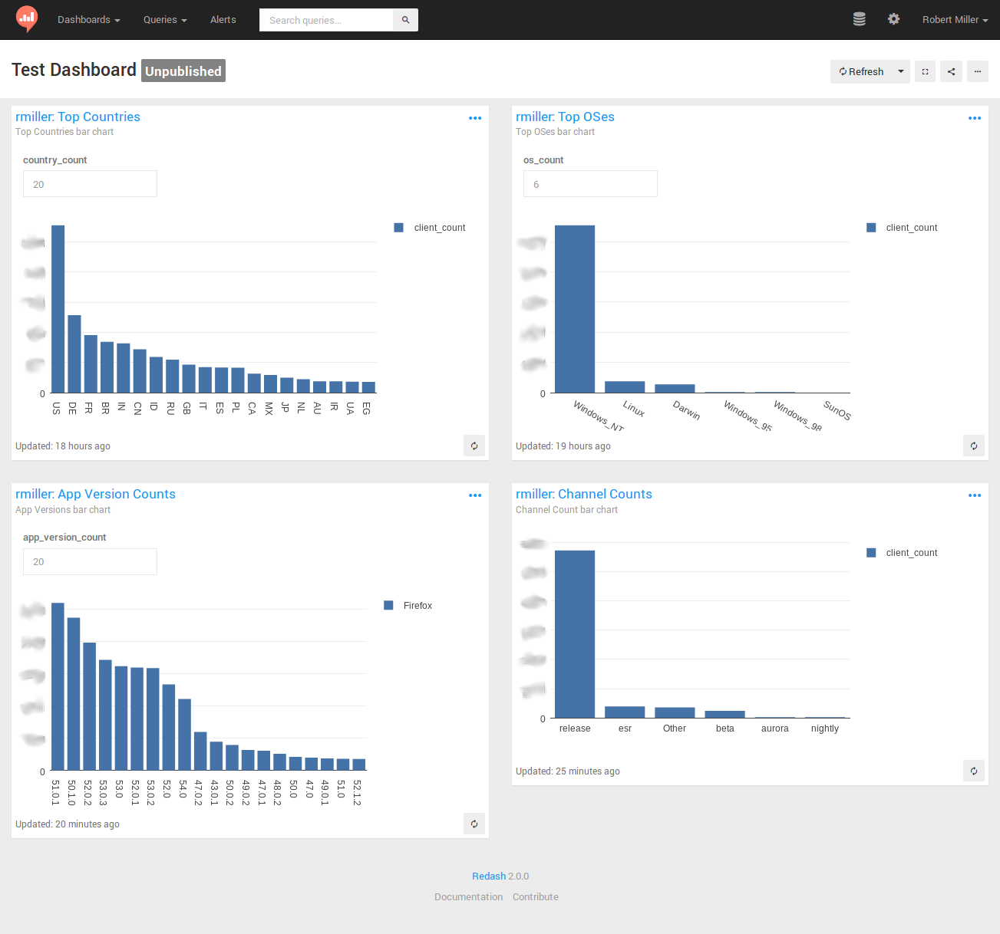

## Introduction to STMO

[`sql.telemetry.mozilla.org`](https://sql.telemetry.mozilla.org) (STMO) is Mozilla's installation of the [Redash](https://redash.io/) data analysis and dashboarding tool. As the name and URL imply, the effective use of this tool requires familiarity with [SQL](https://en.wikipedia.org/wiki/SQL), with which all of the tool's data extraction and analysis are performed.

Access to STMO is limited to Mozilla employees and designated contributors. For more information, see [gaining access](../concepts/gaining_access.md).

## STMO Concepts

You need to use the following building blocks from which analyses in STMO are constructed:

- Queries
- Visualizations
- Dashboards

#### Queries

STMO's basic unit of analysis is a query. A query is a block of SQL code that
extracts and optionally transforms data from a single data source. Queries
can vary widely in complexity. Some queries are simply one liners (e.g., `SELECT some_field FROM tablename LIMIT 10`) while others span over many pages, almost like small programs.

The raw output from a query is tabular data. Each row represents one set of
return values for the query's output columns. You can run a query manually or specify a refresh schedule that executes automatically after a specified interval of time.

#### Visualizations

Tabular data is great, but rarely is a grid of values the best way to make
sense of your data. You can associate each query with multiple visualizations. Each visualization can render the extracted data in a format that makes it easy to interpret your data.

There are many visualization types, including charts (line, bar, area, pie, etc.), counters, maps, pivot tables, and more. You can use each visualization type that provides a set of configuration parameters to specify how to map from the raw query output to the desired visualization. Some visualization types make demands of the query output. For example, a map visualization requires each row to include a longitude value and a latitude value.

#### Dashboards

A dashboard is a collection of visualizations that is combined into a single visual
presentation for your convenience. A dashboard is decoupled from any particular queries. Although you can include multiple visualizations from a single query in one dashboard, it is not required. Users can add any visualizations that they can access to any dashboards they have created.

## Data Sources

SQL provides the ability to extract and manipulate the data, but you won't get
very far without having some familiarity with what data is actually available,
and how that data is structured. Each query in STMO is associated with exactly
one data source, and you have to know ahead of time which data source contains
the information that you need. One of the most commonly used data sources is
called _Telemetry (BigQuery)_, which contains most of the data that is
obtained from telemetry pings received from Firefox clients. _BigQuery_
refers to Google's [BigQuery](https://cloud.google.com/bigquery/) data warehouse.

Other available data sources include _Crash DB_, _Tiles_, _Sync Stats_, _Push_,
_Test Pilot_, and even a _Redash metadata_ which connects to STMO's
own Redash database. If you want to learn more about all available data sets and how
to locate one that is suited for your development environment, see the [Choosing a
dataset](../concepts/choosing_a_dataset.md) page. If you have questions regarding data sets or would like to know if specific data is or can be made available
in STMO, see the [getting help](../concepts/getting_help.md) topic for more information on how to get in touch.

## Create an Example Dashboard

The following topics describe the process of creating a simple dashboard using STMO.

#### Create A Query

Let's start by creating a query. The first query counts the number of client ids that Mozilla receives from each country, for the top N countries. If you click the 'New Query' button that is located at the top on the left-hand side of the site, the query editing page appears:



For this and most other queries where each client IDs is counted, you want to use
[`clients_last_seen`](../datasets/bigquery/clients_last_seen/reference.md),
which is generated from Firefox telemetry pings.

- Search for the table in `Telemetry (BigQuery)`

  Click the 'Data Source' drop-down and select `Telemetry (BigQuery)`. Then, search for the table by typing `clients_last_seen` in the "Search schema..." field that is above the schema browser interface to the left of the main query Edit field.

You should see a `clients_last_seen` entry (appearing as `telemetry.clients_last_seen`). You may also see versioned copies of the tables as `telemetry.clients_last_seen_v<VERSION>`.

- Introspect the available columns

  Click `telemetry.clients_last_seen` in the schema browser to display the columns that are available in the table. The following columns are of interest for this query:

  - `country`
  - `days_since_seen`
  - `submission_date`.

If a query extracts all unique country values and the MAU for one day for each one, sorted from highest MAU to lowest MAU, the query then appears as follows:

```sql
SELECT
  country,
  COUNTIF(days_since_seen < 28) AS mau
FROM
  telemetry.clients_last_seen
WHERE
  submission_date = '2019-04-01'
GROUP BY
  country
ORDER BY
  mau DESC
```

If you type these parameters into the main query Edit field and then click the "Execute"
button, a blue bar then appears below the Edit field. It includes the text "Executing query...", followed by a timer that indicates how long the query has run. After some period of time, usually less than a minute, the query typically completes its run. A table appears that displays a MAU value for each country. You have just created and run your first STMO query!

Next, click the large "New Query" text located at the top of the page. An Edit field appears so you can rename the query. It is recommended that you assign a unique prefix (such as your name) to the query to make it easy to find your query later. For example, `rmiller:Top Countries`.

#### Create A Visualization

After you have created a query, you may want to provide a simple visualization. The table with results from the first query execution now appears under the query Edit field. Another heading titled `+NEW VISUALIZATION` appears next to the `TABLE` heading:



Click the `+NEW VISUALIZATION` link to display the "Visualization Editor" screen. You can now specify a visualization name ("Top Countries bar chart"), a chart type ("Bar"), an x-axis column (`country`), and a y-axis column (`mau`):



After the `GENERAL` settings have been specified, you need to modify additional settings on the `X AXIS` tab. Click this tab and then change the 'Scale' setting to 'Category', and un-check the 'Sort Values' checkbox to enable the query's sort order to take precedence:



#### A Note About Limits

After you have saved the visualization settings and displayed the query source page, a bar graph appears near the bottom of the page. The graph includes quite a few entries. Rather than being able to view _all_ of the countries, you may want to display only the first 20 entries by adding a `LIMIT` clause to the end of a query:

```sql
SELECT
  country,
  COUNTIF(days_since_seen < 28) AS mau
FROM
  telemetry.clients_last_seen
WHERE
  submission_date = '2019-04-01'
GROUP BY
  country
ORDER BY
  mau DESC
LIMIT
  20
```

If you edit the query to add a limit clause and then click 'Execute', a new bar graph only displays the 20 countries that have the highest number of unique clients. In this case, the full result set includes approximately 250 return values: limiting the result count improves readability.

In other cases, however, an unlimited query may return thousands or even millions of rows. Any queries that return millions of rows or lines can not only be unreadable but negatively impact the performance of all other users of STMO. Thus an important warning:

**ALL QUERIES SHOULD INCLUDE A "LIMIT" STATEMENT BY DEFAULT!**

It is highly recommended that you add a "LIMIT 100" clause to the end of all new queries to prevent a query from returning a large result set that causes user interface (UI) and performance problems. You may learn that the total result set is small enough that setting a limit becomes unnecessary. Specifying an explicit LIMIT helps prevent unnecessary issues.

#### Query Parameters

You can add user arguments to a query, which allows the user to specify parameters without modifying the query itself. Using the query in the previous section as an example, you can replace the `LIMIT 20` with a country count variable in double curly braces:

```sql
SELECT
  country,
  COUNTIF(days_since_seen < 28) AS mau
FROM
  telemetry.clients_last_seen
WHERE
  submission_date = '2019-04-01'
GROUP BY
  country
ORDER BY
  mau DESC
LIMIT
  {{country_count}}
```

After you have replaced the hard-coded limit value with `{{country_count}}`, an input field appears above the bar chart. If you type a numeric value in the input field and click 'Execute', the query will run with the specified limit. Click 'Save' to save the query. The query applies the parameter value that you typed as the default.

#### Create A Dashboard

You can create a dashboard to display visualization by selecting 'New Dashboard' from the 'Dashboards' dropdown that is located at the top left of the page. Choose a name for your dashboard and an empty page should appears. Click the '...' button near the top right of the page to select 'Add Widget'. The following dialog box appears:



Type a unique prefix that has previously been used in a query name in the "Search a query by name" field to locate the query that you have created. You cannot yet execute this query because the query has not yet been published. As soon as you publish a query, you can search on the summary pages. Even though this is only an exercise, the query must be published briefly and then added to the dashboard. You can publish your query by clicking "Publish" on the query source page.

As soon as a query is published, it appears in the search results when you type a unique prefix in the "Search a query by name" field on the "Add Widget" dialog box. When you select a query, you can select a query's visualizations from the "Choose Visualization" dropdown. Select the bar chart that you created and then click "Add to Dashboard". The dashboard now includes a bar chart. You can now edit the `country_count` value and click "Refresh" to change the number of countries that are included in the chart.

#### Completing the Dashboard

A dashboard with just one graph is often insufficient. Therefore, you may want to create additional queries, each with a very similar bar chart. The text that you need to apply to the queries is listed below. However, you need to create the queries and the visualizations and then link them to the dashboard. The queries are as follows:

- Top OSes (recommended `os_count` value == 6)

```sql
SELECT
  os,
  COUNTIF(days_since_seen < 28) AS mau
FROM
  telemetry.clients_last_seen
WHERE
  submission_date = '2019-04-01'
GROUP BY
  os
ORDER BY
  mau DESC
LIMIT
  {{os_count}}
```

- Channel Counts

```sql
SELECT
  normalized_channel AS channel,
  COUNTIF(days_since_seen < 28) AS mau
FROM
  telemetry.clients_last_seen
WHERE
  submission_date = '2019-04-01'
GROUP BY
  channel
ORDER BY
  mau DESC
```

- App Version Counts (recommended `app_version_count value` == 20)

```sql
SELECT
  app_name,
  app_version,
  COUNTIF(days_since_seen < 28) AS mau
FROM
  telemetry.clients_last_seen
WHERE
  submission_date = '2019-04-01'
GROUP BY
  app_name,
  app_version
ORDER BY
  mau DESC
LIMIT
  {{app_version_count}}
```

Creating bar charts for these queries and adding them to the original dashboard
can result in a dashboard that resembles this:



Some final notes to help you create your dashboards:

- Remember to publish each of your queries before adding its visualizations to a dashboard.

- Similarly, it is recommended to un-publish any test queries after you have used
  them in a dashboard. This prevents everyone's search results from being contaminated
  with your tests and experiments. Any queries that result from an actual
  work-related analysis typically remain published. Others users can view these queries and
  learn from them.

- The 'Firefox' label on the 'App Version counts' graph is related to the use
  of the 'Group by' visualization setting. It is recommended that you experiment with
  the use of 'Group by' in your graphs to learn more about its usage.

- This tutorial has only touched the surface of the wide variety of
  sophisticated visualizations that STMO supports. You can view many
  more sophisticated queries and dashboards by browsing and exploring
  the work that has been published by others.

- The [Redash help center](https://redash.io/help/) is a useful resource for exploring Redash and all its capabilities.

#### Prototyping Queries

You may want to start working on a query before data becomes available.
You can do this with most of the data sources by selecting a static test data
set and then work with it, as usual. You can also use this method to explore
how a particular SQL backend behaves.

Note that `UNION ALL` will retain duplicate rows while `UNION` will discard them.

Here are a couple of examples:

**Simple three-column test dataset**

```sql
WITH test AS (
 SELECT 1 AS client_id, 'foo' AS v1, 'bar' AS v2 UNION ALL
 SELECT 2 AS client_id, 'bla' AS v1, 'baz' AS v2 UNION ALL
 SELECT 3 AS client_id, 'bla' AS v1, 'bar' AS v2 UNION ALL
 SELECT 2 AS client_id, 'bla' AS v1, 'baz' AS v2 UNION ALL
 SELECT 3 AS client_id, 'bla' AS v1, 'bar' AS v2
)

SELECT * FROM test
```

**Convert a semantic version string to a sortable array field**

```sql
WITH foo AS (
 SELECT '1.0.1' AS v UNION
 SELECT '1.10.3' AS v UNION
 SELECT '1.0.2' AS v UNION
 SELECT '1.1' AS v UNION
 -- Doesn't work with these type of strings due to casting
 -- SELECT '1.3a1' AS v UNION
 SELECT '1.2.1' AS v
)

SELECT cast(split(v, '.') AS array<bigint>) FROM foo ORDER BY 1
```

**How do boolean fields get parsed from strings?**

```sql
WITH bar AS (
 SELECT '1' AS b UNION
 SELECT '0' UNION
 SELECT 't' UNION
 SELECT 'f' UNION
 SELECT 'true' UNION
 SELECT 'false' UNION
 SELECT 'turkey'
)
SELECT b, try(cast(b AS boolean)) from bar
```
